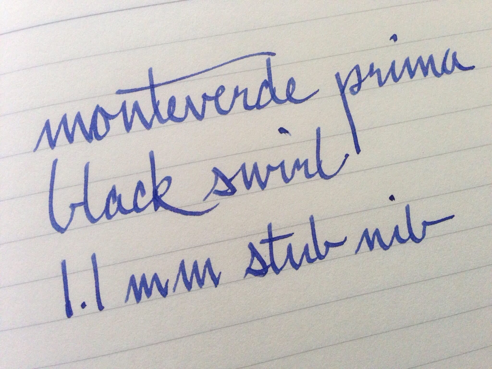
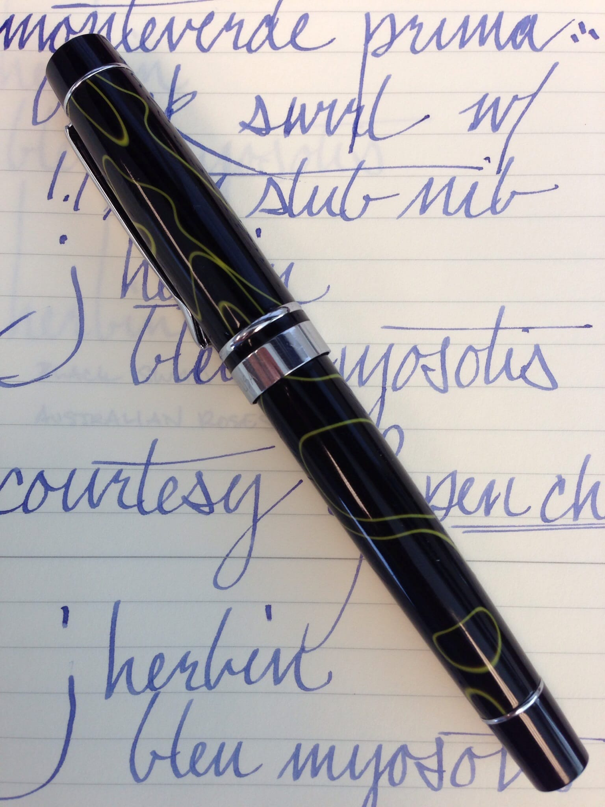
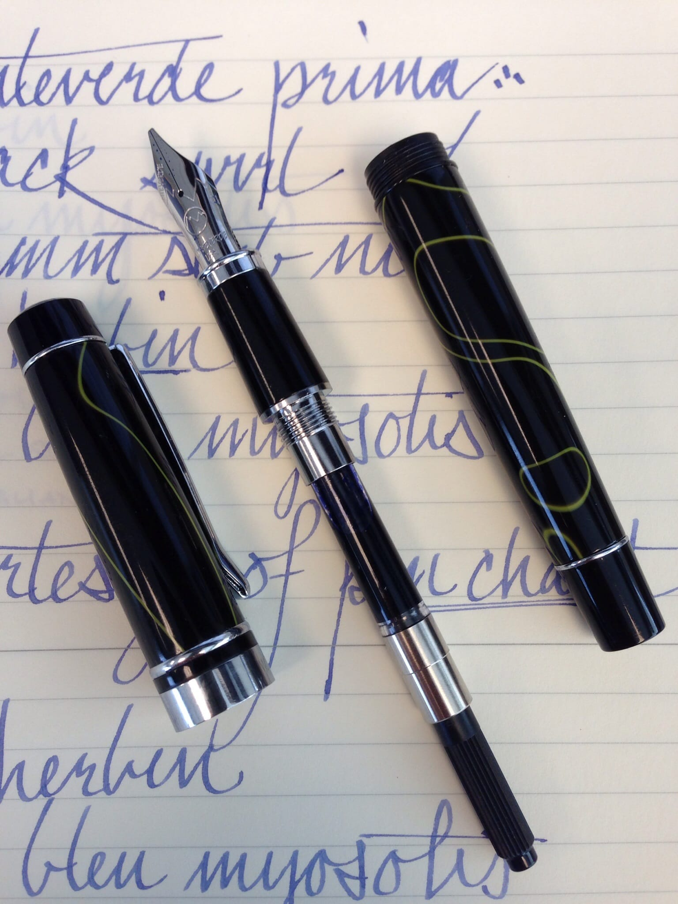
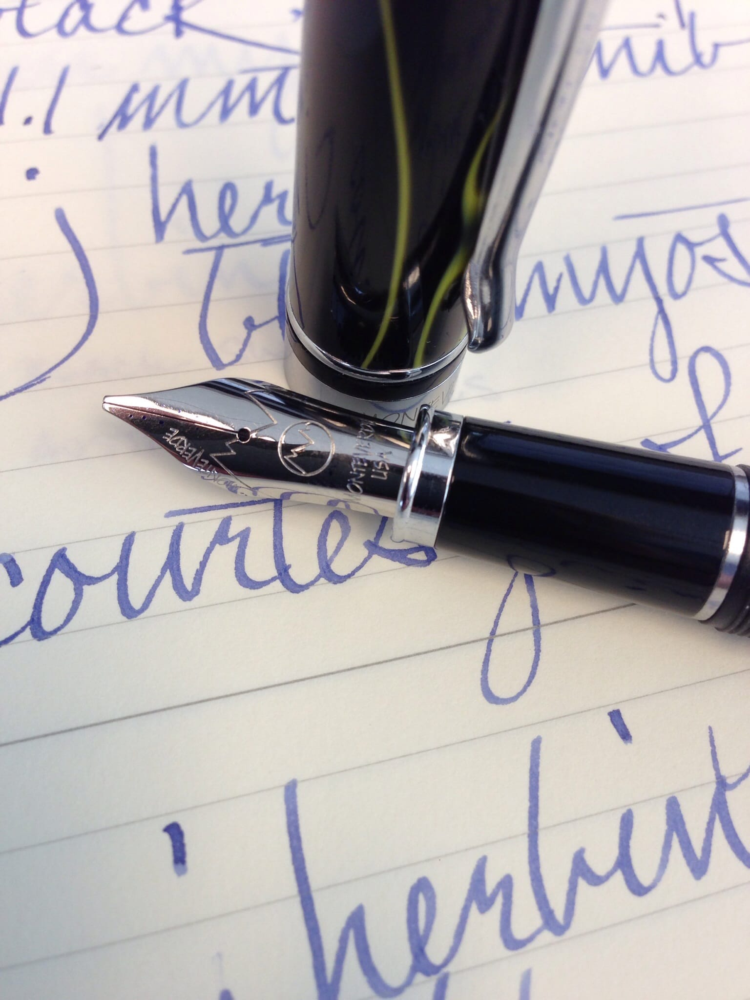
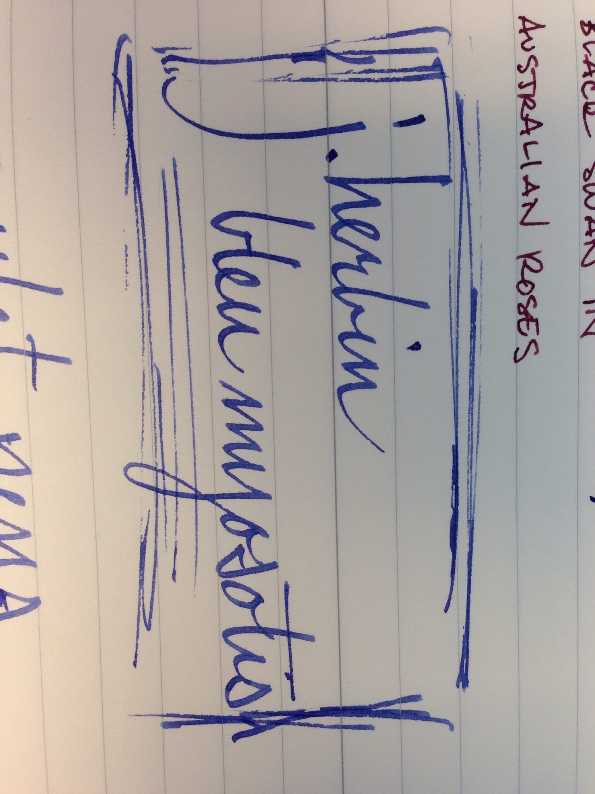
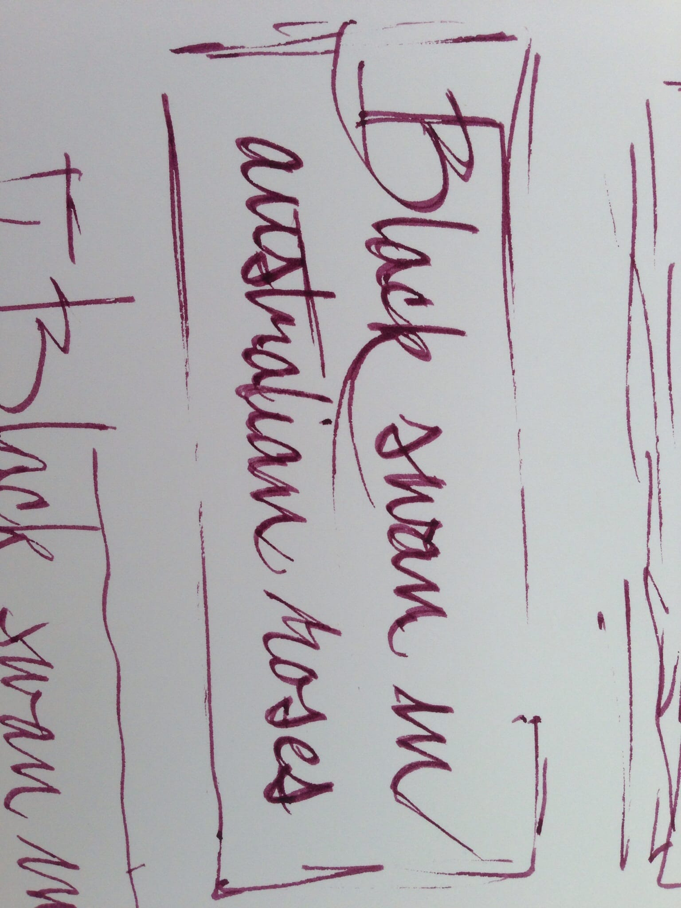
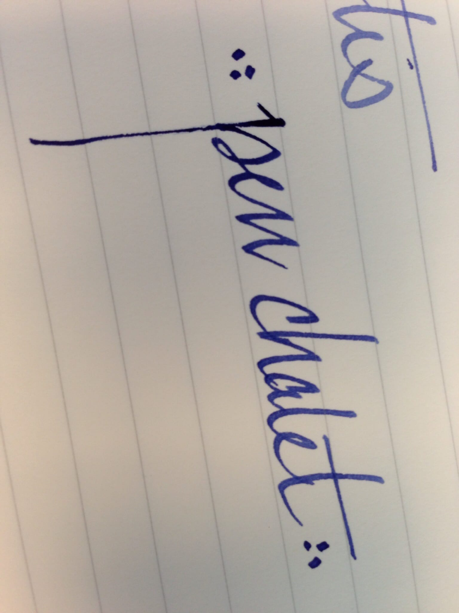

About a month ago, Ron from [Pen Chalet](http://www.penchalet.com/) contacted me to ask if I’d be interested in receiving a pen for review. I happily accepted, and after a bit of back and forth, he agreed to send me a Monteverde Prima with a 1.1 mm stub nib. I’d heard good things about Monteverde, and my only experience with stub nibs was with the wider 1.9 mm nib on my Lamy Joy pen. It was a gap in my collection, and, having recently renewed my interest in calligraphy, I thought it made sense to do a bit of exploration.

It only took a day before I was looking for words that were fun to write. Words with Ms and Ns, like “mnemonic.” Words with Ps and Qs, like “opaque.” Rs were rewarding, Ts divine, and Vs delectable. “Monteverde” itself was a joy to write. I found myself avoiding words with Fs, though – I still haven’t found a version of F that I’m happy with.

At any rate, the Monteverde Prima comes in a green leatherette-ish box, which is embossed on the top with the Monteverde logo. Inside, the pen rests on a white satin bed and is held in place by a satin ribbon. In the bottom of the box, underneath the bed, are a set of instructions and a cartridge. It’s a nice presentation, especially considering the very reasonable cost of the pen, but it’s nothing especially luxurious.

The pen itself, though, is lovely. The cap and barrel are made from a glossy acrylic resin and are nicely framed by chrome trim. The resin comes in five varieties, each of which consists of a base color with an accent color swirled in, creating a marbled look: black with a yellow-green swirl, green with a black swirl, tiger eye (which is an amber-orange) with black, purple with white, and turquoise with both black and white. The black swirl is by far the most conservative, followed by the tiger eye, while the green, purple, and turquoise are all quite vibrant. On all of the models, the very bottom of the barrel, the very top of the cap, and the grip are all solid, glossy black.

The pen fills using either a cartridge or converter, both of which are included. The converter, which is threaded, is installed by default. Because it screws into the section, the converter feels very solid when assembled, which is a nice chance of pace from those converters that are held in by friction. I always worry that a stray bump will knock a friction fit converter off its mount and result in spilled ink. I’ve never actually had that happen, mind you, but it’s not even a worry with this pen

The Prima measures 5.25 inches in length, and weighs in at 1 ounce. By comparison, the [Visconti Homo Sapiens](/blog/2011/11/20/pen-review-visconti-homo-sapiens), which a fairly hefty pen, weighs in at 1.6 oz, and the Pelikan M205, which feels nearly insubstantial by comparison, weighs in at only 0.4 oz. The Prima is a nice compromise between the two extremes, as it feels quite solid and well balanced in the hand. I don’t typically post my cap, so I won’t claim to be an authority on how it feels posted, other than very secure. My one complaint about the construction of the pen is the clip. It is very tight and has no spring to it, so it’s actually a bit tough to get in and out of a suit pocket.

Monteverde offers the Prima with a fine, medium, broad, or 1.1 mm stub nib. My review unit came equipped with the stub nib, and I’m pleased to report that it is a joy to write with straight out of the box. It needed no adjustment to work optimally, though I did make sure to clean all of the parts first. The stub nib takes a little bit of technique to get the most out of – primarily hand position. The results, lovely line variation, are worth it, though; it simply becomes fun to write.

One does have to be concerned about ink flow with a stub nib – the feed has to be able to keep up with the amount of ink laid down by the nib. Happily, the Prima does the job. While the pen occasionally takes two strokes to get started, usually after being left for a while, it generally starts on the second stroke without issue. It is not a wet writer, though – it just keeps up.

I tested the pen with both [J. Herbin Bleu Myosotis](/blog/2010/11/15/ink-review-j-herbin-bleu-myosotis) and [Noodler’s Black Swan in Australian Roses](/blog/2010/11/30/ink-review-noodlers-black-swan-in-australian-roses), both of which typically exhibit a high degree of shading. With the stub nib, though, they both produced a consistent, solid line. I wouldn’t describe it a dry writer – there was no scratchiness in evidence, for example – it does produce a very measured line, which diminishes the amount of shading one would normally see with either ink. This is not a problem with either the pen or the ink so far as I can tell, but it is a behavior that one should be aware of.

Overall, I’m very happy with the Monteverde Prima. I haven’t had experience with any of their other pens or nibs, but I’m certainly going to explore, given my experience with this one. The Monteverde Prima lists for US$70.00, but it can be found for less at many fine retailers, including [Pen Chalet](http://www.penchalet.com/fine_pens/fountain_pens/monteverde_prima_fountain_pen.html).

[Pen Chalet](http://www.penchalet.com/) graciously provided this pen for review purposes.
