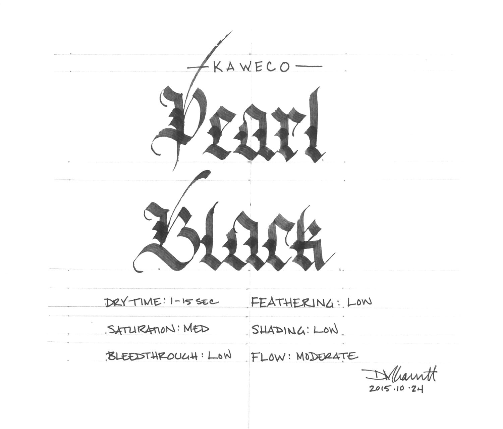
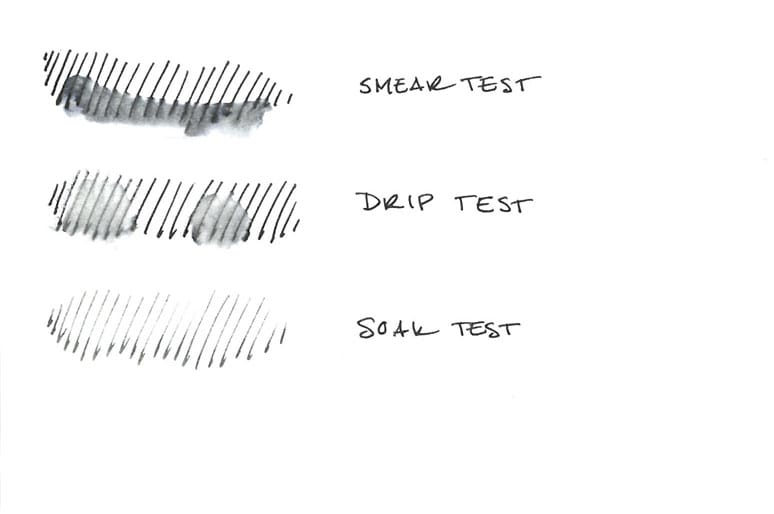
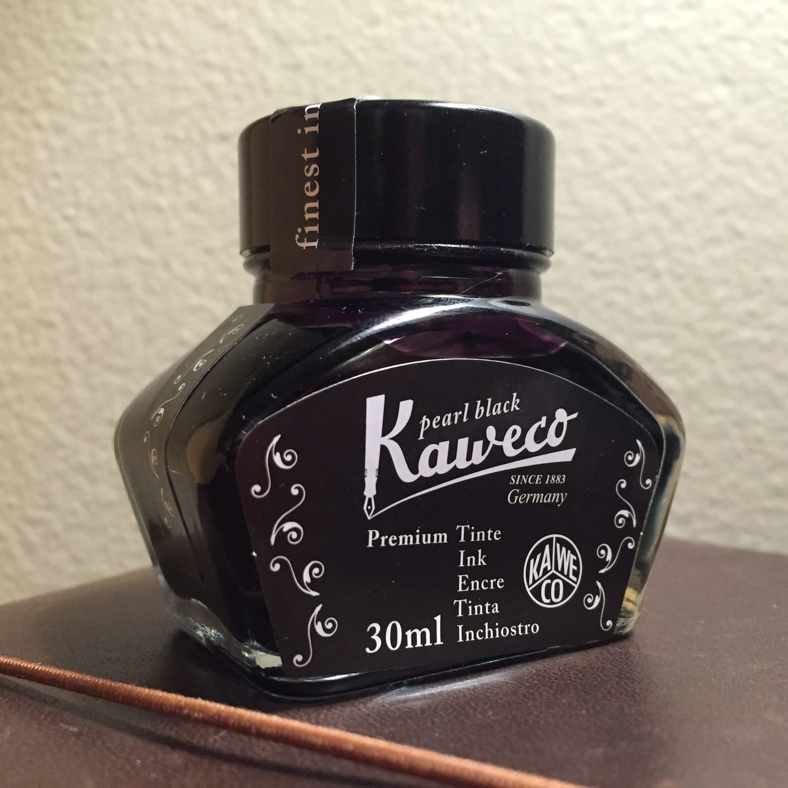

In the years since I began my fountain pen obsession, I've amassed a fair quantity of ink from a wide variety of manufacturers, but I've never been in the position to review the full range of one manufacturer's offerings. Thanks to the fine people at Kaweco, though, I have all eight colors that they offer, so I can compare and contrast within the line as well as without.

When I first received the big box of ink, ink cartridges, and pens that Kaweco sent my way, I was at a bit of a loss. The ink was dry - extremely so compared to the Diamine and Noodler's ink that often inhabits my pen - almost to the level of an iron gall ink. It felt, in comparison, slightly unpleasant to use. It also lays down a thin line compared to other ink varieties - making any nib seem one degree more fine than expected.

After spending some time with each of the colors and engaging in a bit of experimentation, though, I've developed an appreciation for Kaweco ink. I'm impressed that, aside from some minor variations in saturation and shading, all eight colors have been engineered to perform exactly the same across a wide range of paper types.

Let's start with Pearl Black, the most saturated of the eight colors. It's a solid, coal-black ink that provides good contrast on white, off-white, and cream colored paper. It's not quite as dark and impenetrable as Noodler's Black, but it still provides good coverage. It has the best flow of any of the eight colors as well, though it is still extremely dry compared to ink from other manufacturers.

The characteristic that I found most surprising about Pearl Black, and therefore all of the Kaweco colors, was its performance on cheap, absorbent paper: it behaves very, very well. The dry nature of the ink combined with whatever chemical engineering went into its formulation makes the ink resistant to feathering and bleed through. This is the perfect line of ink for someone who wants the benefits of a fountain pen with a variety of color choices, but who is forced to write on the sort of paper that office administrators buy because it is cheap.

| Paper | Dry Time | Bleed Through | Ghosting | Feathering |
| --- | --- | --- | --- | --- |
| Copier | 1 second | Low | Moderate | Low |
| Bagasse | 3 seconds | Moderate | Moderate | Low |
| Rhodia | 15 seconds | None | Low | None |
| Midori | 15 seconds | None | Low | None |
| Canson | 10 seconds | None | None | None |

I had no idea what to expect from Pearl Black going into the water test, as this is the first Kaweco ink I've tested. There is no mention of water resistance in the ad copy, which is good, because it doesn't appear to have any. I was slightly surprised by what the Pearl Black did when water touched it though - in each case, it turned a deep purple before washing away.

In the smear test, in which I run a wet finger across the page, the ink turned into a big purple smudge, which after blotting, turned into a grayish, blue-black smudge. Not much is legible where the water came in contact with the ink. In the drip test, in which I leave a couple of drops of water on the paper before blotting, a similar situation occurred. The ink immediately separated into a gray and a purple component, and left a gray circle behind.

The soak test yielded the best results, counter-intuitively, because the multiple components in the ink washed away quickly, leaving a faint set of lines behind. One could argue that this reflects a minor level of water resistance - clearly some part of the ink is bonding to the paper and resisting removal, but the degree to which the ink bleeds and its eagerness to do so suggests that wetting this ink is mostly likely going to lead to ruin. One should absolutely not use this ink for any type of artwork where washes will be layered on top of it.

Kaweco ink comes in two forms: cartridges and 30ml glass bottles, which is the format I used during testing. The bottles themselves are pleasantly designed, and the labels accurately reflect the color of the ink inside them. I have no real complaints about the bottle, other than I had to tip it to the side slightly in order to create sufficient depth to fill my test pen properly.

Kaweco Pearl Black is an interesting ink. It's a good example of black ink, and it provides good contrast across a wide variety of paper types. It's very dry, which is appealing to those who desire a fine line or who use cheap paper on a daily basis. It's certainly worth investigating if you fall into either camp, or even if you're just curious about what Kaweco has to offer.

Review notes: the handwritten portion of the review was created on 160 gsm, acid free, mixed media paper from Canson’s XL line. The broad lines were made using a Pilot Parallel pen with a 3.8mm calligraphy nib. The fine lines were made using a Visconti Homo Sapiens fitted with an EF palladium nib.

Kaweco Pearl Black is available from:

- [Goulet Pens](http://www.gouletpens.com/kaweco-pearl-black-30ml-bottled-fountain-pen-ink/p/KAW-10000672-739)
- [Jet Pens](http://www.jetpens.com/Kaweco-Ink-30-ml-Pearl-Black/pd/11936)
- [Pen Chalet](https://www.penchalet.com/ink_refills/fountain_pen_ink/kaweco_bottle_fountain_pen_ink.html)

A bottle of this ink was generously provided by Kaweco for review purposes.
