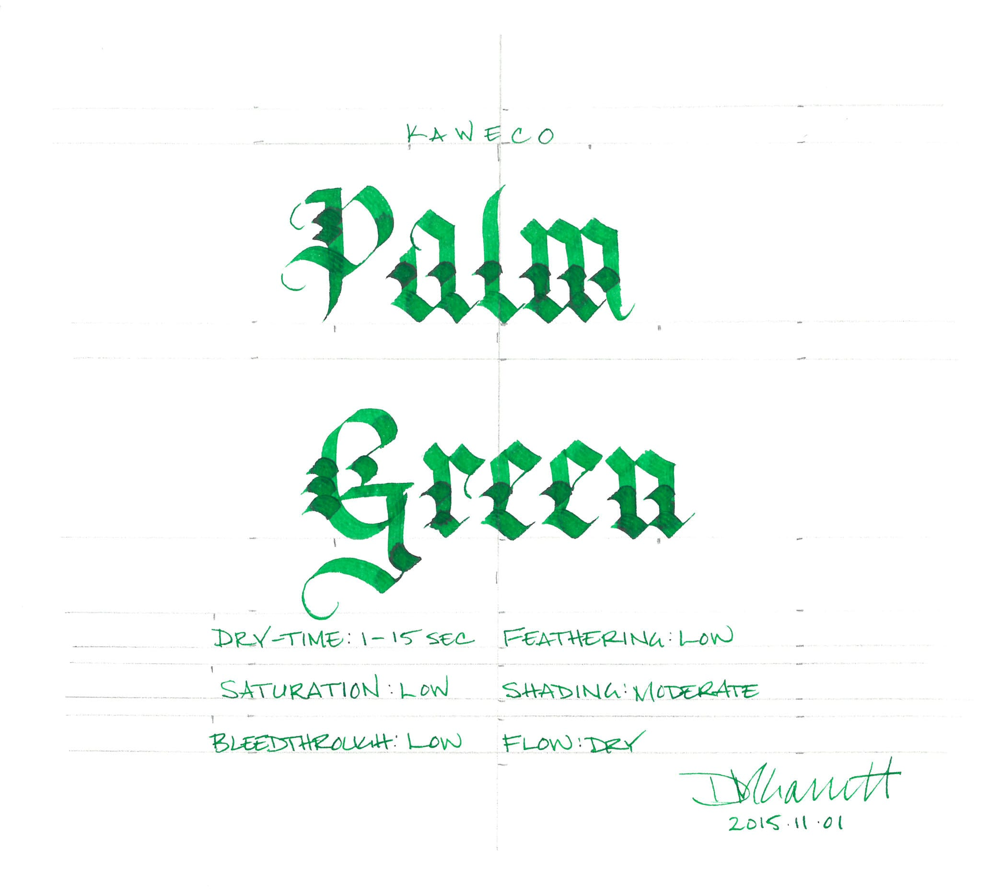
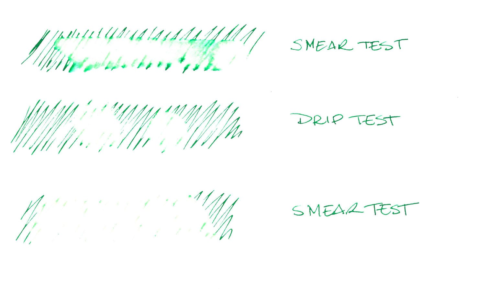
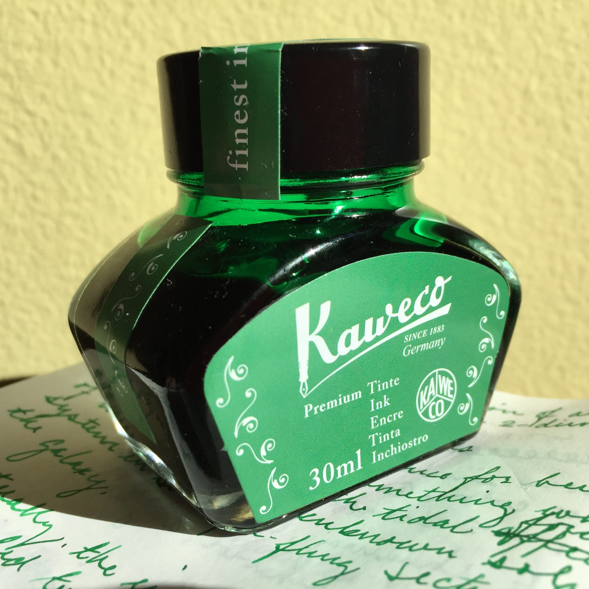

Kaweco Palm Green ink

As I mentioned in my review of [Diamine Meadow](/blog/2015/5/25/ink-review-diamine-meadow), I am not a connoisseur of green ink. I had a grand total of three specimens ([J. Herbin Vert Empire](/blog/2010/3/13/ink-review-j-herbin-vert-empire), [J. Herbin Vert Olive](/blog/2010/6/8/ink-review-j-herbin-vert-olive), and Iroshizuku Shinryoku) sitting on my self until I picked up Meadow. Vert Empire and Shinryoku were too dour to be of interest to me, and Vert Olive is so vibrant as to be all but unusable. Additionally, green isn’t a color that tends to hold my interest, especially when compared to blue, red, and violet, but Meadow opened my eyes to the versatility of green ink.

I mention this so that you know that I am neither damning with faint praise nor speaking from a position of scholarly authority when I say that Kaweco Palm Green is my favorite green ink after Diamine Meadow. It is a lovely forest green that has the best shading of any of the eight Kaweco colors, and which exhibits the excellent behavior characteristics of the line.

Palm Green behaves admirably across all paper types, exhibiting low levels of feathering and a narrow, crisp line even on cheap paper. This comes at a cost of a fairly dry flow, but it is not so severe as to be off-putting. It dries quickly across the board.

| Paper | Dry Time | Bleed Through | Show Through | Feathering |
| --- | --- | --- | --- | --- |
| Copier | 1 second | Low | Moderate | Low |
| Bagasse | 3 seconds | Moderate | Moderate | Low |
| Rhodia | 10 seconds | None | Low | None |
| Midori | 10 seconds | None | Low | None |
| Canson | 10 seconds | None | None | None |

Kaweco Palm Green water test

Kaweco Palm Green performed identically to all of the other Kaweco colors in the water resistance tests. It has little in the way of water resistance, turing into a green smudge on the smear test (where I run a wet finger across the page), easily lifting from the paper on the drip test (where I let several drops of water sit on the paper before blotting), and washing cleanly away on the incorrectly labeled soak test (where I run the page under a stream of water for half a minute).

I wouldn’t recommend using it in any application that requires water-resistance, like addressing an envelope or signing a check.

Kaweco Palm Green bottle

Kaweco ink comes in two forms: cartridges and 30ml glass bottles, which is the format I used during testing. The bottles themselves are pleasantly designed, and the labels accurately reflect the color of the ink inside them. I have no real complaints about the bottle, other than I had to tip it to the side slightly in order to create sufficient depth to fill my test pen properly.

Of the eight ink colors, Palm Green isn’t quite my favorite - that honor belongs to Caramel Brown, which I haven’t reviewed yet - but it is the one that has gone back into my in rotation more often than any of the other colors since I did my initial testing five months ago. If you need a great green ink that behaves very well, and are willing to put up with a relatively dry flow as a tradeoff, then I would recommend Kaweco Palm Green.

Kaweco Palm Green is available from many fine retailers, including:

- [Goulet Pens](http://www.gouletpens.com/kaweco-palm-green-30ml-bottled-fountain-pen-ink/p/KAW-10000676-777)
- [Jet Pens](http://www.jetpens.com/Kaweco-Ink-30-ml-Palm-Green/pd/11934)

Review notes: the handwritten portion of the review was created on 160 gsm, acid free, mixed media paper from Canson’s XL line. All lines, broad and thin, were made using a Pilot Parallel pen with a 3.8mm calligraphy nib.

A bottle of Kaweco Palm Green was generously provided by the fine folks at Kaweco for review.
