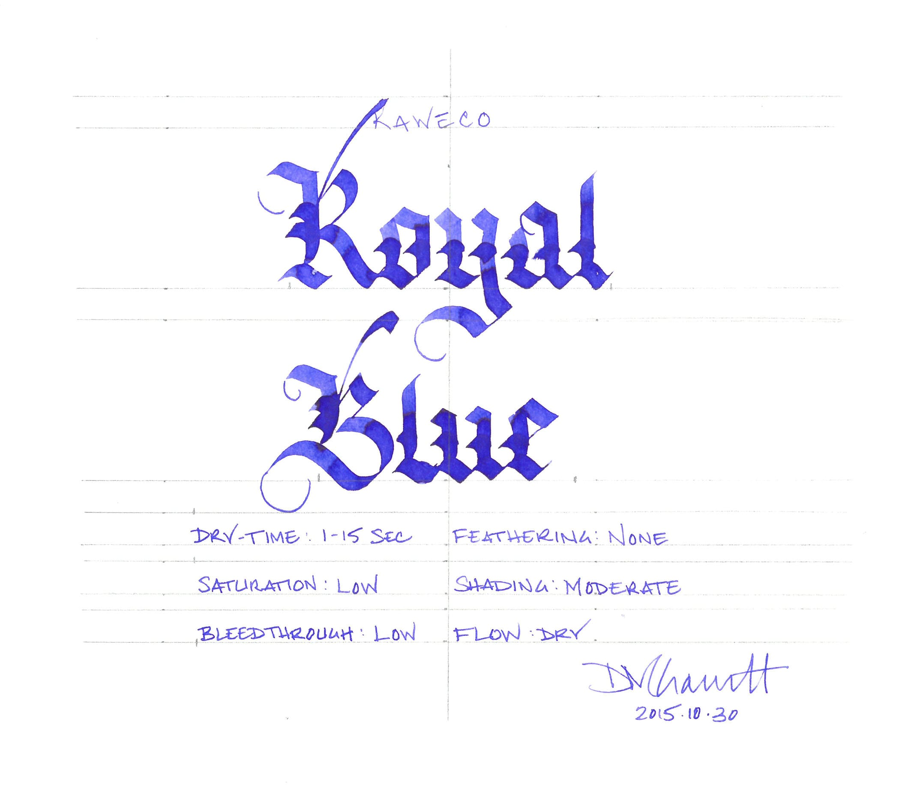
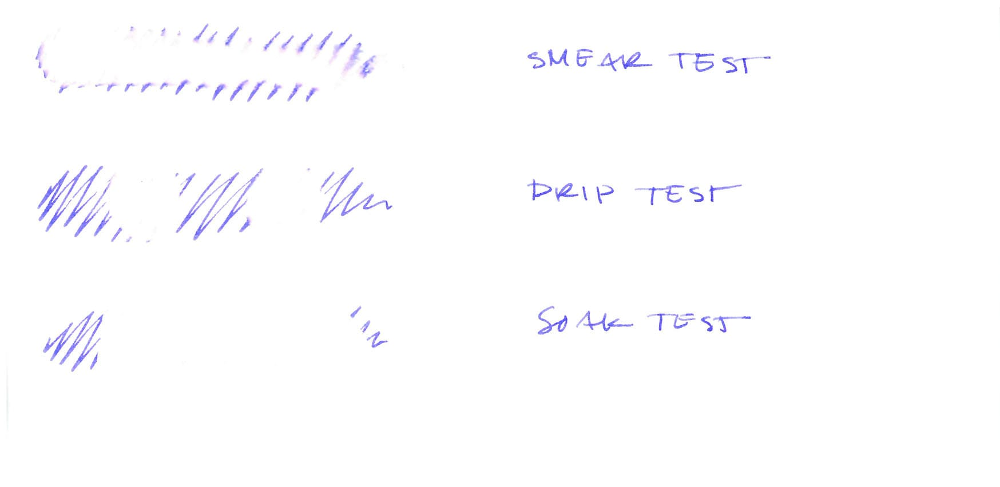
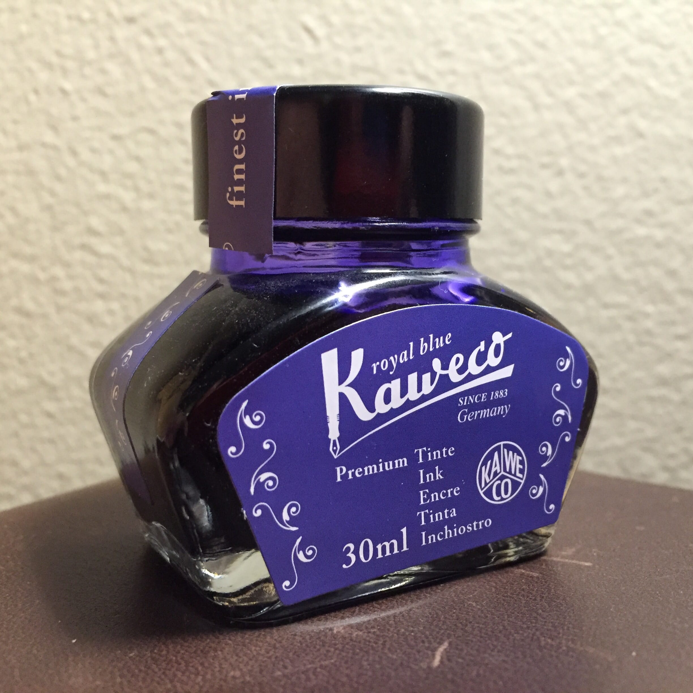

I began my review of the eight Kaweco ink colors with [Pearl Black](/blog/2015/10/28/ine-review-kaweco-pearl-black), though Royal Blue was the first bottle I actually opened. Any manufacturer's version of "ballpoint pen blue" is usually a safe bet - it's like trying the crème brûlée at a new restaurant, or the pale ale at a new brewery. It's a known quantity with minimal variables that provides an easy avenue for comparison.

In [my collection](/blog/2015/11/20/inkventory-2015), Kaweco Royal Blue is most similar to [Lamy Blue](/blog/2010/3/6/ink-review-lamy-blue), but with a more intense color. Like the other Kaweco colors, it has low saturation, moderate to low shading, and a very dry flow. It produces a thiner line than a wet-flowing ink like [Iroshizuku Asa-gao](/blog/2014/8/3/ink-review-iroshizuku-asagao) when used in the same pen. It behaves very well on cheap, absorbent paper, and dries relatively quickly on premium sized paper, which, as far as I can tell, was a deliberate choice on the part of whomever engineered the line.

| Paper | Dry Time | Bleed Through | Show Through | Feathering |
| --- | --- | --- | --- | --- |
| Copier | 1 second | Low | Moderate | Low |
| Bagasse | 3 seconds | Moderate | Moderate | Low |
| Rhodia | 10 seconds | None | Low | None |
| Midori | 15 seconds | None | Low | None |
| Canson | 10 seconds | None | None | None |

Royal Blue holds up to water the same way that the other Kaweco colors do: it doesn't. On the smear test, in which I wipe a wet finger across the page, the ink was wiped completely out, and readily lifted from the page when I blotted it. The same happened on the drip test, where I let a droplet of water sit on the page before blotting. The ink lifted completely away. You can see the same behavior on the soak test, where I hold the paper under running water for a few minutes - no ink remained.

If there is a silver lining, it's that I imagine, though I have not tested, that Royal Blue should clean up easily from other surfaces, like desktops and shirtsleeves. This is an "inside the envelope" ink, certainly not one you'd want to use on the outside.

Kaweco ink comes in two forms: cartridges and 30ml glass bottles, which is the format I used during testing. The bottles themselves are pleasantly designed, and the labels accurately reflect the color of the ink inside them. I have no real complaints about the bottle, other than I had to tip it to the side slightly in order to create sufficient depth to fill my test pen properly.

After evaluating all eight colors, I've concluded that Royal Blue is the best all-around color, especially if you prefer not-black. the other colors have their place, though, which you'll see in the coming weeks: Palm Green has the best shading and Caramel Brown has a lovely sepia-tone quality, for example. If you're looking for an all-around, ballpoint-blue ink to use in an office environment where cheap paper abounds, then Kaweco Royal Blue is a good bet.

Kaweco Royal Blue is available from:

- [Jet Pens](http://www.jetpens.com/Kaweco-Ink-30-ml-Royal-Blue/pd/11932)
- [Pen Chalet](https://www.penchalet.com/ink_refills/fountain_pen_ink/kaweco_bottle_fountain_pen_ink.html)

Review notes: the handwritten portion of the review was created on 160 gsm, acid free, mixed media paper from Canson’s XL line. The broad lines were made using a Pilot Parallel pen with a 3.8mm calligraphy nib. The fine lines were made using a Visconti Homo Sapiens fitted with an EF palladium nib.

A bottle of this ink was generously provided by Kaweco for review purposes.
