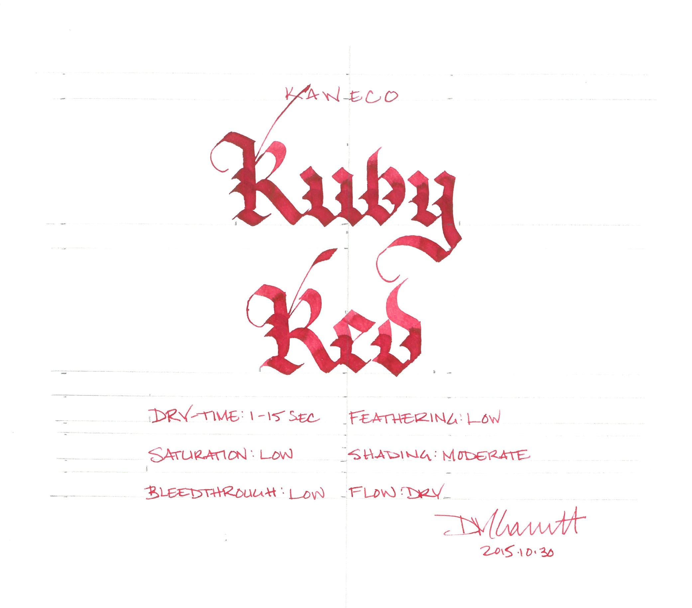
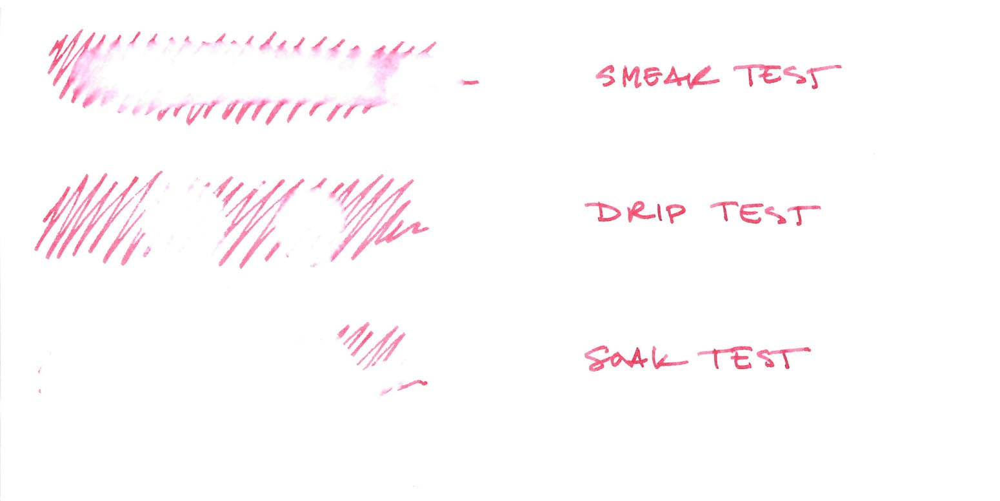
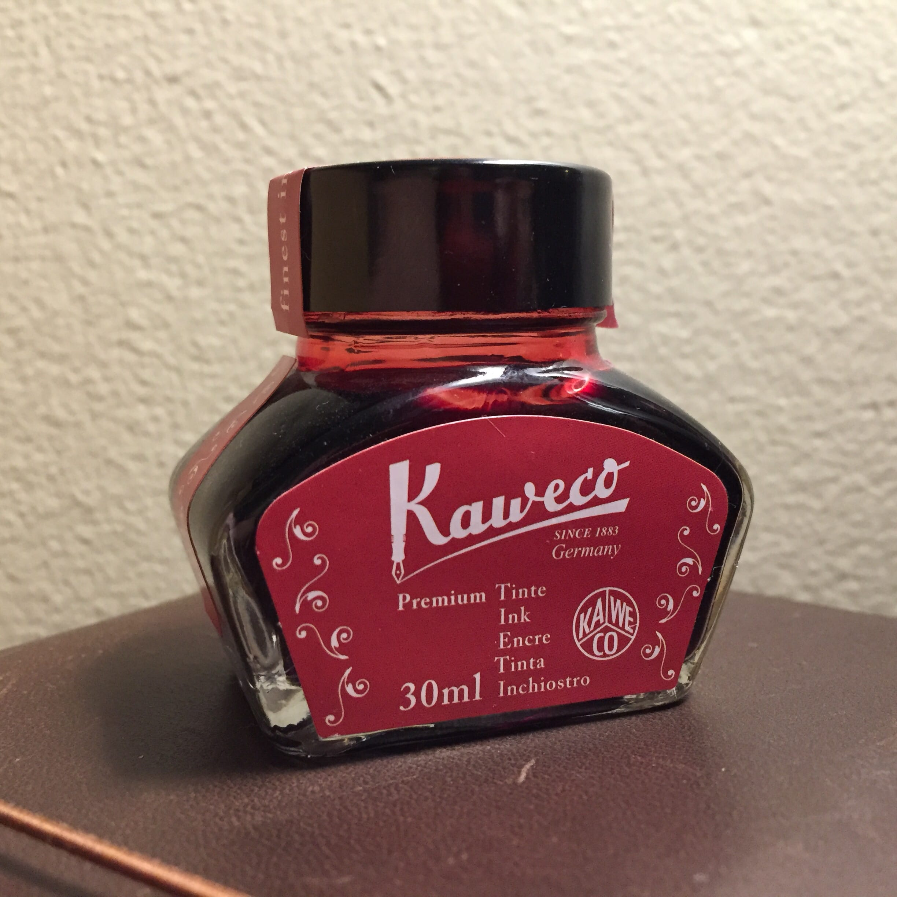

I'm a big fan of red ink. Red is my favorite color - I'm drawn to its vibrancy and dynamism. If the color red has a drawback, though, it is the quality that makes it so interesting: the high degree of contrast that makes it stand out from the crowd. In nature, red is an attention getting color, sending one of a number of messages depending on the organism in question: I am poisonous, I am ripe, I am dangerous, I am delicious. Unfortunately, all the extra stimulation that our brains must endure when dealing with the color can cause red ink to be fatiguing to read over a long period of time.

To find a regular spot in my ink rotation, then, a red ink's aesthetic qualities have to outweigh the burden of use. Some colors capture my imagination: [Diamine Red Dragon](/blog/2010/9/7/ink-review-diamine-red-dragon) is magical and [J. Herbin Rouge Hematite](/blog/2010/5/16/ink-review-j-herbin-1670) is spectacular while [Iroshizuki Momiji](/blog/2010/4/28/ink-review-iroshizuku-momiji) is sublime. Kaweco Ruby Red, though, is more prosaic: it's a pragmatic magenta red, and it makes no pretense about being more. It exhibits low to moderate levels of shading, depending on the width of the nib, and provides very high levels of contrast on white, off white, and cream colored paper.

As with the rest of the Kaweco line, Ruby Red is a dry ink that behaves well across all paper types, from the super-smooth Midori MD to the cheap, feather-prone, low-grade copier paper found in most offices.

| Paper | Dry Time | Bleed Through | Show Through | Feathering |
| --- | --- | --- | --- | --- |
| Copier | 1 second | Low | Moderate | Low |
| Bagasse | 3 seconds | Moderate | Moderate | Low |
| Rhodia | 10 seconds | None | Low | None |
| Midori | 15 seconds | None | Low | None |
| Canson | 10 seconds | None | None | None |

In the water test, Ruby Red showed no resistance at all. The smear test, in which I rub a wet finger across the page, resulted in a red smear that then lifted completely from the page when blotted. The drip test exhibited the same behavior: the ink lifted easily after a drop of water sat for a few seconds. The soak test, in which I run the paper under water, washed away the ink completely.

Each of the Kaweco colors behaves similarly with regard to water resistance: they have none. As long as you keep this in mind, it shouldn't dissuade you from using the ink - just make sure to limit your use to applications that don't require it.

Kaweco ink comes in two forms: cartridges and 30ml glass bottles, which is the format I used during testing. The bottles themselves are pleasantly designed, and the labels accurately reflect the color of the ink inside them. I have no real complaints about the bottle, other than I had to tip it to the side slightly in order to create sufficient depth to fill my test pen properly.

Ruby Red is a fine red ink - it's well behaved and moderately priced - but it fails to capture my imagination. I don't think it will find its way into my regular rotation for that reason. However, if you are in a position where you need a vibrant ink and you are stuck working with low-grade paper, it could be a very reasonable choice.

Kaweco Ruby Red is available from:

- [Goulet Pens](http://www.gouletpens.com/kaweco-ruby-red-30ml-bottled-fountain-pen-ink/p/KAW-10000678-791)
- [Jet Pens](http://www.jetpens.com/Kaweco-Ink-30-ml-Ruby-Red/pd/11937)

Review notes: the handwritten portion of the review was created on 160 gsm, acid free, mixed media paper from Canson’s XL line. All lines, broad and thin, were made using a Pilot Parallel pen with a 3.8mm calligraphy nib.

A bottle of this ink was generously provided by Kaweco for review purposes.
