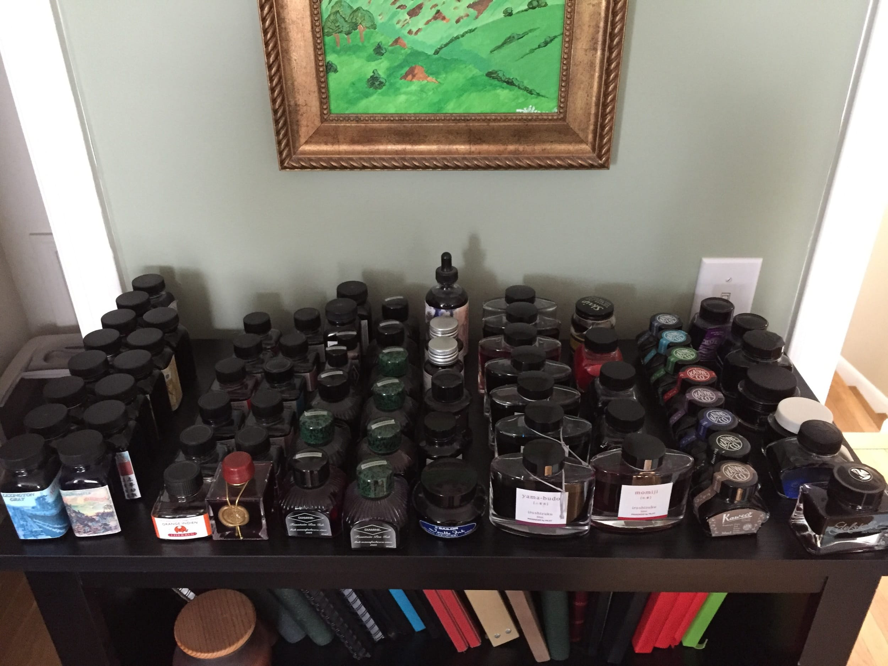

 [Three years ago](/blog/2012/1/27/inkventory-2012), I took stock of my ever-expanding ink collection. It feels like it's time to tackle that process again. Here is the full list of ink bottles that I own, most of which are pictured above:

**De Atrementis**

- [Aubergine](/blog/2012/4/27/ink-review-de-atramentis-aubergine)

**Diamine**

- [Blaze Orange](/blog/2015/6/27/ink-review-diamine-blaze-orange)
- [Damson](/blog/2012/1/15/ink-review-diamine-damson)
- [Imperial Purple](/blog/2010/10/18/ink-review-diamine-imperial-purple)
- Indigo
- [Jet Black](/blog/2010/11/2/ink-review-diamine-jet-black)
- [Meadow](/blog/2015/5/25/ink-review-diamine-meadow)
- [Midnight](/blog/2011/2/1/ink-review-diamine-midnight)
- [Monaco Red](/blog/2010/12/24/ink-review-diamine-monaco-red)
- [Oxblood](/blog/2010/9/14/ink-review-diamine-oxblood)
- [Red Dragon](/blog/2010/9/7/ink-review-diamine-red-dragon)
- [Registrar's Ink](/blog/2010/9/3/ink-review-diamine-registrars-ink)
- [Sepia](/blog/2010/12/7/ink-review-diamine-sepia)

**Everflo**

- [Blue Black](/blog/2011/1/11/ink-review-everflo-blue-black)
- Orchid

**J. Herbin**

- [Bleu Myosotis](/blog/2010/11/15/ink-review-j-herbin-bleu-myosotis)
- [Bleu Pervenche](/blog/2013/1/1/ink-review-j-herbin-bleu-pervenche)
- [Cafe des Iles](/blog/2010/3/22/ink-review-j-herbin-cafe-des-isles)
- Eclat de Saphire
- [Orange Indien](/blog/2010/5/29/ink-review-j-herbin-orange-indien)
- [Pousierre de Lune](/blog/2010/3/3/ink-review-j-herbin-poussiere-de-lune)

- [Rouge Caroubier](/blog/2010/8/18/ink-review-j-herbin-rouge-caroubier)
- [Rouge Opera](/blog/2013/6/16/ink-review-j-herbin-rouge-opera)
- [Terre de Feu](/blog/2011/1/3/ink-review-j-herbin-terre-de-feu)
- [Vert Empire](/blog/2010/3/13/ink-review-j-herbin-vert-empire)
- [Vert Olive](/blog/2010/6/8/ink-review-j-herbin-vert-olive)

**J. Herbin 1670**

- [Rouge Hematite](/blog/2010/5/16/ink-review-j-herbin-1670)

**Kaweco**

- Caramel Brown
- Midnight Blue
- Palm Green
- Paradise Blue
- [Pearl Black](/blog/2015/10/28/ine-review-kaweco-pearl-black)
- Royal Blue
- Ruby Red
- Summer Purple

**Lamy**

- [Blue](/blog/2010/3/6/ink-review-lamy-blue)

**Noodler's**

- Air Corp Blue Black
- Antietam
- [Baystate Blue](/blog/2011/2/22/ink-review-noodlers-baystate-blue)
- [Black](/blog/2012/3/24/ink-review-noodlers-black-revisited)
- [Black Swan in Australian Roses](/blog/2010/11/30/ink-review-noodlers-black-swan-in-australian-roses)
- [Black Swan in English Roses](/blog/2011/3/29/ink-review-noodlers-black-swan-in-english-roses)
- [#41 Brown](/blog/2012/5/20/ink-review-noodlers-41-brown)

- [Dragon's Napalm](/blog/2011/4/5/ink-review-noodlers-dragons-napalm)
- [Kung Te-Cheng](/blog/2010/7/25/ink-review-noodlers-kung-te-cheng)
- [Lexington Gray](/blog/2015/9/23/ink-review-noodlers-lexington-gray)

- [Liberty's Elysium](/blog/2012/7/8/ink-review-noodlers-libertys-elysium)
- Massachusetts 54th Blue Black
- [Navaho Turquoise](/blog/2010/3/28/ink-review-noodlers-navaho-turquoise)
- [Shah's Rose](/blog/2010/5/10/ink-review-noodlers-shahs-rose)
- Tiananmen

- [Widowmaker](/blog/2010/8/3/ink-review-noodlers-widowmaker)

**Parker**

- [Quink Blue Black](/blog/2011/3/22/ink-review-parker-quink-blue-black)

**Pelikan**

- [Blue Black](/blog/2010/9/21/ink-review-pelikan-blue-black)

**Pelikan Edelstein**

- [Ruby](/blog/2010/10/9/ink-review-pelikan-edelstein-ruby)

**Pilot Iroshizuku**

- [Asa-gao](/blog/2014/8/3/ink-review-iroshizuku-asagao)
- [Kiri-same](/blog/2010/3/1/ink-review-iroshizuku-kiri-same)
- [Kon-peki](/blog/2010/3/18/ink-review-iroshizuku-kon-peki)
- [Momiji](/blog/2010/4/28/ink-review-iroshizuku-momiji)
- Shin-ryoku
- [Tsukushi](/blog/2014/10/1/ink-review-iroshizuku-tsukushi)
- [Yama-budo](/blog/2010/4/10/ink-review-iroshizuku-yama-budo)
- [Yu-yake](/blog/2010/2/28/ink-review-iroshizuku-yu-yake)

**Platinum Pigmented**

- [Carbon Black](/blog/2011/3/8/ink-review-platinum-carbon-black)
- Blue
- [Rose Red](/blog/2011/2/8/ink-review-platinum-pigment-rose-red)

**Private Reserve**

- Chocolate
- Orange Crush

**Roher & Klingner**

- [Salix](/blog/2012/4/9/ink-review-rohrer-and-klingner-salix)
- [Scabiosa](/blog/2012/2/16/ink-review-rohrer-and-klingner-scabiosa)

**Sailor**

- [Jentle Blue Black](/blog/2011/5/3/ink-review-sailor-jentle-blue-black)

**Waterman**

- Florida (Serenity) Blue
- Purple
