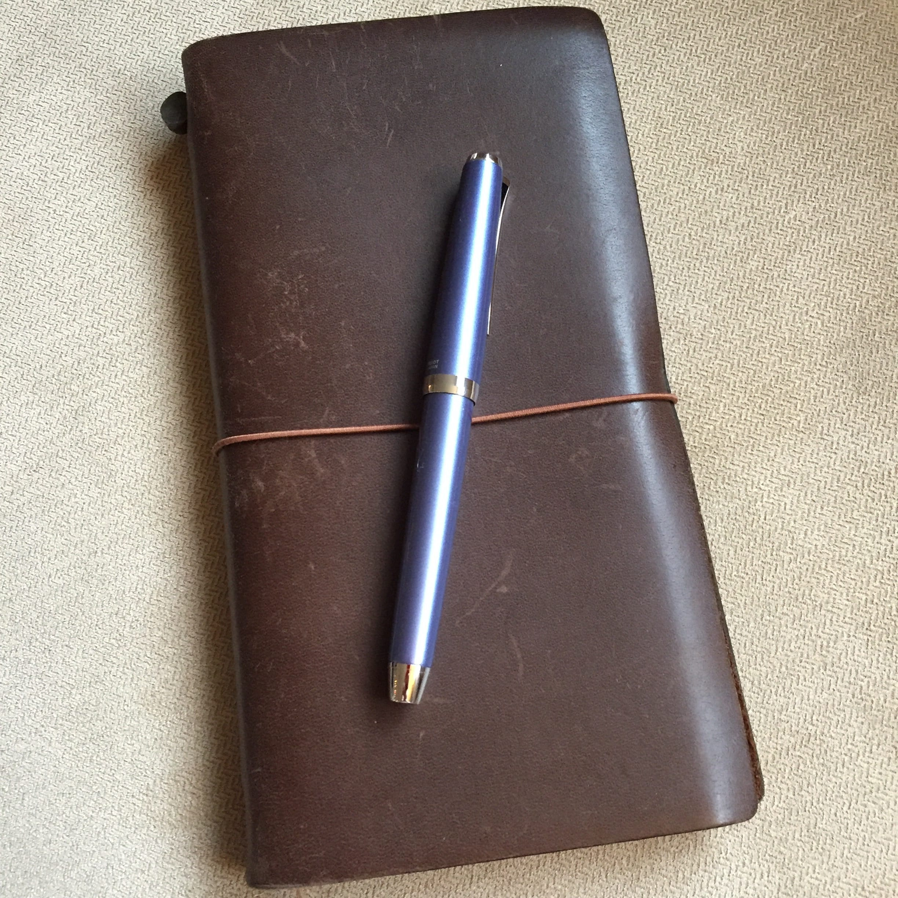

The Traveler’s Notebook is a revered product in the pen and paper community. All [the](http://scription.typepad.com/blog/) [cool](http://www.leighreyes.com/) [kids](http://www.penaddict.com/blog/2015/3/2/midori-travelers-notebook-passport-review) have one, but for a long time, I wondered what the fuss was about; I was perfectly happy with my Midori MD notebooks and Rhoda notepads. Then, about six months ago, as I was getting to the end of a notebook and deciding what to buy next, I had a bit of an existential crisis. I realized that, each time I finished a notebook, I would put it on the shelf and start over. There was no sense of continuity from one notebook to the next - no set of memories to carry with me. One of the great things about fountain pens is that they aren’t disposable, generally speaking - they become a familiar tool that becomes part of your life, and I wanted the same from a notebook.

The logical choice was the Traveler’s Notebook, so I took the plunge. I looked online, blinked a couple of times at the UD$60 price tag, and then placed the order. The TN comes in two sizes: Regular and Passport, and two colors: brown and black. A camel version will be joining the lineup later this year, and Midori also occasionally releases special editions in different colors - there was a blue version available in 2015. I settled on the Regular brown version.

When you buy a Traveler’s Notebook and open the box, you might be slightly underwhelmed. _I spent US$60 for a piece of leather and an elastic band_, you might think? It's a very nice piece of leather, but $60 nice? Then, though, you start using it and it starts to develop character, and you start ordering refills and accessories to make that notebook _your_ notebook, and you realize that you haven't spent $60 on a piece of leather. No - you bought an extensible tool that became an indespensible part of your life.

The key to the Traveler’s Notebook is its refillable and customizable nature. Out of the box, it is a blank slate: outside, it’s a piece of rough-cut leather, an elastic band, and a tin clasp. Inside, it is filled with a slim, blank notebook made with Midori MD paper. The only indication that the notebook is made by Midori is a small embossed logo on the back of the journal.

As I mentioned, it’s a very nice blank slate, but the lack of adornment or features is one of the reasons that it provoked the “Huh...” reaction that I had. That design is intentional though - it is intended to be customized. The elastic band can be replaced with a band of different color or threaded with charms, baubles, and beads. Dozens of accessories can be added: pen holders, brass clips, pocket stickers, and zippered cases among them; and almost as many different types of refills are available: lined, unlined, grid, diary, sketchbook, and on and on.

Depending on your sensibilities, the number of options can be overwhelming or empowering. After spending a few months with mine, I’ve found it to be the latter - I love my Traveler’s Notebook, and understand why it has the following that it does.

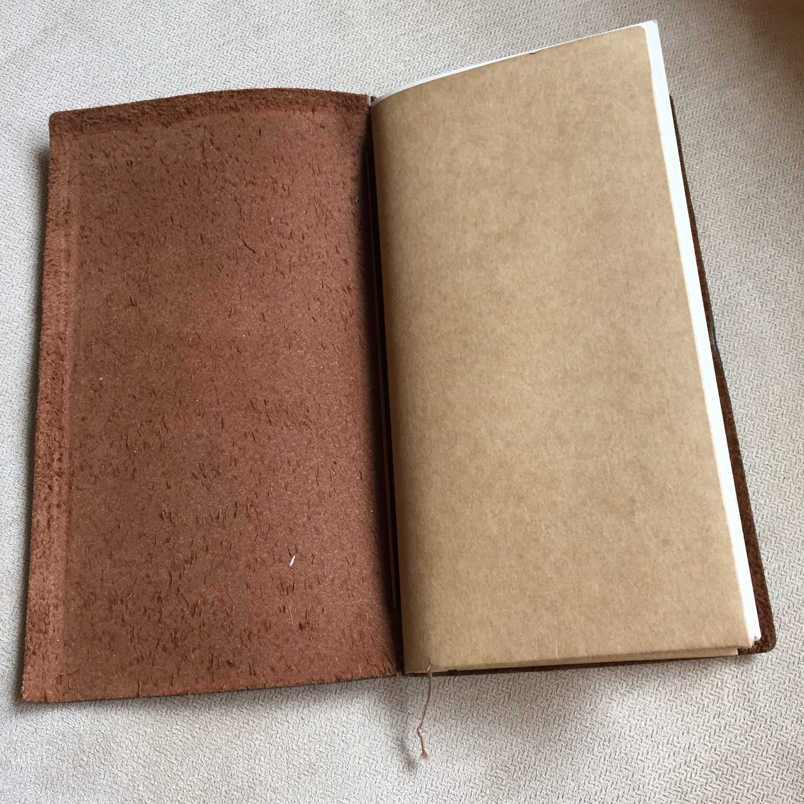

Inside front cover.

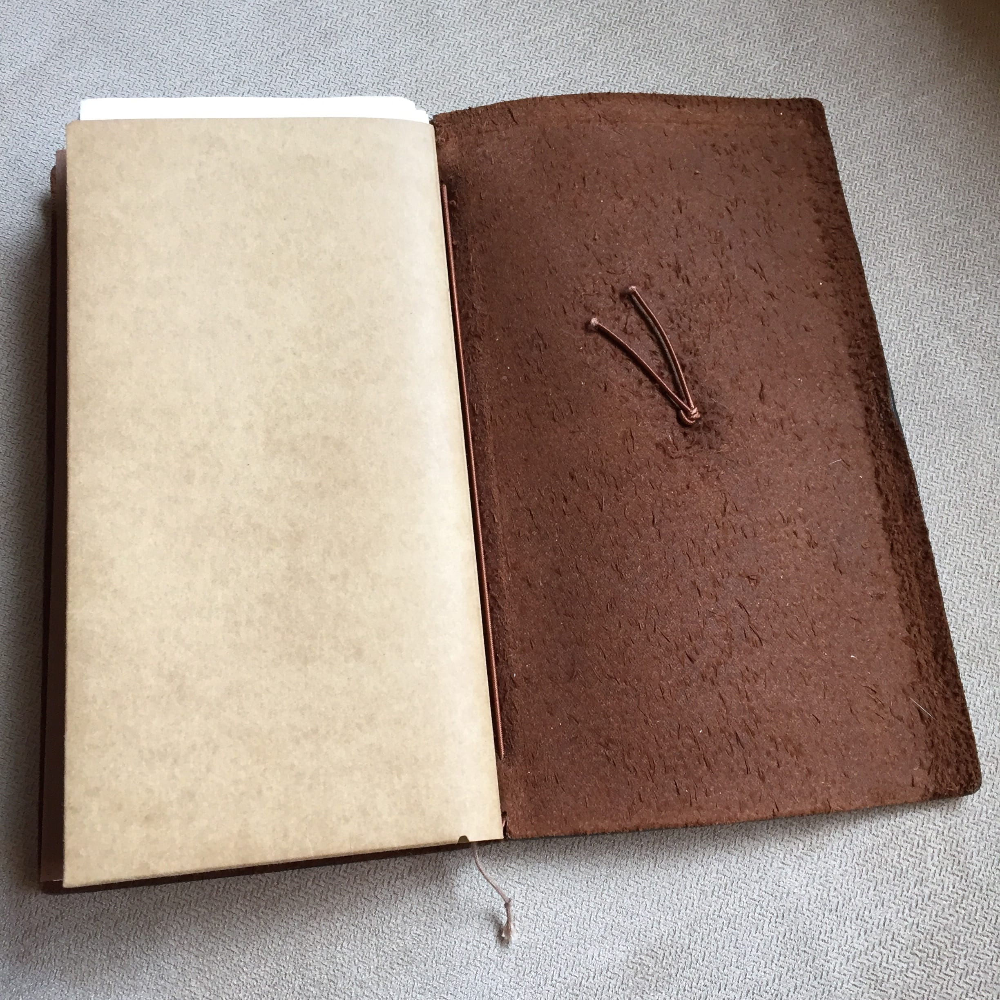

Inside back cover - you can see that the elastic band that stretches around the middle is secured inside the back.

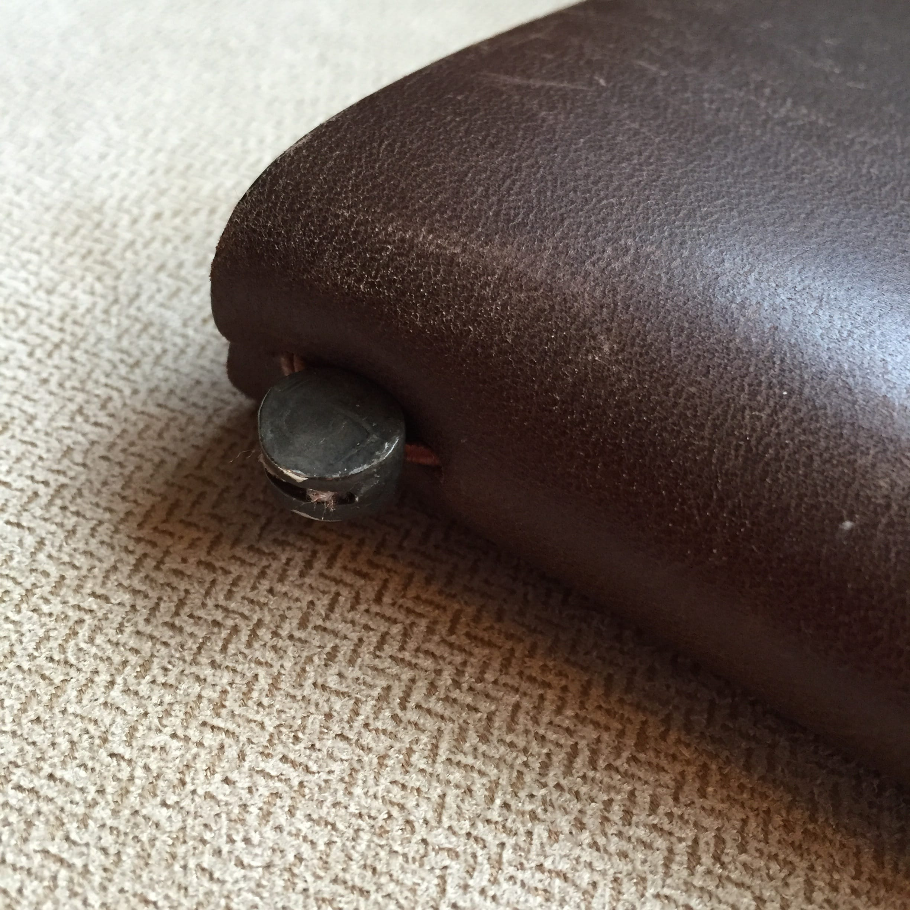

The tin clasp lies at the top of the spine. It fastens the elastic band that holds the refills inside the notebook as well as securing the bookmark.

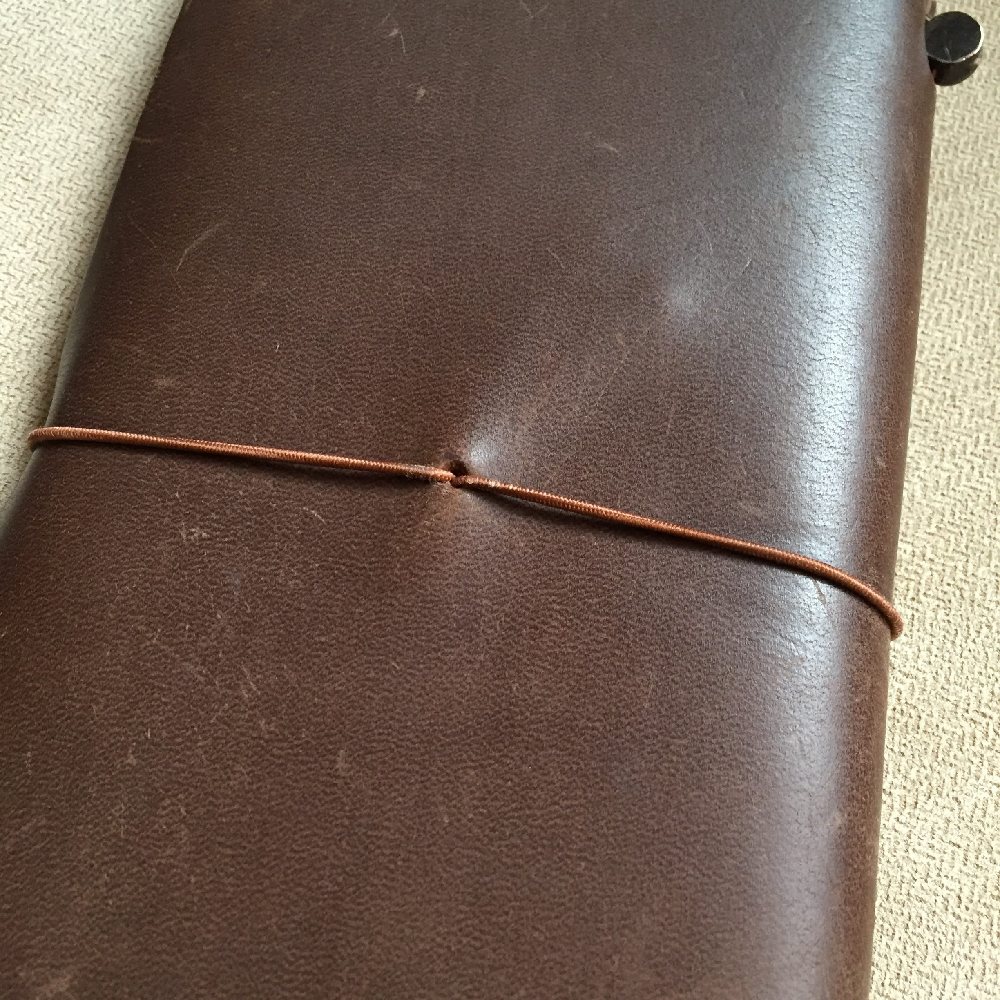

The back of the notebook. Here you can see the elastic band that holds the notebook closed emerging from the center of the back cover.

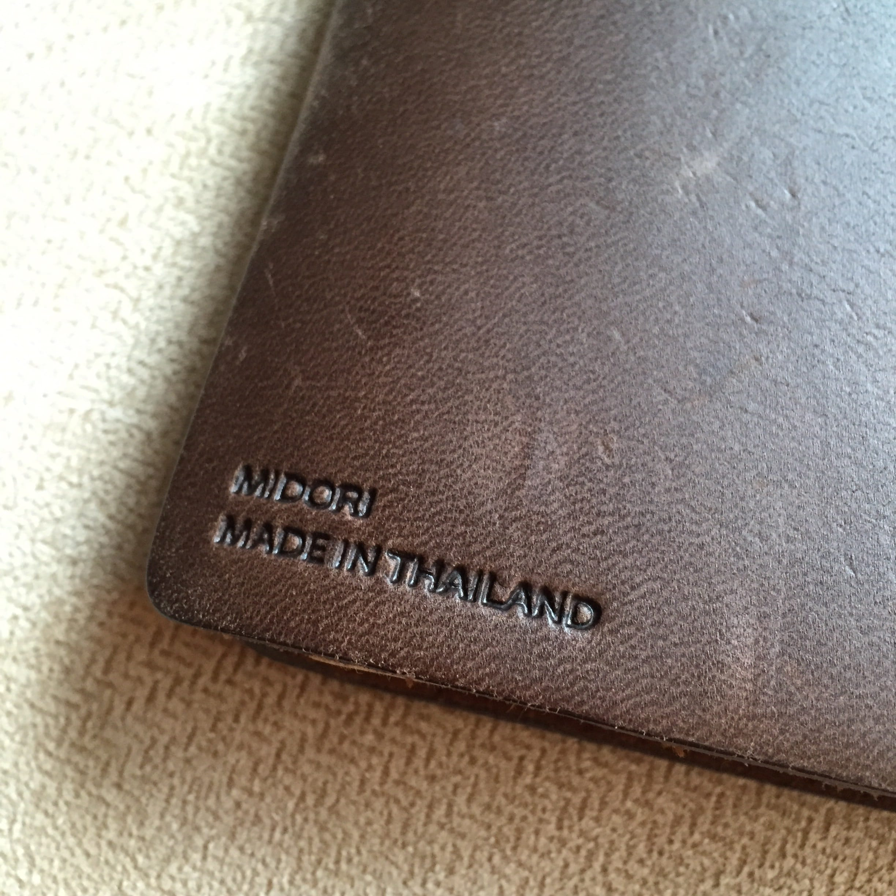

The only trace of branding on the notebook is this very modest embossment on the lower left corner of the back cover.

An additional aspect of customization for the Traveler’s Notebook is the ability to add more than one refill at the same time - it can comfortably hold up to three with the addition of a rubber band accessory. If you’re a note-taker and a visual artist, you might choose to have both a lined notebook and a sketchbook. Or you might have a grid notebook, some craft paper, and a planner. In my case, I have the 013 Light Paper Notebook - a version of the 003 Blank Notebook, but with thinner paper and more pages - for note taking and doodling, and the 005 Diary, for my daily journaling.

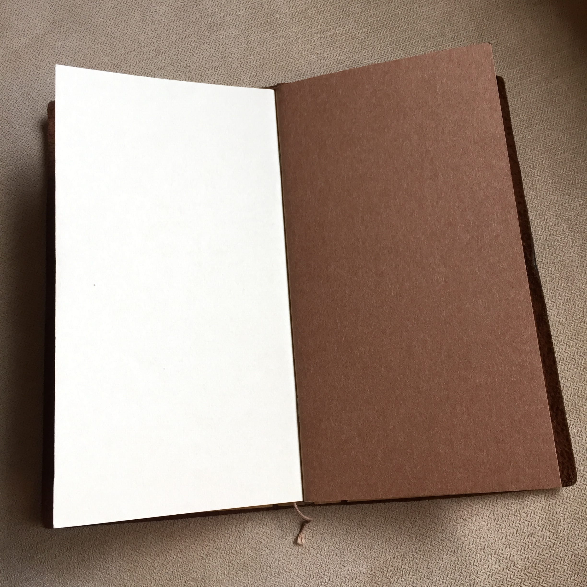

Two refills side by side. The 013 Light Paper Notebook is on the left and the 005 Diary is on the right.

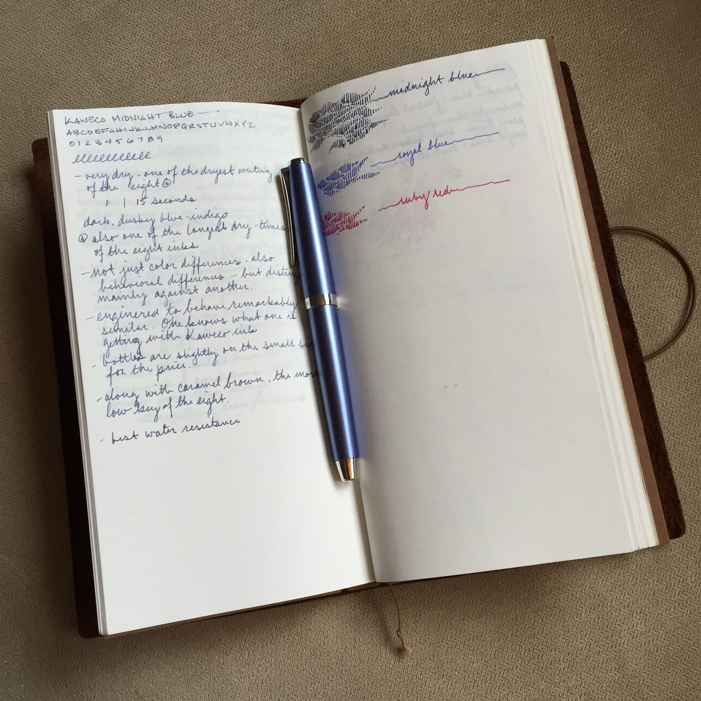

A closer look at the 013 Light Paper notebook.

Beyond being a notebook, the Traveler’s Notebook can also function as an organizing solution. One of my first purchases was the 020 Kraft File Folder. The front pocket has been perfect for keeping receipts from business trips - it is called the Traveler's Notebook for a reason - and the back pocket holds sheets of each of the types of paper I use for ink reviews so that I always have them handy.

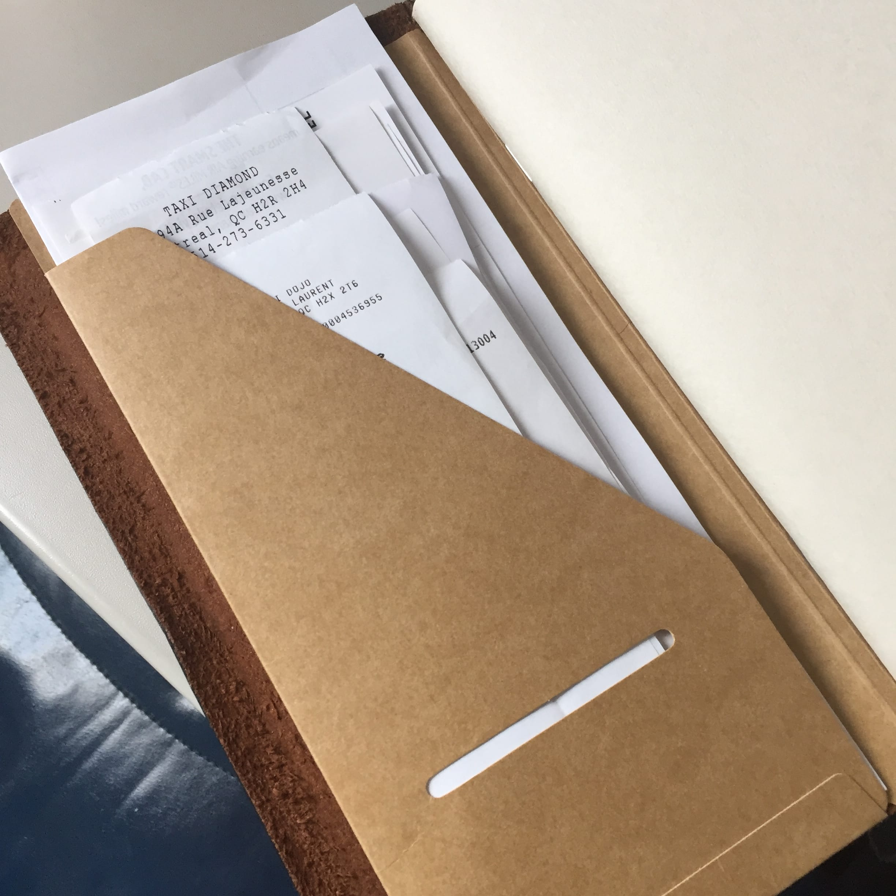

The inside front pocket of the 020 Kraft File Folder stuffed receipts. This photo was taken mid-flight.

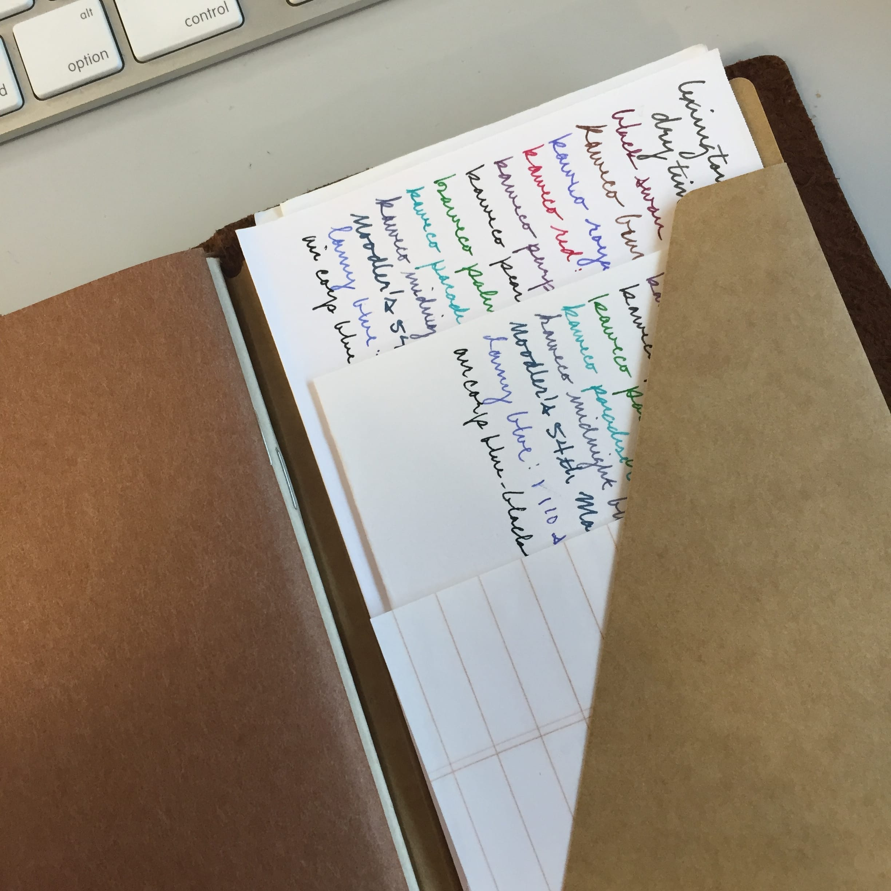

The back of the 020 Kraft File Folder with my paper samples for testing ink.

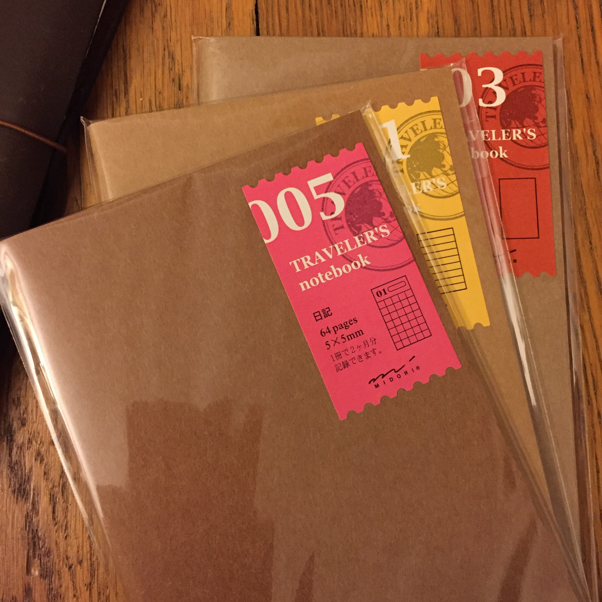

A sample of the many available refills.

Once you begin exploring, you'll find a range of refills and accessories manufactured by Midori, but you'll also find them manufactured by third parties. Beyond accessories, though, you can even find the notebook itself manufactured by others in a wide range of colors and materials. Leather, vinyl, bright colors, patterns, even two-toned covers are available. They may have exactly the same size, shape, and set of features, or they be wider, taller, thicker, and come with two or three elastic bands to allow you to carry more refills at once. One could conceivably end up with a Traveler’s Notebook manufactured entirely by third parties, without a single component manufactured by Midori.

One other potential point of confusion is that I am writing this review in the midst of Midori rebranding itself as “Traveler’s Company,” so you may see the Traveler’s Notebook referred to as manufactured by either of those two company names depending on when and where you’re shopping.

The Midori (Traveler’s Company) Traveler's Notebook, refills, and accessories are available from many fine retailers, including:

- [Goulet Pens](http://www.gouletpens.com/tn13715006/p/TN13715006)
- [Jet Pens](http://www.jetpens.com/Midori-Traveler-s-Notebook-Starter-Kit-Regular-Size-Brown-Leather/pd/13623)
