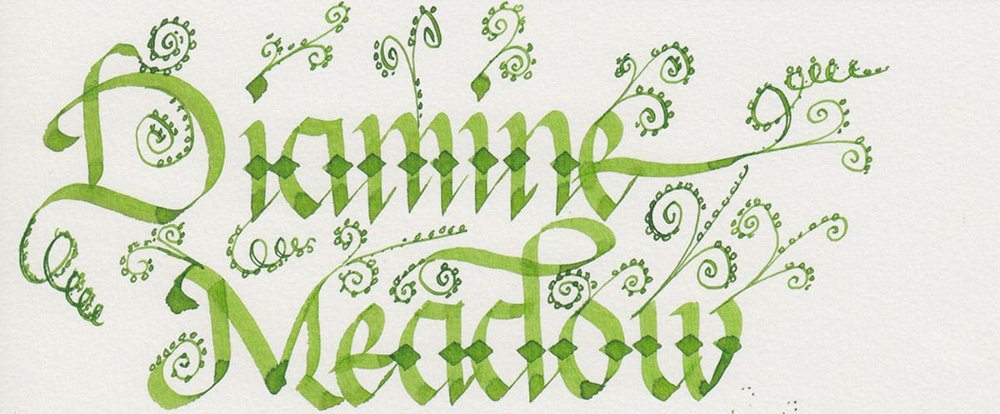
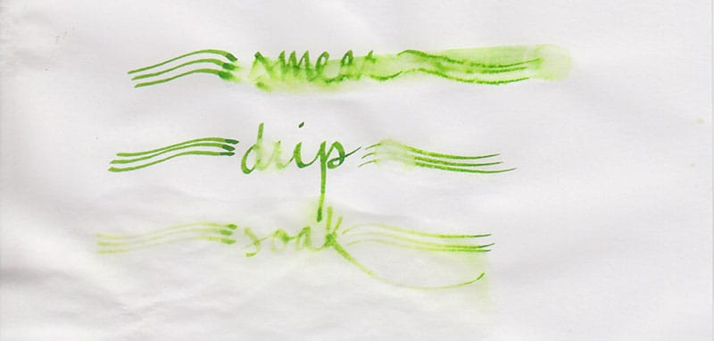

I’m not a connoisseur of green ink. I’ve reviewed J. Herbin’s [Vert Olive](/blog/2010/6/8/ink-review-j-herbin-vert-olive) and [Vert Empire](/blog/2010/3/13/ink-review-j-herbin-vert-empire), and I have Iroshizuku Shinryoku sitting on my shelf, but none of them have spent much time in my pens. Over the years, I’ve reviewed plenty of red and blue ink, and I love a good purple, but green isn’t a color that captured my imagination – until I tried Diamine Meadow.

There’s no mystery in the inspiration behind the name of the ink – no foreign (to English speakers) language to parse or obscure tidbit to research – only the verdant, vibrant, green of an English meadow. The ink is a lovely, moderately saturated yellow-green that exhibits a very high degree of shading. Like most Diamine ink, it is neither especially dry nor especially wet. It is pleasant to write with, but doesn’t go out of its way to make the pen glide across the page.

In my experience, Diamine ink performs consistently across the different colors of the line: it feathers on absorbent, un-sized paper, and it behaves admirably on coated, ink-resistant paper. Meadow behaved as expected on the five paper types I used to test it: cheap, office copier paper; Staples Bagasse notepad; Rhodia Bloc pad; Midori MD notebook; and Canson XL Mix Media notebook.

| Paper | Dry Time | Bleed-Through | Show-Through | Feathering |
| --- | --- | --- | --- | --- |
| Copier | 1 second | Yes | Medium | Moderate |
| Bagasse | 3 seconds | Yes | Medium | Moderate |
| Rhodia | 8 seconds | No | Low | None |
| Midori | 15 seconds | No | Low | None |
| Canson | 20 seconds | No | None | None |

While an actual meadow is invigorated by a healthy rain, growing bolder and more verdant as a result, Diamine Meadow is affected in precisely the opposite fashion. The smear test, in which I run a wet finger over the paper, produced a lovely yellow-green smudge, obliterating the lines on the page. In the drop test, in which I leave water on the paper for 10 seconds before blotting it up, the ink lifted easily from the page, leaving a ghostly haze behind.

The soak test, in which I run water over the paper in an attempt to wash the ink away, completely obliterated my writing; only a hint of color remained. In fact, I cut the test short for fear of washing the ink away entirely.

Diamine ink is available in 30ml plastic and an 80ml glass bottles, both of which are utilitarian and slightly boring in appearance. The 30ml plastic bottle has a neck that is very small in diameter, and I found that some of my larger pens would not fit all the way in, which made getting to the ink a bit of a challenge. Though you may wish to go with the smaller volume to try out a new color, my recommendation would be to go for the larger bottle due to its superior usability.

Diamine Meadow is gorgeous and I’ve had a fantastic time using it. It looks phenomenal flowing from an extra-fine nib, a flex nib, and a super-wide calligraphy pen. It’s a tremendous value for the cost – 80ml for about $15 – which is good, because the shading that it displays seems to compel serious amounts doodling.

Diamine Meadow is available from multiple sources, including:

- [Jet Pens](http://www.jetpens.com/Diamine-Fountain-Pen-Ink-80-ml-Meadow-Green/pd/8766)
- [Goulet Pens](http://www.gouletpens.com/d7083/p/D7083)

Review notes: the handwritten portion of the review was created on 160 gsm, acid free, mixed media paper from the Canson XL line. The broad lines were made using a Pilot Parallel pen with a 3.8mm calligraphy nib. The fine lines were created using a Noodler’s Konrad fitted with a steel flex nib.
