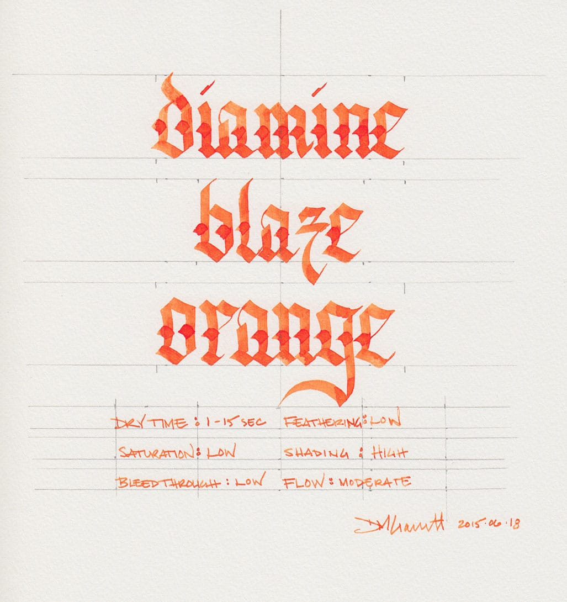
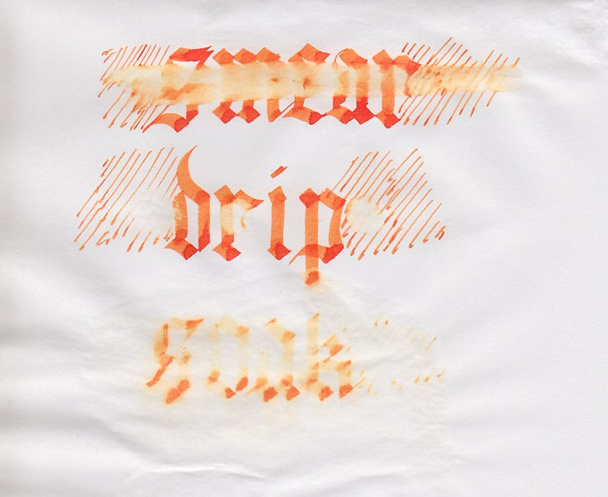
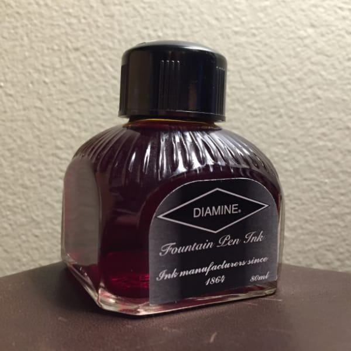

Blaze orange is well known to Americans as the color of construction barrels, traffic cones, and hunting caps. It’s a color designed to provide significant contrast to the environment – critical when dodging traffic during rush hour on a busy highway or when creeping through the woods with dozens of other hunters, all of whom have high-powered rifles in hand. In those contexts, the color is aggressively monotone, obnoxious, and prosaic, but when embodied in ink form by Diamine, it becomes delightfully dynamic, engaging, and lyrical.

Its most laudable characteristic is its extremely high degree of shading, which is evident even in fine nib pens. It creates the impression of a flickering flame that dances directly off the page. My one quibble with the ink is that it is low in saturation, which, combined with the color, makes it hard to read on cream-colored paper. It looks good, though, on off-white paper and really comes to life on bright-white paper.

Blaze Orange is generally pleasant to write with. Like most Diamine ink, it is neither especially dry nor especially wet. It writes very easily on fountain pen-friendly paper like Midori, but doesn’t do much to make paper with a bit of tooth feel smooth.

In my experience, Diamine ink performs consistently across the different colors of the line: it feathers a bit on absorbent, un-sized paper, and it behaves admirably on coated, ink-resistant paper. Blaze Orange behaved as expected on the five paper types I used to test it: cheap, office copier paper; Staples Bagasse notepad; Rhodia Bloc pad; Midori MD notebook; and Canson XL Mix Media notebook.

| Paper | Dry Time | Bleed-Through | Show-Through | Feathering |
| --- | --- | --- | --- | --- |
| Copier | 1 second | Yes | Medium | Low |
| Bagasse | 3 seconds | Yes | Medium | Low |
| Rhodia | 15 seconds | No | Low | None |
| Midori | 10 seconds | No | Low | None |
| Canson | 15 seconds | No | None | None |

Blaze Orange exhibits very little in the way of water resistance. When I ran a wet finger across the page for the the smear test, I left a giant orange smudge behind. In the drip test, where I let a drop of water soak on the paper before blotting it up, the ink fared no better – the affected ink lifted cleanly from the page, leaving only a soft, orange haze behind. During the soak test, in which I ran the page under a stream of water for 30 seconds, the ink almost completely washed away, fading to a ghost of its original self. This is not an ink that one should use to address an envelope or anything else that might be exposed to the elements.

Diamine ink is available in 30ml plastic and an 80ml glass bottles, both of which are utilitarian and slightly boring in appearance. The 30ml plastic bottle has a neck that is very small in diameter, and I found that some of my larger pens would not fit all the way in, which made getting to the ink a bit of a challenge. Though you may wish to go with the smaller volume to try out a new color, my recommendation would be to go for the larger bottle due to its superior usability.

Blaze Orange isn’t likely to be an everyday ink for most people, but it is a pretty amazing one. I highly recommend it if you’re the kind of fountain pen user who keeps several pens inked at once, or if you just happen to be in a vibrant state of mind.

Diamine Blaze Orange is available from multiple sources, including:

- Jet Pens - [http://www.jetpens.com/Diamine-Fountain-Pen-Ink-80-ml-Blaze-Orange/pd/7725](http://www.jetpens.com/Diamine-Fountain-Pen-Ink-80-ml-Blaze-Orange/pd/7725)
- Goulet Pens - [http://www.gouletpens.com/diamine-blaze-orange-80ml-bottled-fountain-pen-ink/p/D7035](http://www.gouletpens.com/diamine-blaze-orange-80ml-bottled-fountain-pen-ink/p/D7035)

Review notes: the handwritten portion of the review was created on 160 gsm, acid free, mixed media paper from the Canson XL line. The broad lines were made using a Pilot Parallel pen with a 3.8mm calligraphy nib. The fine lines were created using a [Visconti Homo Sapiens](/blog/2011/11/20/pen-review-visconti-homo-sapiens?rq=homo%20sapiens) fitted with an EF palladium nib.
