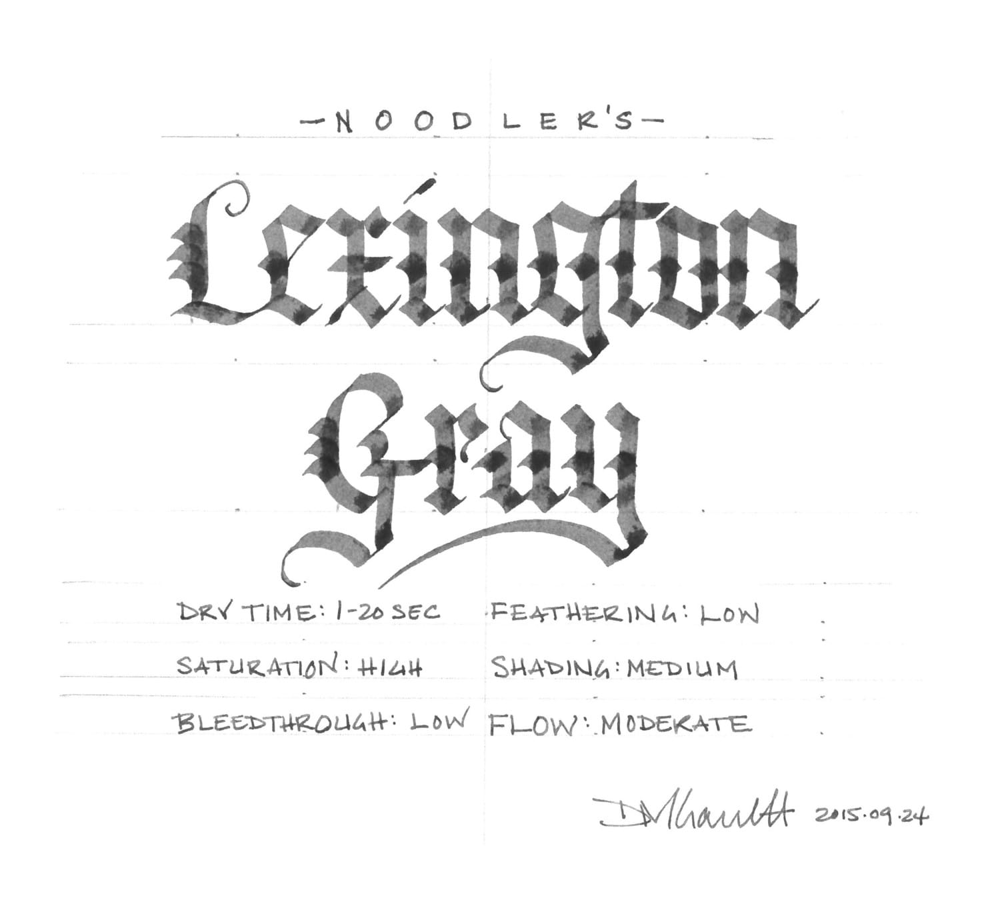
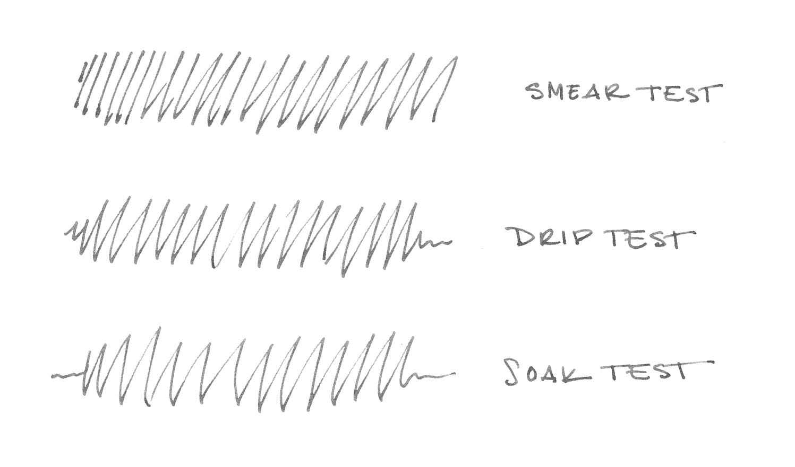
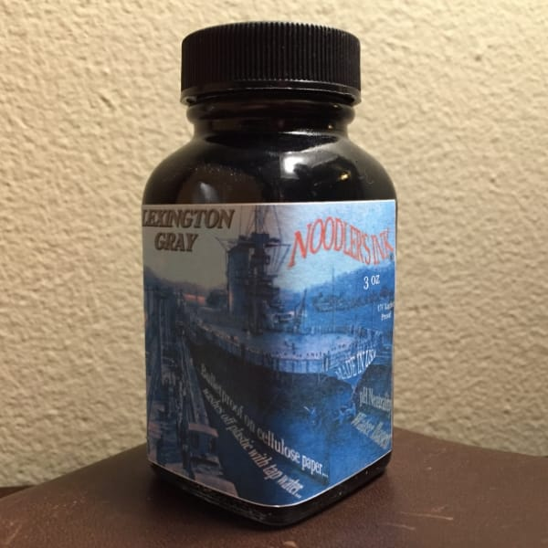

The USS Lexington is the oldest surviving aircraft carrier in the world. Commissioned in 1943, it saw extensive service as part of the Pacific fleet during WWII, where it developed a reputation for being impossible to sink - so much so that Japanese navy began referring to it as a “ghost” ship. This reputation, coupled with it’s blue camouflage scheme, earned the ship the moniker “The Blue Ghost.”

Since then, the Lexington has had a long career, acting first as an attack carrier, then as an anti-submarine carrier, and finally as a training carrier. It was finally decommissioned in 1991 and now lives as a museum ship in Corpus Christi, Texas, where it was designated a National Historic Landmark. If you’re going to pick a ship to name a waterproof, battleship gray ink after, the Lexington is a pretty great choice.

“Battleship gray" was named for the particular shade of gray paint used to rustproof steel battleships - a practice that began in the Royal Navy. The paint gets its color from micaceous iron oxide, a sparkly iron ore comprised of millions of tiny rustproof flakes. Curiously, the same iron oxide was first mined to produce “pounce" - the sandy power used during the 18th and 19th centuries to help quickly dry writing ink. Fortunately, you won’t need any pounce to deal with Lexington Gray, as it’s a very well-behaved ink.

It exhibits a surprising amount of shading for an ink with such a high degree of saturation. It’s not a high-shading ink, but there’s enough variation to make things interesting, even in a fine-nib pen. It’s easy to read on a variety of paper colors and types, from white to cream to yellow post-it notes.

It is smooth-writing ink, though the flow is slightly on the dry side. Overall, it’s easy to write with across most types of paper. It also behaves quite well on all of the paper types I tested. Feathering was low across the board, and dry times were will within expectations for the different paper types I tested: cheap, office copier paper; Staples bagasse notepad; Rhoda Bloc pad; Midori MD notebook; and Canson XL Mix Media notebook.

| Paper | Dry Time | Bleed Through | Show Through | Feathering |
| --- | --- | --- | --- | --- |
| Copier | 1 second | Moderate | Moderate | Low |
| Bagasse | 5 seconds | Moderate | High | Moderate |
| Rhodia | 10 seconds | Low | Moderate | None |
| Midori | 15 seconds | None | Low | None |
| Canson | 20 seconds | None | None | None |

Lexington Gray is advertised as "bulletproof" - Noodler's term of art for ink that resists removal from that paper, once dry. As you can see by the water test, the description is entirely accurate; the ink isn't going anywhere. Once again, the Lexington lives up to its reputation as unsinkable. This is one of the most impressive water tests I've done. If I didn't tell you that the scan above was from _after_ the water test, you'd never suspect it.

I do three types of tests to evaluate an ink's water resistance. In this case, the first test was the smear test, in which I ran a wet finger across the page. The ink didn't budge. Second, I performed the drip test, in which I placed several droplets of water on the page and let them soak for a few seconds before blotting them up. The ink looked at me and laughed. Finally, I ran the paper under a stream of water for thirty seconds in a process that I call a soak test. The ink just shook its head and said, "Hey buddy. I ain't going nowhere, nohow."

One other item worth noting is that Lexington Gray is also advertised as UV light-proof. Testing ink for light-fastness isn’t part of my standard repertoire, but I do understand that it is a concern for those looking for an archival quality ink. If the water-fastness test is any indication of the ink’s light-fastness, though, I’m guessing that you could leave your work face up in the middle of the Sahara desert for several millennia, and it wouldn’t fade one bit.

Noodler’s bottles are very utilitarian, and this one is no exception. The bottle of Lexington Gray is their standard, stock bottle, filled to the brim with ink. Be careful when opening a bottle of Noodler's ink for the first time - it's easy to spill if you're even the slightest bit careless. On the label is a picture of the ink's naval namesake, the USS Lexington. Noodler’s is never going to win design awards for their bottles or packaging, but they don’t need to when the ink itself is so good.

If you’re a fan of gray ink, or of bulletproof ink in general, Noodler’s Lexington Gray is well worth picking up. It’s a workhorse of an ink, and it will definitely become one of those that makes it into my regular rotation.

Noodler's Lexington Gray is available from many fine retailers, including:

- [Goulet Pens](http://www.gouletpens.com/noodlers-lexington-gray-3oz-bottled-fountain-pen-ink/p/N19042)
- [JetPens](http://www.jetpens.com/Noodler-s-Ink-Specialty-Color-Ink-3-oz-Bottle-Lexington-Gray-Bulletproof/pd/3317)
- [Pen Chalet](https://www.penchalet.com/ink_refills/fountain_pen_ink/noodlers_bottled_ink.html)

Review notes: the handwritten portion of the review was created on 160 gsm, acid free, mixed media paper from Canson’s XL line. The broad lines were made using a Pilot Parallel pen with a 3.8mm calligraphy nib. The fine lines were made using a Visconti Homo Sapiens fitted with an EF palladium nib.
