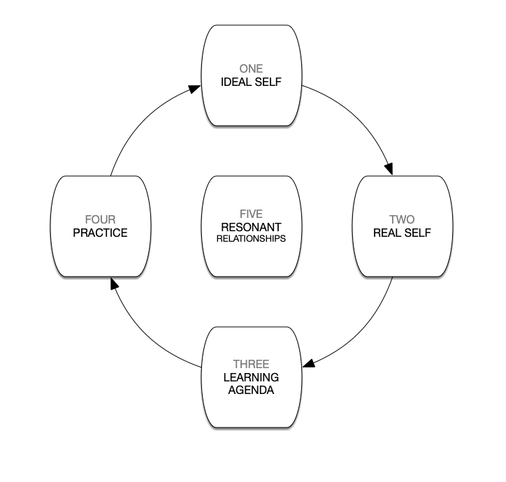

Change can be scary. The path between point A and B never seems to be a straight line. It is filled with twists and turns, false starts and false stops, missteps and side steps. It always seems to take longer than you’ve anticipated, and you may not even recognize the destination once you’ve arrived. Sometimes, you may start your journey without knowing where you’re going, and in today’s fast-paced world, just keeping track of where you’ve been can be a challenge.

Faced with the seeming difficulty of change, many people abandon their efforts and resign themselves to the status quo. Businesses spend all of their resources on incremental improvements that don’t drive growth. People sit in front of the TV instead of learning a new skill. Relationships languish because neither partner knows where to start making a difference.

Fortunately, desired, sustainable change doesn’t have to be scary. Intentional Change Theory, developed by Professor Richard Boyatzis at Case Western Reserve University, provides a framework for understanding how change works. Once you understand the process, you can harness its power, reduce uncertainty, and make change work for you.

## The Five Discoveries

According to Intentional Change Theory, desired, sustainable change occurs when five steps are completed in a specific order. As we’ve already discussed, most people encounter change as a chaotic, discontinuous process, so when they finally complete each step, often by happenstance, it is usually accompanied by a feeling of epiphany or discovery. Therefore we call these five steps the five discoveries.

However, once you become aware of the process of Intentional Change, and are mindful about applying it, you’ll find that the process will feel controlled and continuous. There is still discovery to be had, but each step will feel like a natural progression from the last.

**Ideal Self** – discovering the Ideal Self answers the question, “Who do I want to be?” This sounds like an intuitive place to start the process of change, but people often start by looking at where they are now and then asking where they can go. Taking that approach may seem practical, but it is ultimately self-limiting. It is critical to keep an open mind when discovering your Ideal Self.

Worse, some people jump right into action, figuring that doing something is usually better than doing nothing. Unfortunately, all that energy ends up wasted if you’re not moving in the direction that you really want to go.

**Real Self** – discovering the Real Self requires taking an objective look at yourself to assess which strengths you can build on to achieve your Ideal Self and where you have gaps that you’ll need to bridge. By starting with the Ideal Self, this step in the process will be aspirational, instead of critical. You’ll be moving toward the future instead of being trapped in the past.

**Learning Agenda** – the third discovery is the development of a concrete set of steps to move you from your Real Self to your Ideal Self. You’ll take the gap analysis and strengths assessment from your discovery of the Real Self and use that to create a plan. Once you have that plan, then it’s time to take action, which brings us to the fourth discovery.

**Practice** – when we talk about Practice, we mean practicing until mastery. The old adage that amateurs practice until they get it right while professionals practice until they can't get it wrong is the key to sustaining your desired change. The change you seek needs to become intuitive, or else you’re likely to return to old habits when times get tough.

**Resonant Relationships** – the last discovery is the development of supportive relationships. Change doesn't have to be scary, but it is rarely easy. Resonant relationships will help you to completeeach step of the process as well as to move from one discovery to the next. They can provide an editorial voice when preparing your Learning Agenda, a critical eye when discovering your Real Self, positive energy when discovering your Ideal Self, and emotional support when Practice gets hard.

It’s important to keep in mind that this process is iterative. You should expect to envision your Ideal Self, assess your Real Self, develop a Learning Agenda, and Practice over and over again as you make progress toward your desired change.

## Multiple Levels

So far, we’ve talked about Intentional Change using the language of the individual, but the theory applies at all levels of human interaction, from the very intimate to the global stage. From a leadership perspective, we most commonly apply Intentional Change at the following four levels:

**Individual** – that’s you.

**Dyad** – two people involved in a sociologically significant relationship: romantic partners, parent and child, manager and employer, business partners, mentor and mentee, and so on. A dyad can apply Intentional Change to the relationship itself – making it stronger or deeper, for example, or to the focus of the relationship: a business, a family, etc…

Where does a dyad find resonant relationships? Business partners might find them out in the larger business community – perhaps as part of a local organization. Romantic partners may rely on family and friends. Managers and employees can look to the rest of their team or to fellow leaders in the organization. Resonant relationships are out there, but we aren’t used to thinking about them in the same way we think about them at an individual level.

**Team** – a team is a group of people working collaboratively toward a common work product. Teams can use Intentional Change to work on their own team structure and dynamics or to chart the course of their work.

**Organization** – a team of teams. A business, church, non-profit, or community organization can apply Intentional Change in the same way. The logistics get a bit trickier, with far more cats to herd, but the process remains the same.

By harnessing the power of Intentional Change Theory, you, your team, or your organization can tackle desired change, make it last, and make the process itself positive for everyone involved. Change is scary, but Intentional Change doesn’t have to be.
