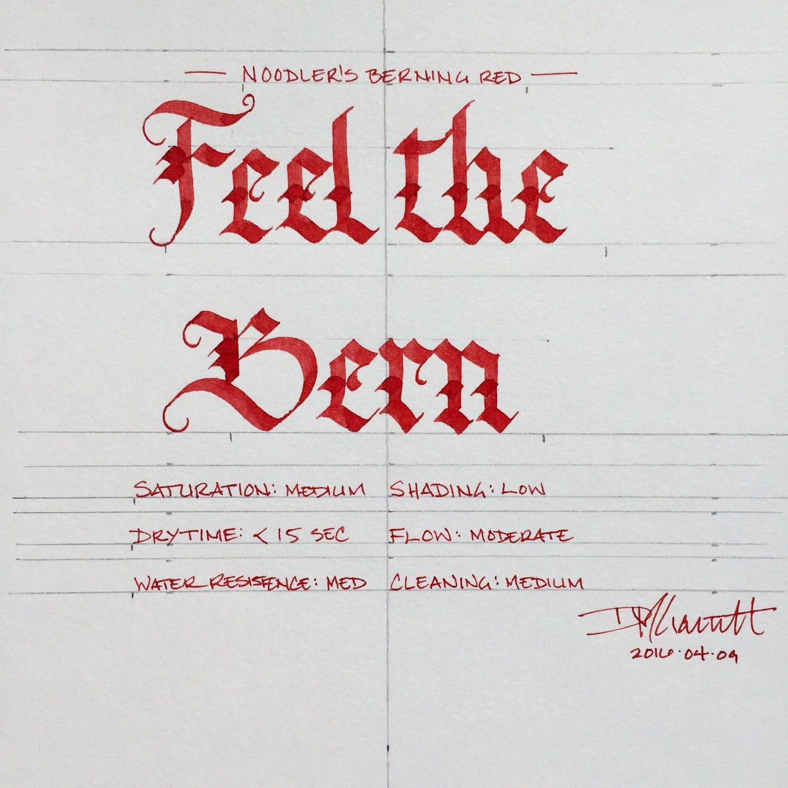
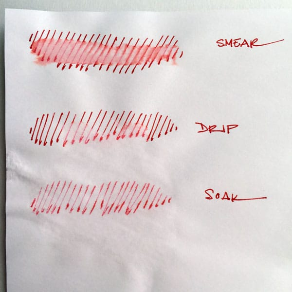
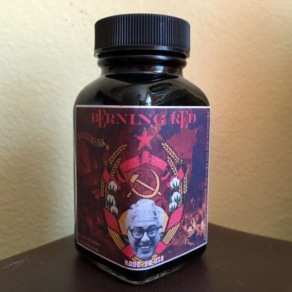

Noodler's Berning Red

It’s an immutable karmic law that, when an ink producer creates a new color specifically to mock a presidential candidate, one then must use said ink to write the candidate’s campaign slogan, regardless of how one actually feels about said candidate. In this case, Nathan Tardiff, the man behind the curtain of Noodler’s Ink, created Berning Red in honor of Bernie Sanders, the democratic socialist senator from Vermont, and one of the two remaining candidates for the Democratic nomination. The tagline for the ink is “a red for lefties that dries fast.” Because Sanders is a socialist, he’s a lefty on the American political spectrum, and left-handed writers need a quick drying ink - get it? Also red, because red is equated with socialism, as evidenced by the Soviet-propogada-inspired label.

Politics aside, Berning Red is quite a good ink. It’s a bright, candy-apple red - it doesn’t lean purple or brown, and no magenta is in sight. It’s a quintessential red that’s easy to read on the page. It has a moderate level of saturation, fading a little in the really broad strokes of a calligraphy pen, but producing a crisp, bold line with low levels of shading when used with a fine nib. It’s easy to write with, having a moderate level of flow and producing no sensation of scratchiness on most paper.

After I was done testing it, it cleaned up easily, flushing quickly from the converter and feed. It did not stain. Berning Red is also an extremely cost-effective ink. Noodler's standard line of ink is the best value on the market - the 3 oz bottles run roughly $12.50, which works out to a cost of $0.14 per milliliter - the lowest of any ink I’m aware of.

| Paper | Dry Time |
| --- | --- |
| Copier | 1 second |
| Bagasse | 5 seconds |
| Rhodia | 5 seconds |
| Midori MD | 15 seconds |
| Carson XL | 10 seconds |
| Leuchtturm | 10 seconds |

So how does the quick-drying claim stand up? Well, it dries faster than a lot of Noodler’s ink, though not so quickly as I’d have imagined for an ink specifically designed to be fast-drying. Overall, it was dry to the touch and smudge free in less than 15 seconds, with cheap office-grade copier paper being the fastest and Midori MD paper the slowest of those I tested.

It is generally well-behaved across each of the paper types I tested, though it has an increased tendency to show-though on absorbent papers, and to bleed through when used with a really wet nib, like the Pilot Parallel pens. It’s not something you’re likely to encounter if you’re using good quality paper in a fine-nib pen, but it is something to keep in mind.

Noodler's Berning Red water test

Berning Red held up surprisingly well in the water resistance test, in which I simulate three scenarios: something wet gets dragged across the page, droplets of water fall onto the page and get blotted up, and the paper gets soaked. It smeared easily enough when I ran a wet finger across the page, which resulted in a lovely red smudge - so it is not suitable for painting over with washes or watercolors. However, it didn't completely lift from the page when I blotted it, nor when I soaked it under the faucet, which means that your work won’t be completely obliterated if you do happen to get it wet by accident.

Noodler's Berning Red bottle

Noodler’s 3 oz glass bottles are, in and of themselves, utilitarian. They’re stock bottles ordered in bulk in order to keep the cost of production down. It’s the labels that are always interesting, even if they occasionally make you shake your head in bewilderment. Berning Red is certainly one of those cases. The Soviet-style design with hammer and sickle, and Bernie Sanders’ smiling face plastered on it is…fascinating. One cannot deny that it is eye catching. Whether you display the bottle proudly on top of your desk or stuff it in a drawer is likely to be driven more by your politics and sense of irony than by your aesthetic sensibilities.

Berning Red is a great ink. I’m very happy with having had the chance to test it. While it doesn’t displace [Diamine Red Dragon](/blog/2010/9/7/ink-review-diamine-red-dragon) as my current favorite red ink, its good behavior, ease of reading, and cost effectiveness make it a go-to choice when I’m in the mood for a vibrant red ink.

This bottle of Noodler’s Ink Berning Red was graciously provided by [Pen Boutique](http://www.penboutique.com/).

Review notes: the handwritten portion of the review was created on 160 gsm, acid free, mixed media paper from Canson’s XL line. All lines, broad and thin, were made using a Pilot Parallel pen with a 3.8mm calligraphy nib.
