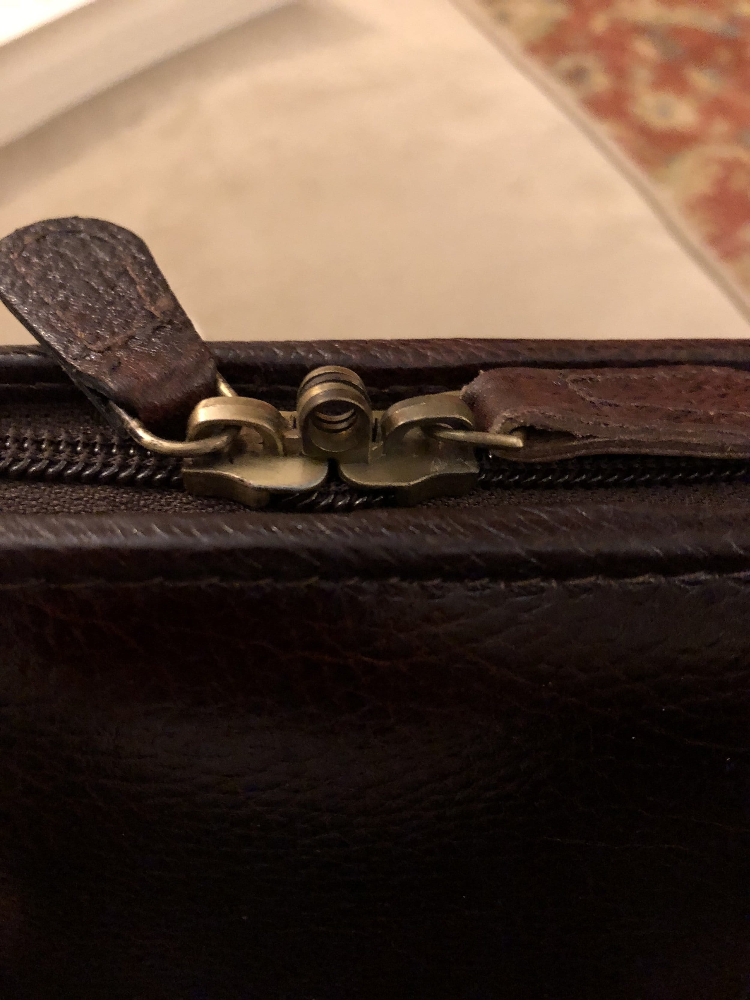

The folks at Pen Boutique were kind enough to send me a sample of the brown, twelve-pen, [Yak Leather pen case](https://www.penboutique.com/products/yak-leather-premium-leather-24-pen-case-brown) to review. It’s a new brand to them, and to me, so I thought it was worth taking a look.

The case arrived in a nondescript cardboard box lightly wrapped in tissue paper - enough packaging to keep it safe, but nothing special - and without any accompanying information. It was just the case and a silica gel packet, if I recall correctly, which is unfortunate, because I can’t find any other information on the brand online - so I don’t know if this is actual yak leather or not.

Whatever animal gave its life to protect my pens should be happy with the result, though. The case is nicely constructed and has some thoughtful touches as well as some areas in need of improvement. The red-brown pebbled leather exterior feels good in the hand, though it is hard to tell how thick or durable the leather is without stress testing it. The zipper has loops to allow for a small lock to be used to secure it. The back of the case has a “Yak Leather” logo embossed in the bottom center.

The interior is where I felt there was room for improvement. The pen loops inside are made with the same leather as the exterior, which looks nice, but doesn’t do a great job of holding in pens without using the pen clip. In contrast to the Monteverde pen case I currently use, which has elastic pen loops, it comes up short. Fortunately, it is sized just right that most standard fountain pens will fit without too much rattling around, and it does fit twelve full sized pens perfectly.

The divider that protects one side of the case from the other is affixed with velcro to the middle of the case, which makes it easy to remove. However, the way the velcro is affixed to both the case and the divider mean that no configuration of the two actually feels secure. It’s an obvious design flaw, as if the divider were a last minute addition to the case.

The size of the case is such that it fits into a day bag without issue. I can carry my laptop, my Traveler’s Notebook, and this case easily inside my Saddleback messenger bag, for example.

If you have a small collection; are interested in yak leather; or have a large collection and just need a case for your daily arsenal, then give the Yak Leather pen case a shot.
