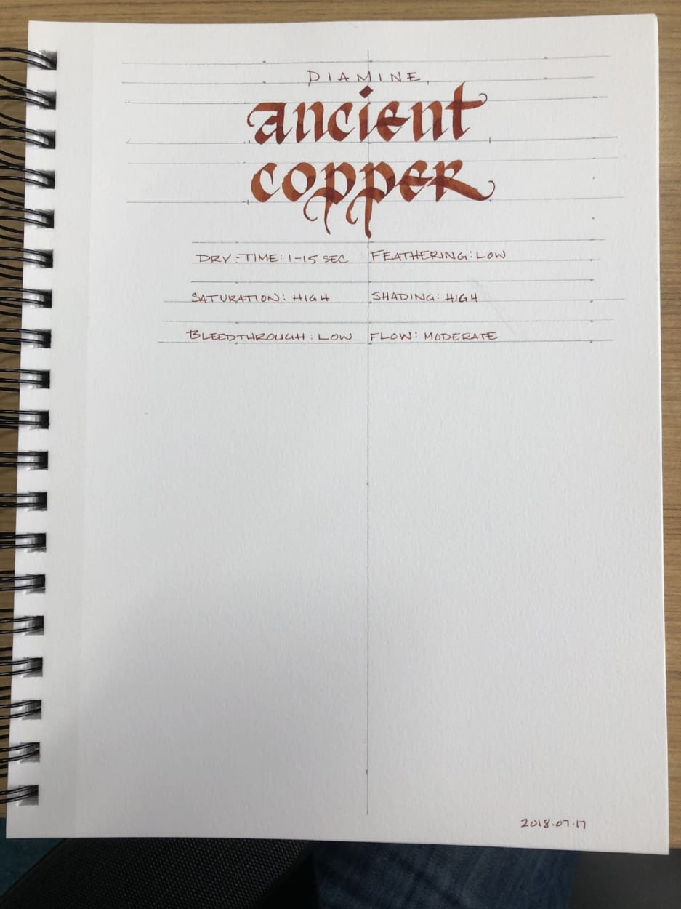
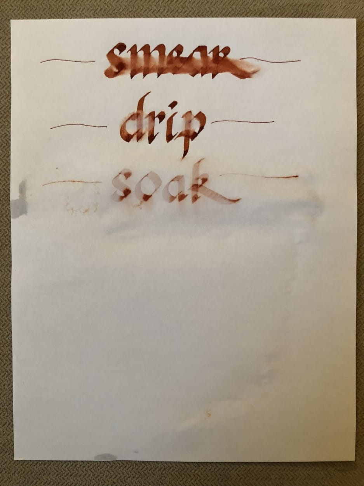
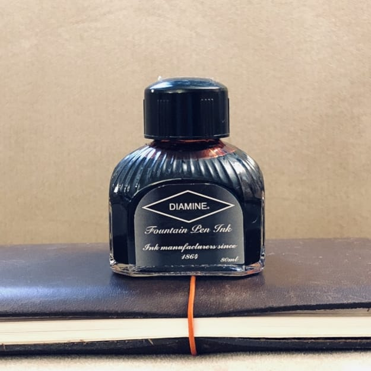

Diamine Ancient Copper

Diamine Ancient Copper is one of an elite group of inks that seems to be universally respected. It is artistically interesting -- in broad nibs it shades dramatically. It is easy to read, providing sufficient contrast on white and cream colored paper without being hard on the eyes. It is also a very lovely color that one does not often see in ink formulated for fountain pens. Acrylics, oils, metallic markers, yes - but not fountain pen ink.

It also has gravitas of a sort that is not usually present in inks that are not black or blue - a sort of quality that makes one see it and think, “the person that uses this ink must be sophisticated." It’s similar in this way to [Diamine’s Oxblood](/blog/2010/9/14/ink-review-diamine-oxblood?rq=oxblood) and [Damson](/blog/2012/1/15/ink-review-diamine-damson?rq=damson), red and purple inks that are equally substantive, and are good choices for those with needs that are more traditional, but who tire of black and blue.

In my experience, Diamine ink performs consistently across the different colors of the line: it feathers a bit on absorbent, un-sized paper, and it behaves admirably on coated, ink-resistant paper. Ancient Copper behaved as expected on the six paper types I used to test it: cheap, office copier paper; Staples Bagasse notepad; Rhodia Bloc pad; Midori MD notebook; Canson XL Mixed Media notebook; and Leuchtturm1917 notebook. It took anywhere between one second to dry on copier paper to twenty seconds to dry on Midori paper.

Diamine Ancient Copper Water Tests

Diamine Ancient Copper is not a water resistant ink. It smudges and runs when exposed. In the smear test, in which I run a wet finger across the page, it left a coppery smudgy mess. In the drip test, in which I drip water and then blot it up, much of the ink lifted from the paper. In the soak test, in which I run the page under water, the ink nearly washed away completely. A ghost of the image remains - enough to still read it - but not much else.

Diamine Ancient Copper Bottle

Diamine ink is available in 30ml plastic and an 80ml glass bottles, both of which are utilitarian and slightly boring in appearance. The 30ml plastic bottle has a neck that is very small in diameter, and I found that some of my larger pens would not fit all the way in, which made getting to the ink a bit of a challenge. Though you may wish to go with the smaller volume to try out a new color, my recommendation would be to go for the larger bottle due to its superior usability.

Diamine ink is generally a very good value for the price -- similar to Noodler’s Ink. You get a lot for your money and the quality is very high, but one doesn’t buy it for the bottle. To me, Ancient Copper is a no brainer, in the same category as [Noodler’s Black](/blog/2012/3/24/ink-review-noodlers-black-revisited) or [Lamy Blue](/blog/2010/3/6/ink-review-lamy-blue). It’s a classy, quality ink that looks good in almost every circumstance, behaves well, and is priced competitively.

Review notes: the handwritten portion of the review was created on 160 gsm, acid free, mixed media paper from Canson’s XL line. All lines, broad and thin, were made using a Pilot Parallel pen with a 3.8mm calligraphy nib.
