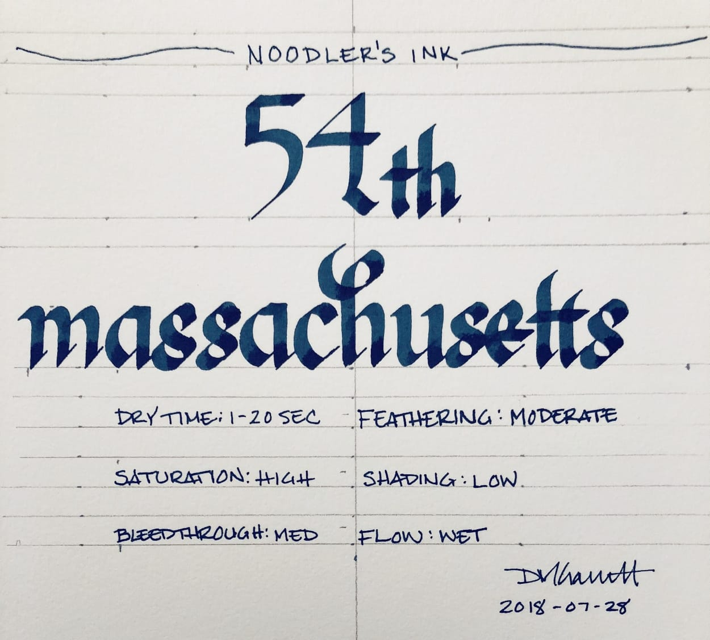
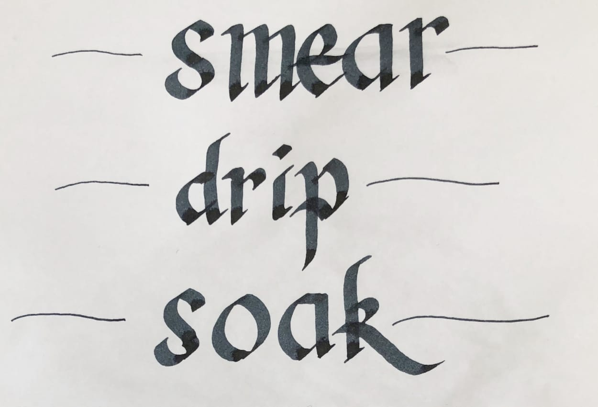

Noodler’s 54th Massachusetts blue-black ink has become one of my favorites. It is conservative enough to be useful in any situation -- business or personal -- but is still a lovely diversion from a standard blue or black. It flows easily -- it is wet, smooth, and easy to write with. It dries in a reasonable amount of time, and I find the color pleasant and easy to read. It also appears to have a touch of chartreuse to it that blue and black inks don’t typically possess.

It’s highly saturated with low amounts of shading, even in a broad calligraphy pen. In a fine nib, it sometimes exhibits a slightly chalky appearance. It’s also worth pointing out that it smells strongly of solvents. If you are particularly sensitive to odors, you may want to avoid it for that reason, but it has never bothered me.

My complaints, such as they are, are twofold: first, it does not behave in an outstanding fashion on cheap, absorbent paper -- though I typically have the luxury of writing on good paper. Second, it does create a noticeably bold line, due to its wet flow, which doesn’t work as well with my condensed style of writing. I have to write with a looser and larger style in order for my writing to be legible. It turns my EF nib into a M nib. However, it is otherwise such a joy to use that I put up with the inconvenience in order to use it. That says something about my appreciation for this ink.

Dry time is relatively quick, though, as one would expect, it takes longer to dry on smooth, sized paper like Rhodia and Midori (20 seconds) than on cheap copier paper (1 second). It does bleed through and feather heavily on copier paper, but otherwise behaves.

54th Massachusetts is advertised as bulletproof - a marketing term that Noodler’s created to refer to ink that can’t be removed once it has bonded to the fibers in the paper -- so one would expect it to hold up on the water test, and it does. 54th Massachusetts soaks right in to the paper, which means that, on the smear test, where I run a wet finger across the page, absolutely no ink moved.

On the drip test, where I place droplets of water on the page, absolutely no ink lifted off the page. Finally, on the soak test, in which I run the paper under the faucet, the ink stood resolute. Noodler’s 54th Massachusetts lives up to its bulletproof moniker - it's impossible to remove with water alone.

Noodler’s 54th Massachusetts comes in a standard 3 oz. Noodler’s bottle that’s filled to the brim – so be careful when opening. Noodler’s intentionally uses stock bottles and lids to keep their prices low, which means that they aren’t intended to be show pieces in and of themselves. The labels, however, almost always tell their own story.

Nathan Tardiff, the man behind Noodler’s, likes to create labels chock full of meaning. In this case, he chose an illustration of the ink’s namesake, the 54th Regiment Massachusetts Volunteer Infantry - the first African American regiment organized in the northern states during the Civil War. The regiment was organized in 1863 and, after training, was sent to South Carolina, where it took part in several famous battles, including the Second Battle of Fort Wagner.

The label illustrates the regiment's frontal assault on the fort - a charge that became one of the best known episodes of the war. It was the story of this regiment and their charge on Fort Wagner that was the subject of the film Glory.

All that aside, Noodler’s 54th Massachusetts is one of the best blue-black inks I’ve used. It’s a great value for the money, behaves generally well, and is easy to read. I highly recommend it.
