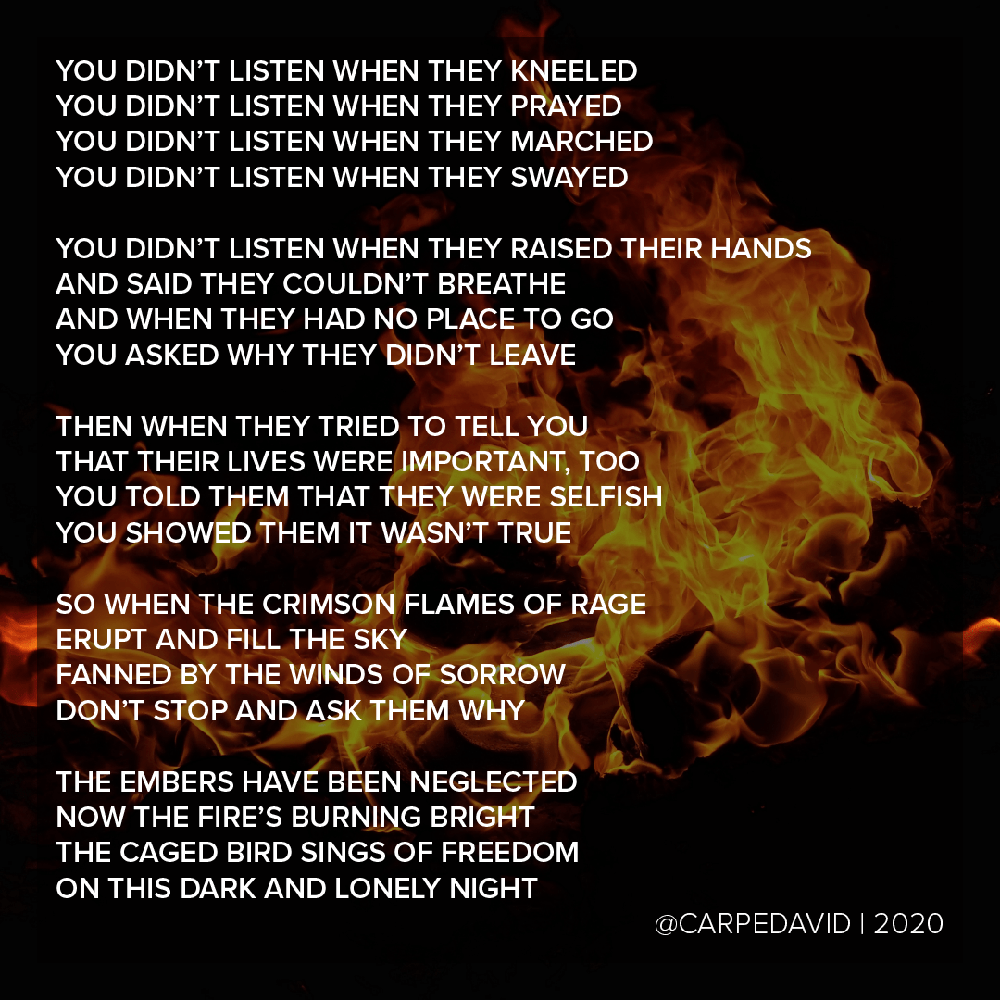

This is not ok.

I am not ok.

I say this fully aware that as an able-bodied, neurotypical, cisgendered, heterosexual, gender-conforming, middle-class, middle-aged, white male who was lucky enough to be born into a strong, stable, supportive family, and who has an MBA from a prestigious school and an executive position in a field that has blissfully remained unaffected by the global pandemic, I am as privileged as it is possible to be without being a member of the 1%.

And **I am not ok**.

I can _literally_ only imagine what everyone else must be feeling — people whose gender is more fluid than mine, whose sexuality has been repressed but yearns to be expressed, who have an X where I have a Y, who are Jewish or Muslim or Hindu, who speak a first language other than English. But today, especially, people whose skin is darker than mine.

A people who were subject to slavery, and Jim Crow, and segregation, and redlining, and an institutional racism that is still rotting away the very core of our society, and so, so, so, so, so very much more.

A people two of my children belong to.

I am very not ok.

While I can’t condone rioting and looting and vandalism, I can absolutely understand it. I can only imagine what I would be capable of if it were my son or my daughter whose life was taken. No, I can’t condone the violence, but if it were me, and that was my Baby Bear under the knee of that officer, I would hope others would understand when I burned the whole fucking city to the ground.

—-

It’s been a while since I’ve shared my creativity publicly, but this seems like the right time. It’s helping me process. Maybe it will help someone to understand. If we work on understanding, then we can work on fixing, and preventing, and elevating, and supporting.

Anyway, here’s a poem…

—-

**Hear No Evil**

You didn’t listen when they kneeled
You didn’t listen when they prayed
You didn’t listen when they marched
You didn’t listen when they swayed

You didn’t listen when they raised their hands
And said they couldn’t breathe
And when they had no place to go
You asked why they didn’t leave

Then when they tried to tell you
That their lives were important, too
You told them that they were selfish
You showed them it wasn’t true

So when the crimson flames of rage
Erupt and fill the sky
Fanned by the winds of sorrow
Don’t stop and ask them why

The embers have been neglected
Now the fire’s burning bright
The caged bird sings of freedom
On this dark and lonely night
