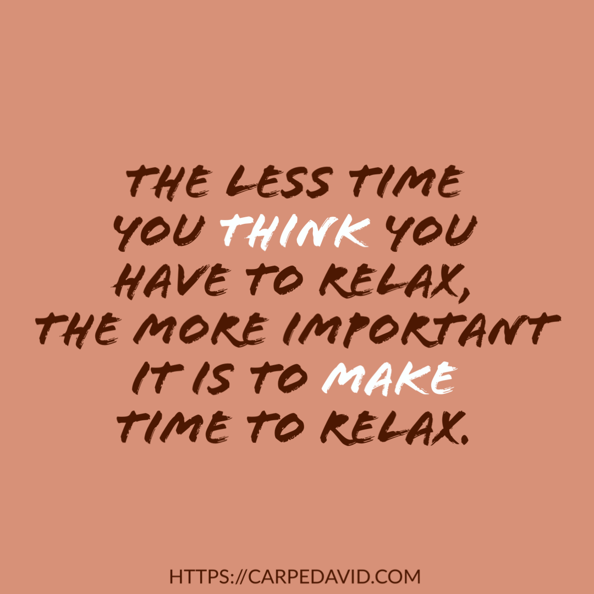

2020 is certainly one for the history books. I can’t remember a time in my life when every one of the over seven billion members of our species seemed to be this stressed out for this long _all at the same time_. These are undoubtedly the “interesting times” referred to in the perpetually misattributed curse.

So consider this your friendly reminder to breathe. It’s one of the great ironies of life that the less time you think you have to relax, the more important it is to make time to relax. So whatever you do to relax, do that. Do yoga. Meditate. Go jogging. Contemplate the serenity prayer. Cook a meal. Fold origami. Fish.

I, personally, spend a few minutes each day just concentrating on my breath. I’ve set up a recurring reminder in Todoist to meditate. It has no specific time attached it it, but it’s there each day, reminding me to breathe. I use the Unwind app, which is gloriously simple and beautifully designed, to do breath exercises. There’s a morning, afternoon, and evening setting — that’s it. I just sit there and follow along, and turn my attention to the flow of air in and out of my lungs.

Some days I get in five minutes, while others are close to ten. It doesn’t really matter. Just take time to take care of yourself. I’m not going to claim that it’ll change the world, but it might change you, and that might be the best we can ask for right now. So, remember to relax. Remember to unwind. Remember to breathe.
