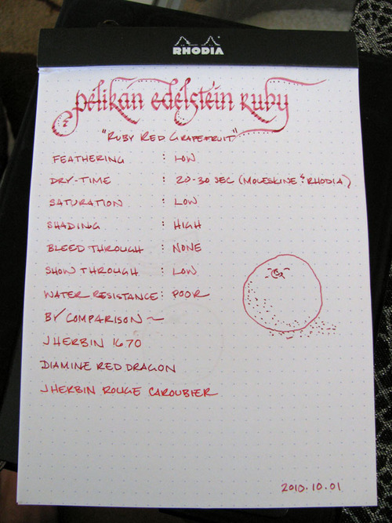
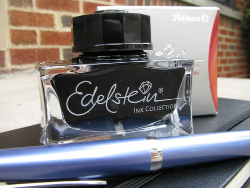

Rating: 3.0
October 09, 2010

Pelikan has just released a new line of premium inks called Edelstein, which means “gemstone” in German. There are seven colors in the line, all intended to represent a jewel tone: Onyx, Sapphire, Topaz, Jade, Aventurine, Mandarin, and Ruby. As of the date of this review, all but Onyx are available via US retailers. Like many ink collectors, I was eagerly awaiting the line, and I ordered a bottle of Ruby as soon as I got word that they were in.

Frankly, it’s not quite what I expected. When I think of jewel tones, I think of bright, highly saturated colors – deep and vibrant. The Edelstein inks, however, are anything but. Ruby, at the very least, is billed as a “soft” ink on the box, which is an adjective I hadn’t heard applied to ink before. It’s a useful descriptor, though, because that’s essentially how this ink behaves – think the touch of a feather on your skin, or a light breeze gently stirring through the leaves. That’s how the ink treats the paper.

Ruby is a pinkish-red that reminds me of ruby-red grapefruit. It is one of the least saturated inks I’ve ever used, but it exhibits significant shading – thus its color on paper runs from light pink to a deep, well, ruby. Its tone varies, depending on the paper – on the white of a Rhodia pad, it is lighter and pinker. On the off-white of a Moleskine, it becomes darker and redder.

Feathering was very low on all papers I tested it with, and it is a dry writing ink, as well. I’ve got two pens that lay down rivers – a Lamy Studio and Pilot Falcon – and having inks on hand that pair well with them is great. It’s also a very smooth ink – some dry writing inks cause one’s pen to feel like fingernails on a chalkboard, but happily, this is not one of them.

I’ve decided to add a water resistance test to all of my new reviews, and I can safely report that Ruby isn’t water-resistant at all. A drop of water, as one might accidentally deposit from a glass of water, dissolves the ink very quickly. Running the paper under water for thirty seconds washes it almost completely off.

Dry time varies significantly, depending on the composition of the paper. It takes about 20 to 30 seconds to dry on Rhodia and Moleskine journal papers, about 10 seconds on standard copier paper, and 15 seconds on Moleskine cahier paper. In all cases, it performed admirably with regard to show-through, which was very low, and bleed-through, which was non-existent. I’m especially impressed that it behaved so well in my wet writing Lamy Studio on the thin paper of a Moleskine cahier – those two are often a bad combination.

Edelstein Ruby does not provide much contrast on either white or off-white paper, so it can be a bit tough to read. On the other hand, it avoids the problem that many red inks have – being hard on the eyes. It’s certainly not an ink you’d use for business correspondence, though it would make a decent proofing ink. It is pleasant enough to use for personal correspondence for those that prefer a softer touch.

The entries in the Edelstein collection come in a beautiful glass bottle that holds 50ml of ink. The bottle is nice and heavy, with a thick bottom and soft corners. The cap has a raised Pelikan logo gilt in silvery paint. It is definitely intended to be a showpiece – whoever designed it was clearly inspired by jewelry design. It is easily a match for the Iroshizuku ink bottles in terms of beauty, and, depending on your aesthetic preference, may very well surpass it.

Speaking of Iroshizuku, how does Ruby compare to that brand of premium inks? Well, it is somewhat better behaved than Momiji (one of my top 5 inks), which I’d describe as the one in my collection that it most closely resembles; it is dryer, with higher shading potential, and is less expensive. Yet I don’t feel the need to own both – and if I had to pare down my collection, I’d personally keep the Momiji for its more vibrant color.

So, to recommend or not recommend Pelikan Edelstein Ruby? I’d say yes, conditionally. As I mentioned earlier, it wasn’t what I expected, but it is growing on me. If you’re a fan of highly saturated inks, then Ruby is definitely not for you. However, if you like low saturation and high shading potential, then by all means, check it out.

Review notes: the thick strokes were made using a 1.9mm steel calligraphy nib on a Lamy Joy. The fine strokes were made using a 14K gold EF nib on my wet-writing Lamy Studio. The paper is bright white Rhodia 80gr paper on a Rhodia Dot Pad.
