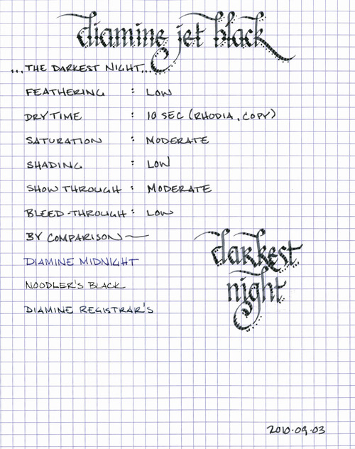
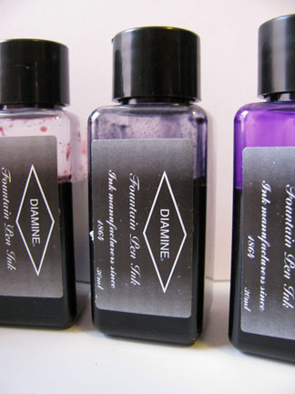

Rating: 4.0
November 2, 2010

I do not use black ink on a daily basis. To me, one of the joys of using fountain pens is the broad spectrum of available ink colors and black ink just isn’t all that interesting. However, there are a number of situations for which only black ink will do, so when Diamine offered to send me ink samples for review, I requested Jet Black.

Jet Black is a moderately saturated black ink with very modest shading potential. Depending on the flow of the pen, it ranges from a dark gray to a moderate black. Like other Diamine inks I’ve tested, it flows nicely – being neither too wet nor too dry – and allows the pen to glide across the paper.

On each of the papers I tested this ink with, it exhibited low feathering. It is also well behaved when it comes to show and bleed-though. On all but the thinnest of paper (Moleskine planner paper, on which everything seems to bleed through), the show through was moderate (it is a black ink, after all) and bleed through was unnoticeable.

Oddly, Diamine Jet Black seemed to have a consistent drying time. On both Rhodia (on which ink tends to take longer to dry) and generic, absorbent copier paper (on which ink tends to dry quickly), Jet Black took about ten seconds to dry with a medium nib pen. I’m not certain whether this is due to the formulation of the ink or to the combination of ink and nib, but I haven’t seen this behavior in any other inks. Regardless, it takes just long enough to dry that I wouldn’t recommend it for a lefty over-writer.

Diamine inks are available in a 30ml plastic bottle and an 80ml glass bottle, both of which are utilitarian in appearance. The smaller plastic bottle has a neck that is very small in diameter. I found that some of my larger pens, like a Lamy 2000, would not fit all the way in, which made getting to the ink a bit of a challenge. My recommendation would be to go for the larger bottle.

Jet Black is a very pleasant black ink. It’s not quite as dark as Noodler’s Black, and also doesn’t have its bulletproof characteristics, but it’s well-behaved and pleasant to write with. If you’re a fan of black ink, it is definitely worth checking out.

Review Notes: for the wide strokes, I used a Lamy 1.9mm steel calligraphy nib on a Lamy Joy. For the narrow strokes, I used a medium nib on a Waterman Phileas. The paper is Rhodia 80gsm from a No. 16 Rhodia Bloc Pad.

Note on this review: a sample of this ink was provided for review purposes by Diamine Ink.
