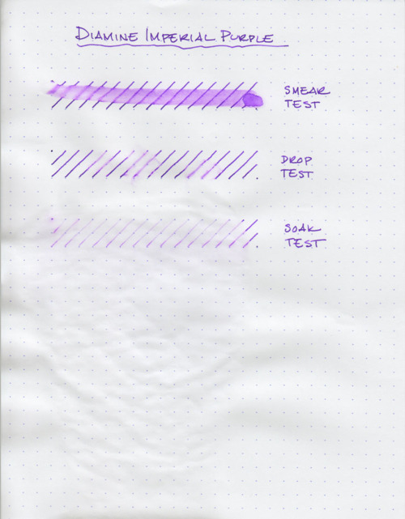

Greg asked:

> I just read your review at:
> [/2010/10/ink-review-diamine-imperial-purple](/blog/2010/10/18/ink-review-diamine-imperial-purple/)
>
> Very nice.  How permanent is this ink?

Well, as you can see above - not very. The smear test, which is a wet finger dragged across the ink, left a big, purple streak. The lines range from obliterated to semi-readable.

The drop test, in which I drip water, let it soak for a second, and then blot it up, fared a little better. I did notice that the blotting lifted a lot of ink up, but you can still make out the lines.

The soak test was conducted by running the paper under water for about five seconds. Normally, I’d let it run longer, but the ink was washed away at such a rapid rate, I was worried that there would be nothing left to show!

In summary, it’s a beautiful ink, but I wouldn’t even use it to address envelopes, as a stray raindrop or two could render the ink illegible.
