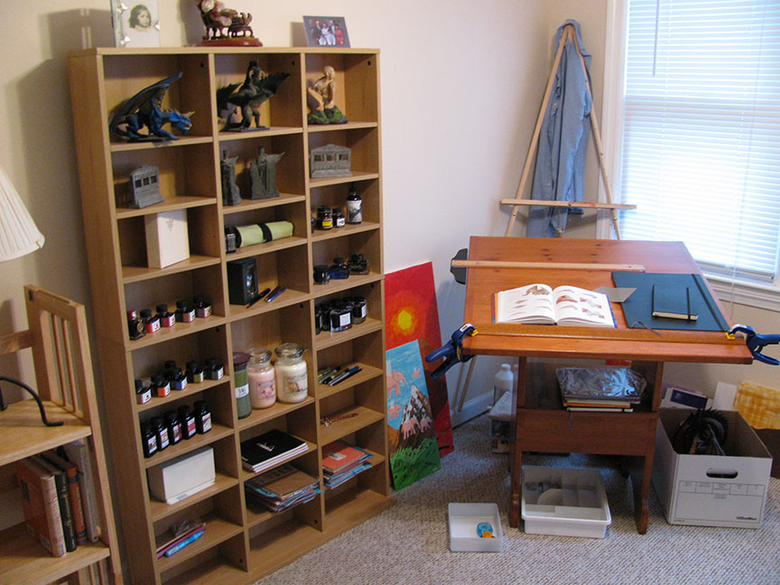

[DIYSara](http://diysara.tumblr.com/) asked, in a previous thread, “Any chance we can see a photo of your ink “shelf” or storage method? :)”

Sure! Here is my shelf of ink and other miscellaneous things, including origami paper and stationary. To the right is my art desk with some sketchbooks, and an origami book open. Behind that is my easel and various painting supplies.
