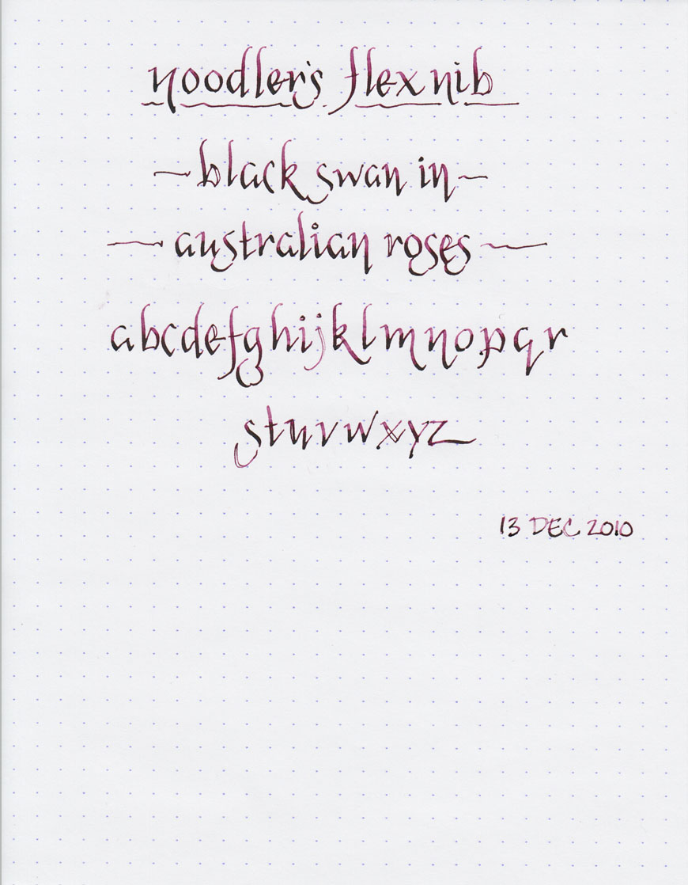

Above is a writing sample of [Noodler's Black Swan in Australian Roses](/blog/2010/11/30/ink-review-noodlers-black-swan-in-australian-roses/) in the new Noodler's Flex Nib Piston Fill fountain pen. I'll have more thoughts about the pen later, but this is my first attempt at using a flex nib fountain pen, and I think the Black Swan ends up shading quite nicely with it.

**Update:** Inkophile has a spot-on review of the [Noodler's Nib Creaper](http://inkophile.wordpress.com/2010/12/17/black-swan-in-australian-roses-charms-a-noodlers-flex-pen/) pen.

**Update:** Leigh Reyes has a [demonstration](http://www.leighreyes.com/blog/?p=3054) using the Creaper and the Black Swan ink to draw.
