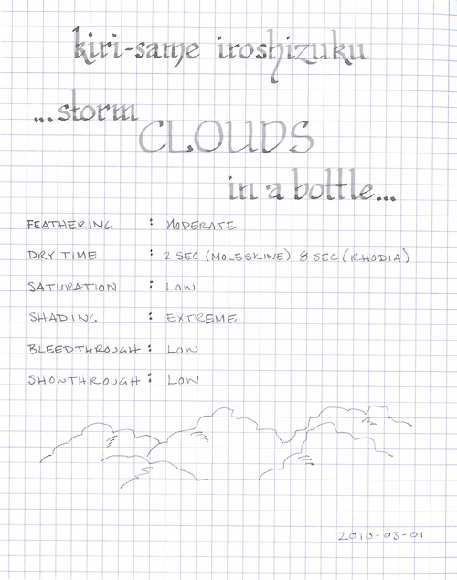

Rating: 3.5
March 01, 2010

Iroshizuku Kiri-same (Misty Dark Gray) by Pilot is the essence of storm clouds in a bottle. It runs the gamut from light to dark gray, as it exhibits significant shading in wider nibs. In fine nibs, it tends to run very light – almost too light for normal use.

Like other Iroshizuku inks, it flows well, and I have had no issues using it across a variety of pens and nibs. The drying time for Kiri-same varies dramatically based on the paper used: 2 seconds on Moleskine and Ecosystem journals, and 8 seconds on 80g Rhodia paper. In the Moleskine, the ink exhibits some feathering, but minimal show- and bleed-though.

As mentioned, Kiri-same can be very light in a fine nib, which is what I typically use for my daily writing. As such, it has not occupied significant time in my ink rotation. I suspect that I will use it most often with a calligraphy nib, where the full spectrum of its dynamic range can be seen. I can also see using it with a brush, as it mimics the effects of a light wash.

As with the other Iroshizuku inks, Kiri-same comes in a beautiful, solid, 50 ml bottle that looks great on one’s desk. The bottle has a depression in the base to allow for the last drops to be claimed with ease. The only minor drawback to this ink is the cost – for a comparable volume, Iroshizuku tends to run 50% to 100% more than other inks.

Kiri-same is a beautiful ink, but I can only recommend it for specialized purposes.

Review materials: For the wide strokes, I used a Lamy 1.1mm steel calligraphy nib on a Lamy Safari. For the fine strokes, I used a Lamy EF steel nib on a Lamy Safari. The paper was 80g Rhodia.
