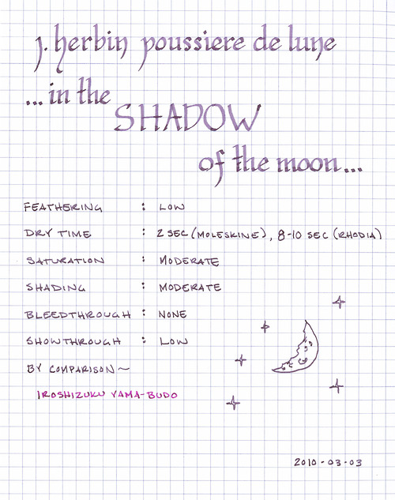

Rating: 5.0
March 03, 2010

J. Herbin Poussière de Lune (Moon dust) is a deep violet color that reminds me of the shadow cast by a lunar eclipse. It exhibits moderate shading in wider nibs, but is remarkably consistent in a fine nib. It is a moderately saturated ink – especially compared to other J. Herbin inks I own, which tend toward low saturation – so its overall color is affected by the paper it is used with. On the off-white paper of a Moleskine, the ink takes on an even more umbral tone.

It’s been my experience that J. Herbin inks flow well in all of the pens that I’ve used, and this one is no exception. Unlike some of their other inks, which tend to feather, this one displays very little feathering regardless of paper; both Moleskine and Rhodia papers behave well with it. Show-through is minimal, even on the thin paper of a Moleskine Cahier, and bleed-through is nonexistent when used with a fine nib.

As with most inks, drying time varies by the absorbency of the paper in question. On an absorbent paper like Moleskine, it is dry to the touch in two seconds or less. On the Rhodia, though, I noticed a range of behavior, depending on how wet a line I created. It would dry in about eight seconds when writing at a quick pace (the speed at which one might jot down a note or two), but at a more leisurely pace (the speed at which one might write when concerned about one’s penmanship) it took anywhere between ten and fifteen seconds to dry.

While I have a number of bottles of J. Herbin, this is one of the few that stays in my regular rotation. The ink color is saturated enough to provide good contrast and it is of a shade that’s easy to read, so it is well suited to daily use. I’d also consider it to be conservative enough for normal business use.

J. Herbin fountain pen inks come in a 30ml bottle with an integrated pen rest that is suitable for displaying on top of one’s desk.

Review materials: For the wide strokes, I used a Lamy 1.1mm steel calligraphy nib in a Lamy Safari. For the narrow strokes, I used a Lamy 2000 with an EF nib.
