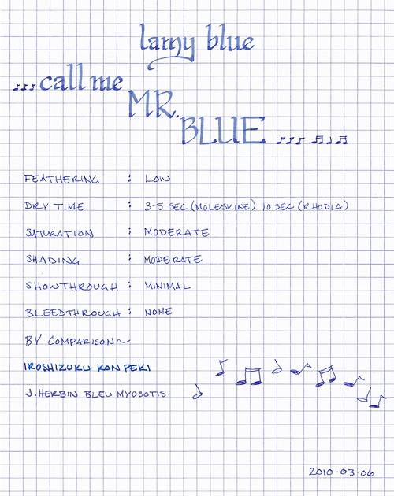

Rating: 3.5
March 06, 2010

Lamy Blue was the first fountain pen ink I used, as it came in the cartridge included with my very first fountain pen – a Lamy Safari. I liked it enough that I purchased a bottle and it remains in my regular rotation. The ink itself is a prototypical blue with moderate shading and saturation. It’s the kind of blue most people would think of when thinking of a blue ballpoint pen.

Unlike J. Herbin inks, which tend to be quite wet, Lamy Blue is a fairly dry. Perhaps because of this, feathering is almost nonexistent on Moleskine or Rhodia papers. Similarly, bleed-through isn’t an issue and show-through is minimal at worst.

When testing the drying time for this review, I found that the ink took longer to dry than I remember. It’s still within the range of what I consider acceptable for daily use, but I found it surprising. On Moleskine paper, it took 3 to 5 seconds to dry completely. On Rhodia paper, it took upwards of 10 seconds.

Lamy Blue comes in a 50ml bottle that isn’t the most fashionable but is certainly one of the most functional ink bottles I’ve seen. It has a well at the bottom that allows for drawing up the very last drops in the bottle, and it also comes with a built-in roll of blotting paper.

Review materials: For the wide strokes, I used a Lamy 1.1mm steel calligraphy nib in a Lamy Safari. For the narrow strokes, I used a steel EF nib in a Lamy Safari.
