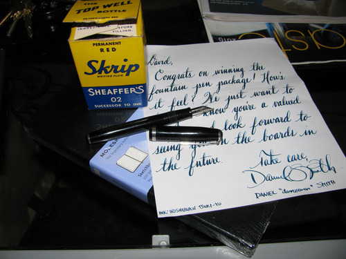

The fine folks over at [Fountain Pen Geeks](http://www.fpgeeks.com/) held a giveaway, and I was the lucky winner. Included were a large Moleskine sketchbook, a vintage bottle of Skrip red ink (review forthcoming), and a vintage Esterbrook SJ pen. Dan Smith, one of the administrators of the Fountain Pen Geeks, even included a lovely handwritten note of congratulations. As befits a true geek, he even noted the ink that he’d used to write it: Iroshizuku Tsuki-yo, which is a lovely greenish blue-black.

Thanks again, guys! For those of you who haven’t been by to check out this new addition to the fountain pen community, be sure to drop by - it’s a very friendly group over there.
