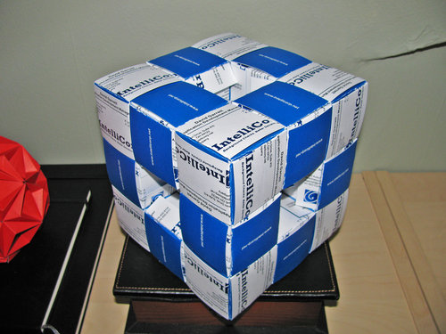
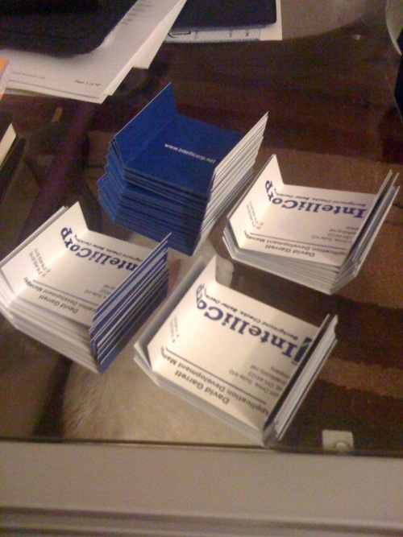
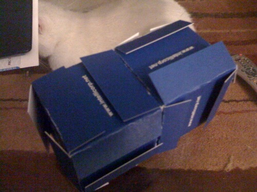
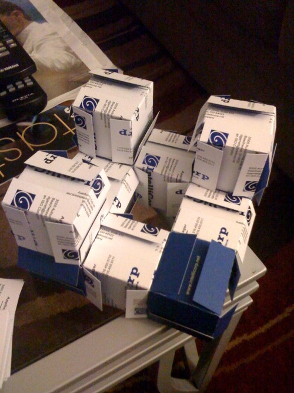
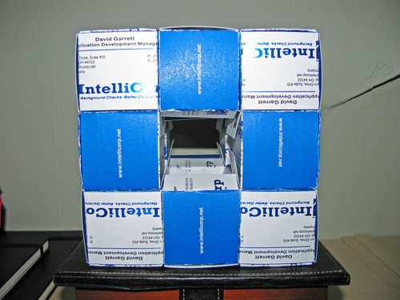

The above is a Level 1 Menger Sponge constructed from 20 structural units made from 6 business cards each, plus exterior paneling, for a total of 168 cards. The unit was assembled, as always, without any glue or other fasteners.

A menger sponge is a fractal cube created by dividing each face into nine squares and then removing the center square. The complexity of the sponge increases as you repeat the process with each of the remaining squares on the face, and then the squares left from that process and so on. Other people have constructed Level 2 and even Level 3 sponges, but it requires a whole lot of business cards.

Above, folding the business card units.

The first two structural units, constructed from 6 cards each.

The sponge after adding more structural units. Once the structural units are in place, it is customary to panel all surfaces with additional cards. Unfortunately, this time I ran out of cards and had to leave the interior of the sponge un-paneled.

