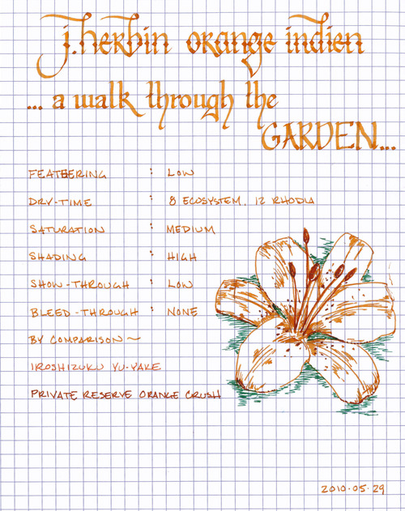
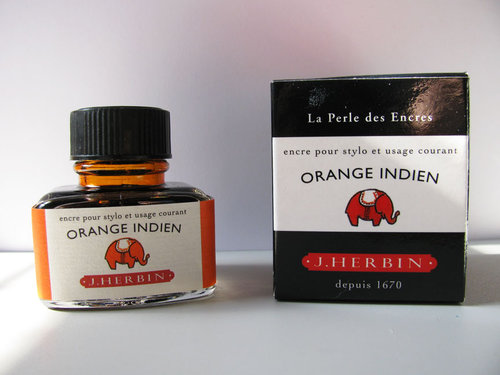

Rating: 4.5
May 29, 2010

J. Herbin Orange Indien reminds me of the wildflowers that grew in the front lawn of my childhood home and of the tiger lilies that lined the streets of my neighborhood. It is a sumptuous, moderately saturated ink that exhibits a high degree of shading in both fine and wide nibs.

Like other J. Herbin inks, Orange Indien flows well. It is not as wet as Vert Empire or Blue Myostosis – behaving more like Café des Isles or Poussiere de Lune. On each of the papers I tested it on, Orange Indien exhibited a low amount of feathering. It was slightly noticeable in my Ecosystem journal, which is a very absorbent paper, but was not noticeable at all on Rhodia paper. Show-through was minimal, even on the thin paper of a Moleskine cahier, and I did not notice any bleed-through on any of the papers that I tested.

Dry time on a Rhodia pad and Moleskine cahier was within the range of other J. Herbin inks: about 12 seconds. On the absorbent Ecosystem paper, which normally sucks up ink like it’s going out of style, it took a surprising 8 seconds to dry completely; though this is fully in the range of acceptable dry time for me. Writing on an incline seemed to produce no noticeable increase in drying time compared to writing flat for this ink, at least in the pen I was using to test with.

Orange isn’t a color that normally factors into business use, and this ink is no exception. For journaling or other personal use, though, it is great. On white paper, it provides great contrast, and while it blends into off-white paper slightly, it is still eminently readable. Dry writing pens work perfectly fine with this ink, but it is in a wet writing pen the character of this ink truly shines – the shading is gorgeous.

J. Herbin fountain pen inks come in a 30ml bottle with an integrated pen rest that is suitable for displaying on top of one’s desk. This one has a picture of a tiny orange elephant on the front label.

Orange Indien is one of my new favorite inks. I plan on using it extensively for calligraphy, as the shading is impossible to resist.

Review Materials: for this review, I used a Lamy 1.9mm steel calligraphy nib on a Lamy Joy pen for the wide strokes. The fine strokes were made using a Lamy 2000 with an EF nib. The paper is Rhodia 80gsm. I also tested using a Moleskine cahier and an Ecosystem notebook.
