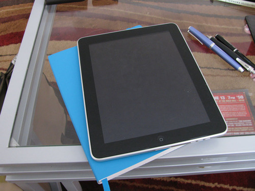
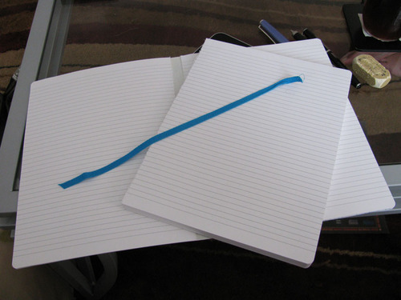
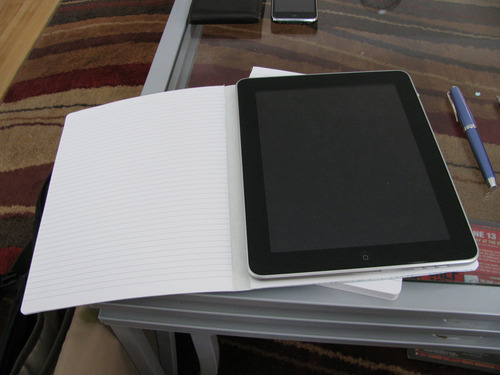
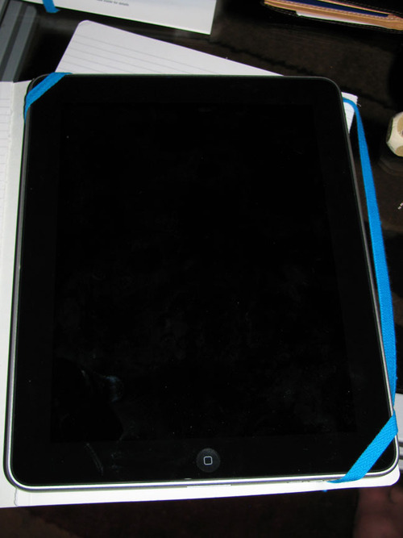
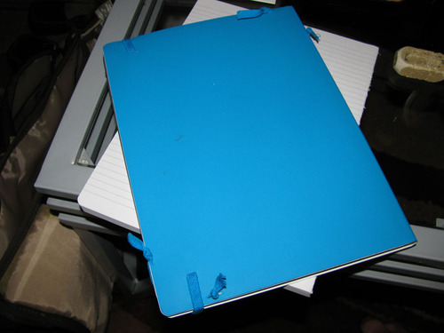
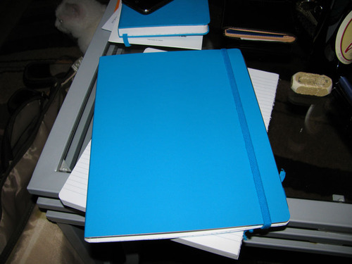

The fine folks at Ecosystem put out a call for people to hack their large notebooks in service of creating an iPad cover. I volunteered, and a large, flexi-cover, lagoon notebook showed up at my door a few weeks ago. I finally got a chance to play with the notebook today, and I think the hack turned out well.

Below is the ecosystem notebook with the iPad. The notebook is almost exactly the same shape and size and the iPad - it is about a quarter inch taller and about an eighth of an inch narrower.

The first step was to cut the signatures away from the cover. The very first and last notebook pages were affixed to the endpapers, so I was able to use a utility knife to slice just behind them. I also discovered that the blue, fabric ribbon was attached to the inside of the spine using some sort of double-sided tape. It came off easily once I had the book disassembled.

Here you can see the iPad sitting in its new home. Because it is slightly thicker than the iPad, the notebook has enough leeway to make up for the narrower width.

The next step was to figure out how to affix the iPad to the notebook. I decided to cut the bookmark in half and use it to create holders for the corners. Below, you can see the iPad with the bookmarks in place.

Here’s the rear view - I was able to thread the bookmarks through the back of the cover, and then knot them to prevent them from slipping back through the notches I made.

And here’s the finished cover, iPad safely tucked inside. I was worried that the flexi-cover wouldn’t be sturdy enough to stand up to the weight of the iPad, but the result is surprisingly secure. Thanks, Ecosystem!

