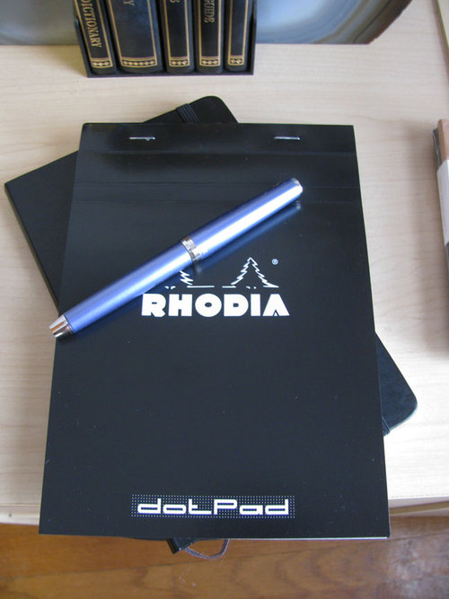
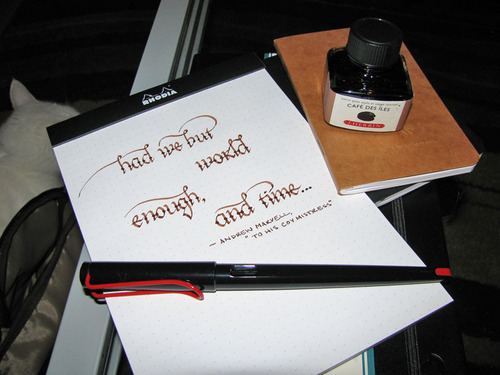
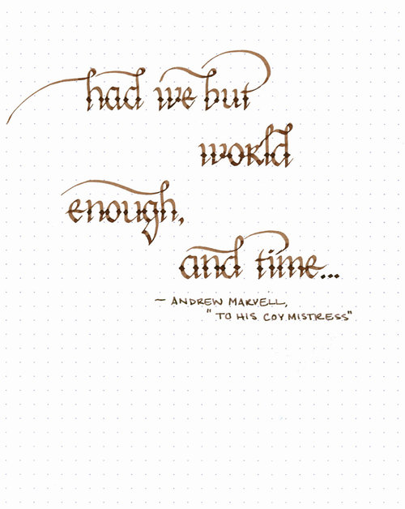

Rating: 5.0
June 23, 2010

Ever since I started writing ink reviews, I’ve been using Rhodia notepads. Rhodia uses bright white, 80gsm, acid-free, pH neutral, Clairefontaine paper in their notepads, which is a joy to write on. Clairefontaine paper is widely considered by fountain pen aficionados to be the best paper available. It has a very smooth finish to it, which makes the pen glide across the paper, and it stands up to even the wettest ink without complaint and without feathering.

All of the Rhodia pads are staple bound, and have either an orange or black cardstock cover that is pre-scored to allow it to fold back over the spine easily. The microperforated pages are easy to remove, and the cardboard backing is sturdy enough to be able to hold the pad without separate support. The version I typically use has a pale, violet, 5x5 ruled grid, which is perfect for calligraphy – the vertical lines help with word and letter spacing, as well as providing a guide for consistent letter angles.

While there are a number of sizes available, I’ve settled on the No 16 pad, which is an A5 (6” x 8 1/4”). It’s just the right size for the reviews that I write and for practicing my calligraphy.

All in all, I’ve been very, very happy with these pads. Recently, though, I received a review copy of the new Rhodia Dot Pad, which is in all respects identical to the pads that I had been using, except that it features a dot grid instead of a ruled grid. I’m not certain who originally created dot grid paper, but whoever it was should be knighted, beatified, and inducted into the Awesome Hall of Fame.

The dot grid is essentially a normal grid, with the lines removed, and only small dots at the intersections of said lines remaining. Here, the dots are the same pale violet ink that the normal grid is printed with, which makes it both easy to read and completely unobtrusive. Initially, I was skeptical that it would provide the same guidance that a ruled grid would, but a little testing revealed that it was just as easy to use. Consider me a convert – the Dot Pad is fantastic.

The Rhodia Dot Pad is currently available in four sizes: 3 3/8” x 4 3/4”, 6” x 8 1/4”, 8 1/4” x 12 1/2”, and 16 1/2” x 12 1/2”.

You can learn more about Rhodia Dot Pads here: [http://www.rhodiapads.com/collections\_boutique\_dotPad.shtml](http://www.rhodiapads.com/collections_boutique_dotPad.shtml)

Note: the Rhodia Dot Pad was provided for this review by Karen of Exaclair, the US distributor of Rhodia and Clariefontaine products.
