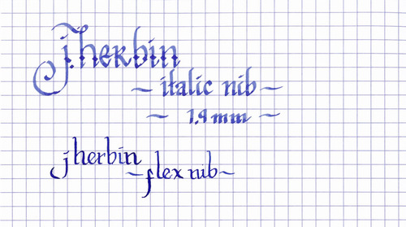

Loomi asked:

> Would you recommend an ink pen to start with Italic writing?

> I have seen videos of the Maby Todd pen with the gloriously flexible nib.

> refer to video linked at <http://youtu.be/Z\_hB8IYR69Q>

> Is that one too advanced for a beginner like me?

> What is a starting pen of Italic writing?

Excellent question! While italic and flexible nibs are both capable of producing significant line variation, there is a definite difference between the two. Italic nibs look like a chisel – they are wide and thin and generally not flexible. The produce line variation based on their angle on the paper. I use a Lamy Joy with a 1.9mm italic nib for most of my ink reviews, and is what you can see in the example below.

Flexible nibs, like the one in the video linked above, are generally the same width as a normal fine, medium, or bold nib, but the tines of the nib respond to the pressure of your hand. They separate, allowing more ink to flow, and thus produce a wider line. While there are some pen manufacturers that produce flexible nibs today, like the Namiki Falcon, vintage flexible nibs generally have a much higher degree of flex. Many nibmeisters will also modify modern nibs to add flexibility to them. For the example below, I actually used a flexible nib on a dip pen.

Personally, I think that italic nibs are much easier for a beginner to learn with. It’s much easier to control the angle that you hold your pen than to control the pressure as you’re learning. Plus, most calligraphy hands are designed for italic nibs, not flexible ones – so if you’re interested in learning classic italic, uncial, and roman scripts, then that’s where I’d recommend that you start.
