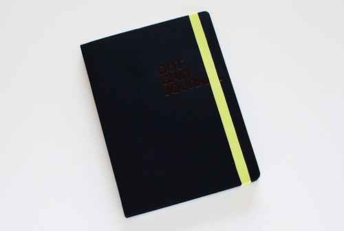

Rating: 2.0
July 7, 2010

The Dot Grid Journal is part of Behance’s Action Method product line – a set of paper products designed to support their Action Method project methodology. They’ve got a wide range of products, from pre-printed loose sheets to spiral bound notebooks, to stickers – the goal of which is to focus the user on action items. This journal, however, can easily be used without any reference to the Action Method. While the back pocket comes stuffed with two sets of Action Stickers and a couple of pamphlets on the Action Method, the book itself is simply a hardbound journal filled with dot grid paper.

Let me say that I really wanted to like the Dot Grid Journal. After recently discovering just how fantastic a dot grid (as opposed to a ruled grid) is, I was eager to have a notebook that utilized it. However, this particular product has the feeling of being, if not cheaply, then somewhat carelessly produced.

The 6” x 8” journal is filled with 200 pages of 60lb, 100% post-consumer, New Leaf bright white paper. The paper itself is fairly smooth, though not as smooth as Clairefontaine or Moleskine paper, and the sheets are perforated, which makes them easy to remove.

The black, “suede-to-the-touch” hardcover is embossed with “DOT GRID JOURNAL” on the front, and the Behance and New Leaf logos on the back. It is thinner than a Moleskine cover and has considerably more flex – not as much as an intentionally flexible cover, but more than a typical hardcover, which gives it an odd, flimsy feel.

The book has a wide elastic band, much like a Moleskine, along with a pocket in the back, and a sewn-in satin ribbon bookmark. While the bookmark is long, and feels fairly sturdy, the elastic band feels flimsy. I suspect that it will stretch out with repeated use.

The corners are rounded, but, at least on my copy, it appears that they were struck by the die at an oblique angle so that the sheets near the top of the book have more paper cut away than those near the bottom. The binding is stitched, and excels at laying flat – however, on my copy, the paper block isn’t square with the cover – it is about an eighth of an inch off on the back cover, resulting in a noticeable gap – which just adds to my opinion of poor quality control.

The pages themselves are printed with a light grey dot grid, which is easy to see but does a good job of disappearing into the background when you’re not focused on it. The grid is tightly spaced – so much so that it was too small for even my already small handwriting. It was ok I skipped every other line, but was too tight to write on every line. I would have preferred a 5x5 grid, like the Rhodia Dot Pads.

The New Leaf paper in the Dot Grid Journal is thinner than that used by Ecosystem in their notebooks, so I tested it with a variety of media. Here, there is some good news and some bad news. The good news is that it works well with Sharpie pens and ballpoint pens. There is a low amount of show-through there, and if those are your tools of choice, then you shouldn’t have any issues.

A Sharpie marker bled through the paper onto the following sheet. This result is not surprising, but not ideal either. However, I don’t tend to use permanent markers in my writing notebooks, so it’s not an issue for me.

Fountain pen ink is the bad news, however. On this paper, both watery inks like Iroshizuku Kon-peki and thicker, more viscous inks, like J. Herbin 1670 result in significant show-through and moderate bleed-through. Anything wet goes right through the paper. Worst of all, though, is that the dots themselves repel fountain pen ink. It looks like the pen is skipping. This is in no way a fountain-pen friendly notebook.

Overall, I can’t recommend the Behance Dot Grid notebook. I’m a fan of dot grids, and I’m still in the market for a dedicated notebook (Ecosystem, I have a product suggestion for you), but this product doesn’t fill my needs. If you’re a fan of the Action Method, or you’d still like to know more about this notebook, you can find it on Behance’s online store:

[http://www.creativesoutfitter.com/Products/Dot-Grid-Journal/20](http://www.creativesoutfitter.com/Products/Dot-Grid-Journal/20)
