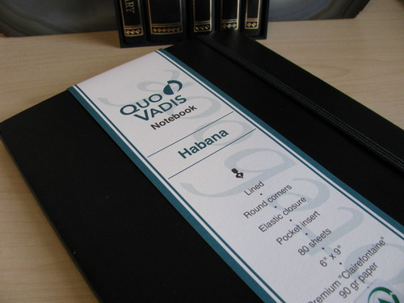
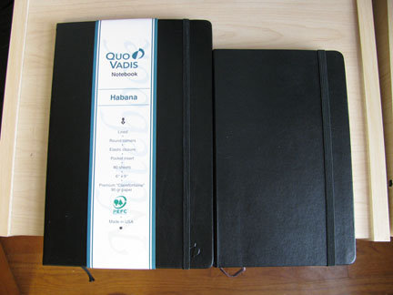
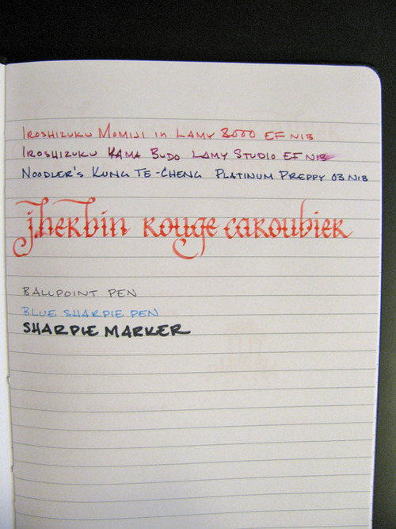

Rating: 4.0
August 10, 2010

Quo Vadis, who, for the past fifty years have produced well regarded date books and planners, also produce a set of notebooks known as Habana. They come in a small size of 4 x 6 3/8” and large of 6 1/4” x 9 1/4”. The large Habana notebook is noticeably bigger than a large Moleskine notebook, but otherwise mimics its form factor. It has rounded corners, a pocket in the back, a sewn-in ribbon bookmark, and an elastic closure. The elastic feels slightly flimsy to me, though, and I can see it stretching out with repeated use.

The hardbound leatherette cover, which comes in red, black, blue, and taupe, is softer than a Moleskine cover, feeling much more like actual calfskin. Also, unlike a Moleskine, the Habana cover has a bit of flex to it, which I’m not fond of. It’s not as flexible as an actual flex cover, but it’s not stiff like a traditional hardback. It’s somewhere in the middle, and I’m not sure what to make of it.

The paper, though, is where the Habana excels. It features 80 sheets of ultra-smooth, bright white, chlorine-free, acid-free, pH neutral, 90 gr Clairefontaine paper. Instead of bleaching the wood pulp, calcium carbonate, the mineral that makes up chalk, is added during the paper-making process, which is what gives the paper both its bright finish and smooth texture. The wide-ruled, large journal has 25 lines compared to the 30 of a narrow-ruled, large Moleskine. I much prefer narrow-ruled paper, but those that use a bold or wide nib pen will likely find the wide-rule to be quite accommodating.

Those that are concerned about environmental sustainability will be pleased to know that Clairefontaine paper is produced in France from sustainably managed forests that are PEFC (Programme for the Endorsement of Forest Certification) certified. Additionally, the Quo Vadis plant in New York is PEFC certified, which means that the end products can bear the PEFC logo, as the Habana does. Even the ink used is vegetable-derived (soy, corn, linseed) and water-based.

So how does the paper stand up to fountain pen ink? In a word: wonderfully. Clairefontaine paper is regarded by fountain pen aficionados as some of the best in the world to write on, and the Habana aptly demonstrates why. It is silky smooth, and even scratchy nibs glide easily over the surface. The paper is of low absorbency, so I noticed little to no feathering, even with wet inks like J. Herbin or Iroshizuku. The trade-off is that most inks take much longer to dry on this paper than on more absorbent paper, like an Ecosystem notebook (note the smearing in the writing sample above). Noodler’s inks, in particular, often take upwards of a minute to dry on Clairefontaine paper when they take only seconds to dry on standard office paper.

The 90 gr paper is thick enough to stand up very well to the wettest inks. I noticed no bleed-through from fountain pen inks at all during my testing, and the amount of show-through is noticeably less than in a Moleskine notebook. It also handles other media well - ballpoint, rollerball, and Sharpie pen all wrote smoothly and without issue. A Sharpie marker bled through, of course, but didn’t seem to penetrate onto the underlying paper.

Overall, the Quo Vadis Habana is a great notebook. While I prefer a narrower rule and a stiffer cover, the Clairefontaine paper can’t be beat. This is definitely worth considering adding to any notebook collection.

Note: the Quo Vadis Habana was provided for this review by Karen of Exaclair, the US distributor of Rhodia, Quo Vadis, and Clairefontaine products.
