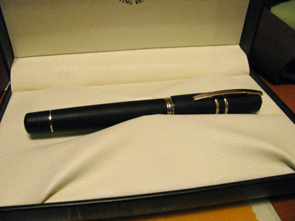

Let me start by stating that the Visconti Homo Sapiens is the nicest pen I own, hands down. It's been on my "to covet" list for a while, and I decided to treat myself recently, as a reward for a promotion at work.

The body is constructed from a dense black material that is a combination of basaltic lava and resin. It is slightly hygroscopic, meaning that it will absorb a light amount of moisture, and it's easy to grip, so it's a pleasure to hold for longer writing sessions. The trim, including the spring-loaded clip, is constructed entirely from solid bronze, and appears to be developing a lovely patina as the days wear on. While the pen comes packed with a cleaning cloth for the bronze, I don't envision myself using it any time soon.

The Homo Sapiens comes with a new 23k palladium "dream touch" nib, which is available in EF, F, M, B, BB, and Stub widths. I purchased the EF nib, which is apparently considered a specialty item, so you may not be able to find it at all retailers.

Unfortunately, I ran into trouble with the nib when I first got the pen. When I pulled it out of the box for the first time, I noticed that the nib and feed were misaligned. It wrote, but the pen was fairly dry, was a bit of a hard starter, and felt scratchy, due to a lack of lubrication from the ink. Goldspot Pens, who I ordered the pen from, arranged for me to send it back to the distributor for a nib swap. They would have done it themselves, but since the EF nib is considered a specialty item, they didn't have any spares in-house.

When I got the pen back from the distributor, I was dismayed - it looked like the nib and feed were still slightly misaligned. I inked it up to test it, and was immediately relieved. Yes, the alignment still appears to be slightly off, but now the pen writes like a dream (living up to the "dream touch" moniker). It has become a wet writer, and it simply glides across the surface of the page.

On Rhodia paper, the EF nib produces a line very similar to the gold EF nib on my Lamy 2000. However, the extra ink it puts down results in a much darker line; both writing samples above were written with Diamine Imperial Purple, and the Visconti is clearly darker. On more absorbent papers, like that in a Moleskine cahier, the line ends up being somewhat thicker - acting more like a fine nib.

The Homo Sapiens uses a vacuum power filler that's made from titanium. While I have heard other people complain that it doesn't draw much ink, I haven't had any trouble with it. It is definitely a bit trickier to get the maximum fill from this pen than one with a piston fill mechanism, but once you get the hang of it, it works quite well.

At 5.75 inches, the Visconti is just a bit longer than a Lamy Safari (or an Al-Star, pictured here). However, it is quite a bit heavier, weighing in at 1.6 ounces - a full ounce heavier than the Safari. Those that prefer their pens light may want to test drive one before purchasing. The cap is heavy enough that it does not lend itself to posting, but at 5.625 inches long unposted, I can hold it comfortably in my gorilla-sized hands.

I can certainly see why the Homo Sapiens received a number of pen of the year accolades for 2010. It's a beautiful, elegant, and well-crafted pen. It took a little bit of effort to get the nib tuned right, but it was worth the effort. It was worth every penny of the $595.00 it cost. I can highly recommend it for those who are looking for a high-end fountain pen.

The Visconti Homo Sapiens is available from:

- [Goldspot Pens](http://www.goldspot.com/Visconti_pens/Homo_Sapiens.html)
