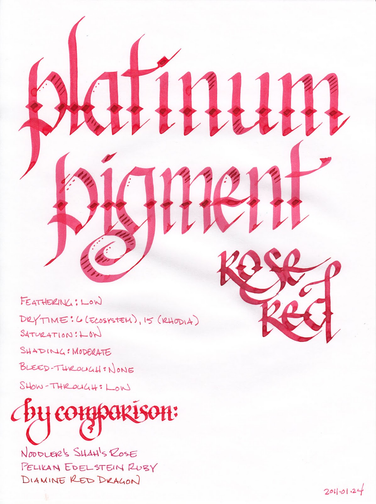
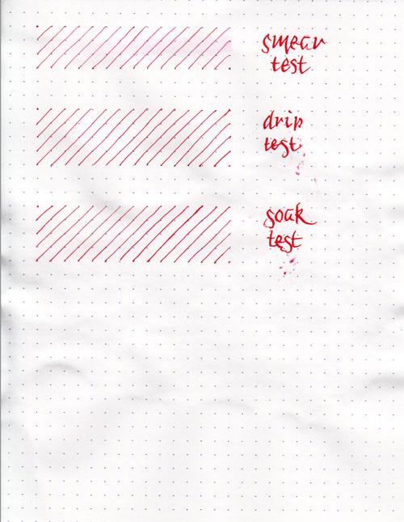
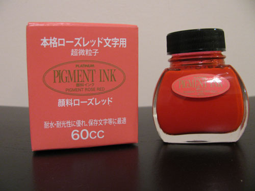

Rating: 4.0
February 8, 2011

Platinum Pigment Rose Red is my first experience with pigment-based fountain pen inks. The vast majority of fountain pen inks are dyes dissolved in water or other solvents, but pigment-based inks have micro-particles that are suspended in solution. They are specifically formulated for fountain pens, with particles small enough and solvents benign enough that they won't clog the feed or interfere with the capillary action of the nib.

From what I can discern, though, the nature of a pigment based ink does call for a vigilant level of pen hygiene. It is always a good idea to flush one's pen with water when switching between inks and between every few fills when sticking with the same ink – and it's essential when using this ink. Additionally, you should definitely flush this ink from a pen if you're going to leave it for more than a week without use – it will make the pen very difficult, if not impossible, to clean if it dries in the pen. That said, it appears to be safe if these normally sensible precautions are followed.

Rose Red is an ink with a low level of saturation and, in a fine nib, possesses a moderate degree of shading. In a calligraphy nib, though, the intensity of the ink corresponds directly to the wetness of the line – it ranges from a pale bubblegum pink to a juicy, ruby red grapefruit.

This ink behaved quite well on each of the papers I tested it with. I saw feathering on neither Rhodia paper, which I expected, as it tends to be feather-resistant, nor on the absorbent paper of an Ecosystem journal. Show-through was low, as it's a fairly light colored ink, and I noticed no bleed-through with any of the pen and paper combinations that I tested.

Dry time varied considerably, though. On Ecosystem paper, the ink was dry to the touch on six seconds. On Rhodia, which normally takes longer, it took about fifteen seconds – much too long for lefty-over-writers. For my habits, it's in the comfortable range.

One of the selling points for pigment inks is their water resistance. Some bulletproof dye-based inks, like Noodler's, bind to the cellulose in the paper, but any ink left to dry on the surface can wash away or smear when exposed to water. This makes them great for signing checks, but poor candidates for artists that want to apply a wash over them. Platinum pigment inks, on the other hand, dry like paint. This makes them ideal for artists who want to work with mixed media.

The smear test, in which I run a wet finger over the paper, revels that the ink can be smudged with a bit of effort. If you look close, you can see a fine pink tint to the paper where I dragged it across the lines. On the other hand, the drip test, in which I let droplets of water settle on the page before blotting them up, and the soak test, in which I run the paper under the faucet for a minute, show that the ink hasn't moved at all. I was incredibly surprised! It doesn't look like I got water near it at all – a major difference from most dye-based inks.

In order to get the ink to leave the page, I actually had to get the paper wet, and then rub it hard enough to take a layer of paper up. Essentially, I had to destroy the paper to get the ink off. This certainly qualifies for the label of permanent for me – and I think it will certainly please those that are looking to use it for artistic purposes.

Platinum Pigment inks come in a clear, 60ml bottle that definitely shows off the ink. Unlike many dye-based inks, which can look dark and uniform within the bottle, pigment inks are vibrant, and look exactly like their respective color on paper. The thick bottomed bottle would look equally at home on an artist's shelf as on top of one's desk.

Pink inks are likely even less business appropriate than red inks – even red ink finds a place in proofing. This ink is certainly not going to be the one to reverse that trend. For those considering using it for personal journaling or correspondence, I would look at the sample provided closely – the contrast isn't high enough in an EF nib to be comfortable for long periods of reading, in my opinion. For calligraphy or other artistic purposes, though, this is an amazing find – and is certainly where I see myself and others using it.

For my first experience with pigment-based inks, Platinum Pigment Rose Red left me satisfied. The color is far too pink and light for my everyday use, but it leaves me excited to try the other colors in the Platinum Pigment line. For those that like rose colored inks, this is definitely one to consider.

Review materials: For the wide strokes, I used three calligraphy pens: Pilot Parallel 6.0mm and 3.8mm pens, and a 1.9 mm Lamy Joy. All three have steel nibs. For the fine strokes, I used a Lamy EF steel nib on a Lamy Safari. The paper is Rhodia 80g.

Platinum Pigment Rose Red is available from:

- [The Goulet Pen Company](http://www.gouletpens.com/Platinum_Pigmented_Rose_Red_Ink_p/plat-inkg-1500-20.htm)
