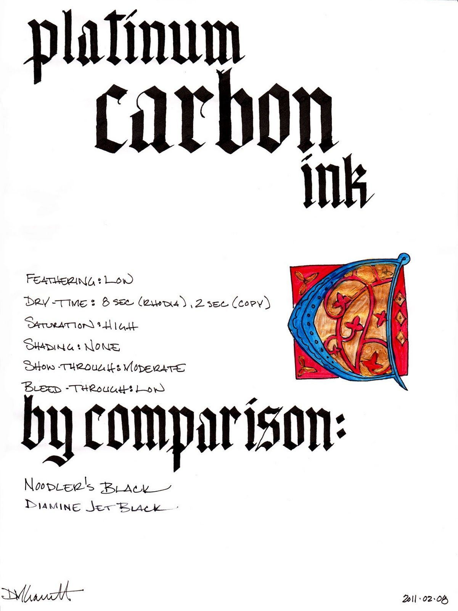
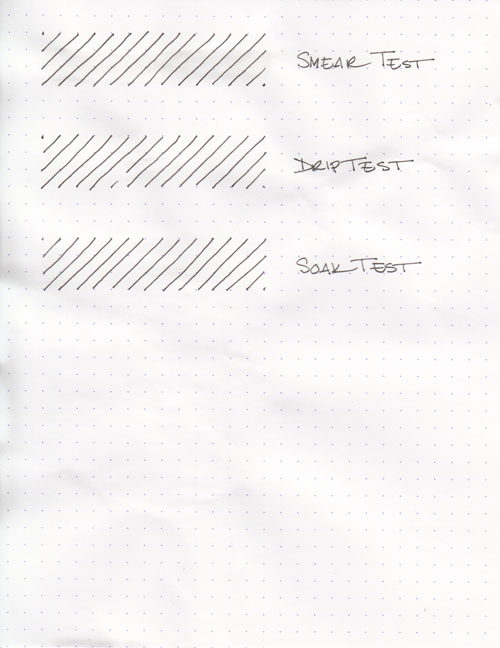
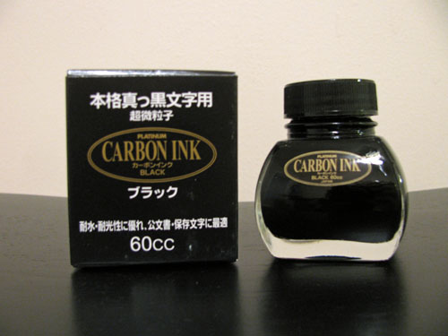

Rating: 4.5
March 8, 2011

Traditional carbon inks were made with soot or lampblack mixed with gum arabic or another binder. The carbon particles would not fade over time, even when exposed to sunlight, and the ink was not harmful to paper. However, it was not waterproof, could smudge in humid environments, and was not at all fountain-pen friendly.

Platinum has re-engineered the carbon ink, though, to solve all of those problems. Their Carbon Black ink is a waterproof, pigment-based, archival quality fountain pen ink. For those unfamiliar with pigment-based inks, they differ from traditional dye-based inks in that they are made by suspending micro-particles in solution. They are specifically formulated for fountain pens, with particles small enough and binders benign enough that they won't clog the feed or interfere with the capillary action of the nib during normal use.

From what I can discern, though, the nature of a pigment based ink does call for a vigilant level of pen hygiene. It is always a good idea to flush one's pen with water when switching between inks and between every few fills when sticking with the same ink – and it's essential when using this ink. Additionally, you should definitely flush this ink from a pen if you're going to leave it for more than a week without use – it will make the pen very difficult, if not impossible, to clean if it dries in the pen.

Unlike the [Platinum Pigment Rose Red](/blog/2011/2/8/ink-review-platinum-pigment-rose-red/) ink, which I have previously reviewed, I have noticed that the Carbon ink has a slight tendency to stain converters – bestowing a slightly smoky finish on the clear plastic – much like Noodler's Black does. Therefore, I wouldn't recommend it for a clear demonstrator, but it should be fine for most other pens. It appears to be otherwise safe if sensible precautions are followed.

Carbon produces a solid black line in both an extra fine nib and a wide calligraphy nib. It is highly saturated and offers no shading. Nor does it possess any sort of tint – there are no blues or reds or greens hiding underneath. It's soot black.

It was well behaved on each of the papers that I tested it with. I saw no feathering on any paper, from Rhodia to Ecosystem to standard copier paper to ultra-thin bagasse. I saw moderate show-through on thinner papers – it is a fairly dark ink – but low to no bleed-through.

Drying time was also fairly good, ranging from 2 seconds on copier paper to 8 seconds on the normally long-drying Rhodia paper. The ink flowed nicely, and produced a line true to width – being neither particularly wet nor particularly dry.

One of the selling points for carbon and other pigmented inks is their water resistance. Some bulletproof, dye-based inks, like Noodler's, bind to the cellulose in the paper, but any ink left to dry on the surface can wash away or smear when exposed to water. This makes them great for signing checks, but poor candidates for artists that want to apply a wash over them. Platinum Carbon Black, on the other hand, dries like paint. This makes them ideal for artists who want to work with mixed media.

The smear test, in which I run a wet finger over the paper, reveals that the ink can be smudged with a bit of effort. If you look close, you can see a fine light-grey tint to the paper where I dragged it across the lines. On the other hand, the drip test, in which I let droplets of water settle on the page before blotting them up, and the soak test, in which I run the paper under the faucet for a minute, show that the ink hasn't moved one bit. It doesn't look like it got water near it at all – a major difference from most dye-based inks.

In the visual example above, I was able to draw an illuminated letter "C" with the carbon ink and then paint over it with thinned acrylic paint without smudging it at all. I had no trouble with it affecting the color of the paint in any way. It seems to be quite artistically friendly in this regard.

Platinum Carbon comes in a clear, 60ml bottle that definitely shows off the solid black ink. In the bottle, it looks exactly like it does on paper. The thick bottomed bottle would look equally at home on an artist's shelf as on top of one's desk.

Black inks are a staple of the business world, and Carbon Black is a great option. It produces a solid line and is easy to read on any paper. Its waterproof nature makes this a great signature ink, and it is very artistically friendly. It's also great for calligraphy – it makes blackletter scripts look fantastic.

I'm not a frequent user of black ink, but Platinum Carbon Black has edged out Noodler's Black as my reference black. I can easily recommend it for those that prefer a dark, black ink, and for those that are using it to create art.

Review materials: For the wide strokes, I used Pilot Parallel 6.0mm and 3.8mm calligraphy pens. They both have steel nibs. For the fine strokes, I used a Lamy EF steel nib on a Lamy Safari. The illuminated letter was outlined with a Lamy EF nib and then painted over with acrylic paints and a brush. The paper is Rhodia 80g.

Platinum Carbon Black is available from:

- [Goulet Pen Company](http://www.gouletpens.com/Platinum_Carbon_Black_Ink_p/plat-inkc-1500-1.htm)
- [Jet Pens](http://www.jetpens.com/index.php/product/view/products_id/3461)
