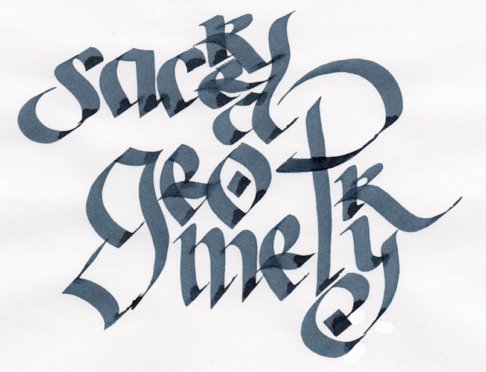
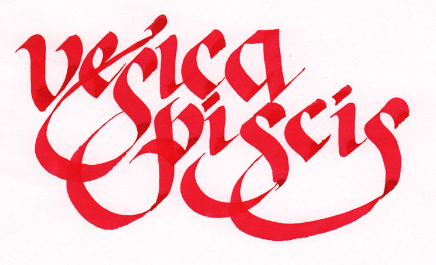

Here are a couple of practice images inspired by the serialized story that I'm writing:

"sacred geometry" - Sailor Jentle Blue-Black in a 6.0mm Pilot Parallel pen.

vesica piscis - Noodler's Dragon's Napalm in a 6.0mm Pilot Parallel pen
