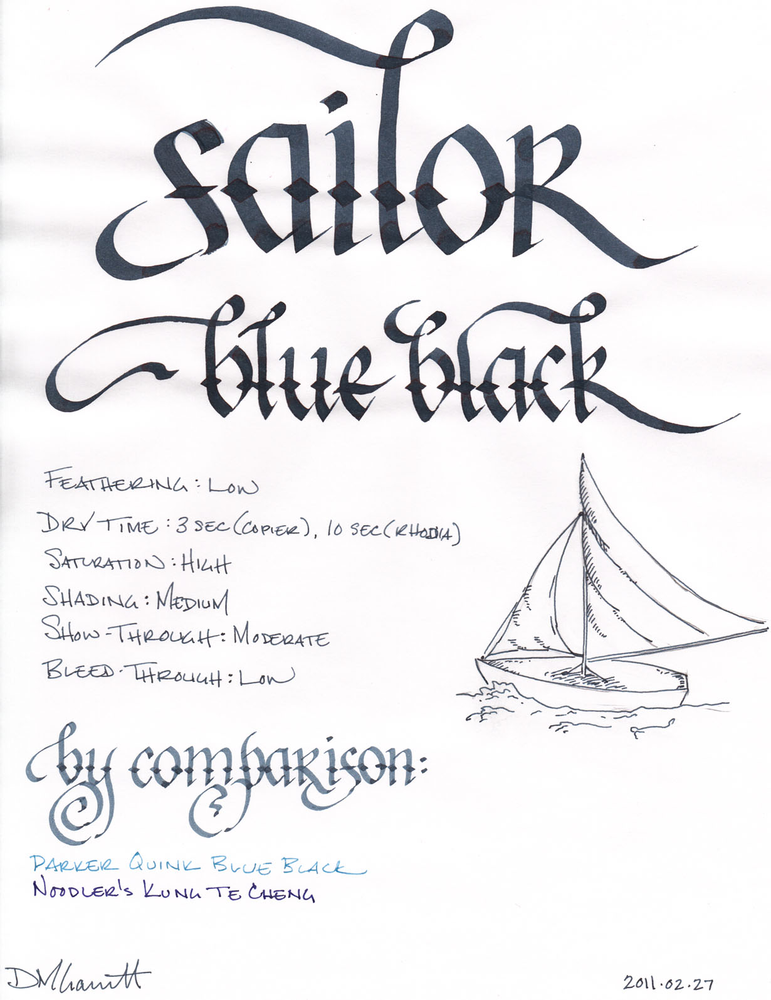
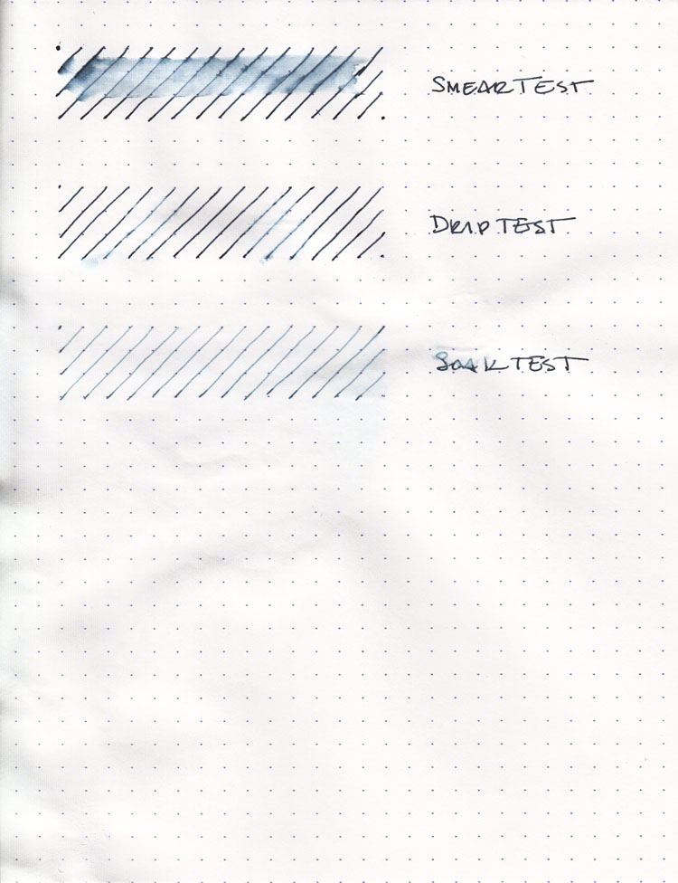
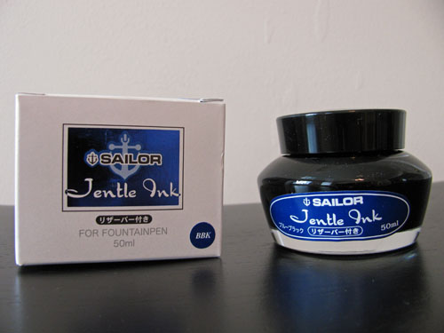

Sailor Jentle Blue Black is a very pleasant, easy to use, blue-black ink. It is a dark blue with tinges of black - exactly what I would expect from a blue-black ink, and exactly unlike the Parker Quink Blue Black I reviewed previously. It is a moderately wet ink, compared to the Parker Quink, and therefore writes with a bolder line. It is highly saturated and exhibits a medium level of shading in a fine-nibbed pen.

As with all of my recent reviews, I tested the ink on a variety of paper using a fine-nib: cheap office copier paper, Staples bagasse, an Ecosystem notebook, and the high-quality Rhodia webbie. On all of the paper, the ink performed equally well.

I noticed no feathering on any of the samples, which impressed me right off the bat. The ink is dark and saturated, so I did notice a medium level of show-through across the board, and no bleed-through on any of the samples except for a very minor amount on the cheap copier paper.

Dry time faired quite well compared to other inks, as well. On the copier paper and Ecosystem notebook, it was dry to the touch in three seconds. On the bagasse, it dried in eight seconds, and on the Rhodia in ten.

My only complaint about the ink is that it has a very sharp chemical solvent smell to it. Some inks possess a mild odor that is only noticeable up close, but this scent is more powerful. It is similar to the smell of some permanent markers. If you're sensitive to odors in general, or specifically to that type of scent, I'd recommend steering clear, or at least evaluating it in person before buying.

Sailor Blue Black did better than I expected on the water tests. It showed the worst behavior on the smear test, in which I dragged a wet finger across the page and got a nice blue-black smear for my effort. While the lines on the page were not destroyed, the smeared ink is dark and saturated enough to make it hard to read.

On the drip test, in which I let droplets of water soak on the page for a minute before blotting, I noticed a lightening of the lines on the page, but that was all. They remained fully legible. The soak test, in which I run the paper under a faucet for a minute, resulted in similar behavior. The lines lightened as the surface ink was washed away, but what remained was entirely intelligible.

My conclusion is that Sailor Jentle Blue Black has an appreciable degree of water resistance. You're unlikely to lose your work if it gets wet, though it might not be as pleasant to read as if it hadn't.

Sailor inks come in a bottle that looks like a cold-cream jar – though I suspect the water-resistant blue-black ink would make a poor cosmetic substitute for anyone but zombies. More interesting, perhaps, than the bottle's outward appearance, though, is the mechanism it has built-in for facilitating the filling of pens.

A plastic funnel of sorts sits inside the bottle. Prior to filling a pen, turn the bottle upside down (leave the lid on for this step, of course), and ink will fill the funnel. Then turn the bottle back over, and the ink will remain in the funnel for long enough to allow you to easily fill the pen. This is especially handy once the ink falls below a certain level in the bottle; it makes it very easy to get to every last drop.

As with most blue-black inks, Sailor Jentle is tailor-made for business use. It's a conservative color, provides very good contrast on the page, and is generally well behaved. It's an ink that would also work well for journaling or correspondence, and, aside from the previously mentioned odor, one I have no qualms recommending.

Review materials: For the wide strokes, I used three calligraphy pens: Pilot Parallel 6.0mm and 3.8mm pens, and a 2.0mm Pelikan Script. All three have steel nibs. For the fine strokes, I used a TWSBI EF steel nib on a TWSBI Diamond 530. The paper is Rhodia 80g from a No. 18 notepad.
