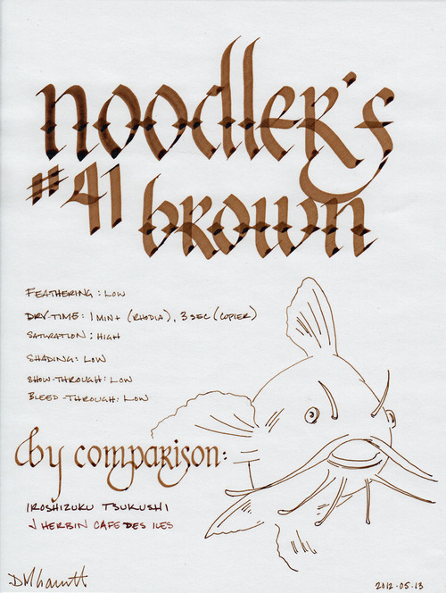
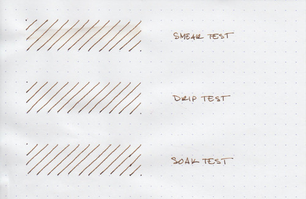
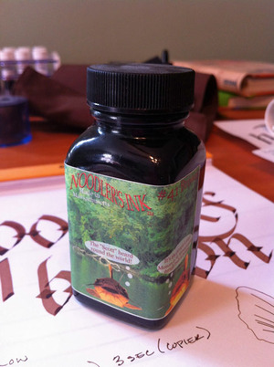

My infatuation with Noodler's bulletproof ink continues. This time, it is #41 Brown – an ink named after the junior senator from Massachusetts, Scott Brown. I'll get to the political meaning behind the name later, when I discuss the label - but for now, let it be known that the ink is a rich, dark brown with golden overtones. It is highly saturated, like most Noodler's inks, which results in a solid, clean line with little shading.

I tested the ink on a Rhodia notepad, Staples bagasse, and cheap office-quality copier paper. Compared to [Noodler's Black](/blog/2012/3/24/ink-review-noodlers-black-revisited), #41 Brown is less viscous - it doesn't enable the pen to glide across the page like an Olympic ice skater, but it is still easy and pleasant to write with. Like most Noodler's inks, it exhibits very little feathering – even on copier paper. Bleed-through is non-existent on all of the papers I tested it with; show-though is also low to nil.

Like most Noodler's inks, the drying time varies widely depending on the paper. On cheap, absorbent, copier paper, it dried to the touch on three seconds. On Staples bagasse, it dried in fifteen seconds. However, as is typical, it took over a minute to completely dry and become smudge proof on the coated Rhodia paper.

Historically, drying time has been the major factor preventing me from extensively using Noodler's inks. As I mentioned in my re-review of Black, my writing habits have changed extensively enough that I no longer find the long drying time to be an issue. Your mileage may vary – if you are tearing through pages in a Moleskine or Rhodia Webbie, committing your latest brainstorm to paper, you may well be unhappy with the results. If you are a lefty and insist on using high quality paper and notebooks, you may be in for a rude surprise. However, if you spend all day writing on legal pads and copier paper, you may quickly fall in love.

Noodler's bulletproof inks are designed to withstand attempts to remove them from paper. The dyes bond to the cellulose in the paper and can't be washed away by water, bleach, or other methods. Therefore, they stand up fairly well to water on most paper. On coated papers that resist ink, they may sometimes smudge, as the ink that dries upon the surface is still susceptible to being washed away.

The results of the water tests demonstrate this behavior. On the smear test, in which I run a wet finger across the paper, some of the ink travels with it, resulting in a light brown smudge. The lines remain perfectly legible, and just as bold as before, but the excess ink does make a bit of a mess.

On the drop test, in which I let droplets of water soak on the page before blotting them up, the ink performs admirably. Since the blotting paper picked up the excess ink, it's nearly impossible to tell where the water was sitting. The ink that did bond to the paper remains bold and readable.

On the soak test, in which I run the paper under a stream of water for several minutes, the bulletproof #41 Brown shows its true power. The excess inks was carried away quickly, leaving a completely legible set of lines that appear no different than how they started. Noodler's bulletproof inks don't mess around.

Nathan Tardiff, the wizard behind Noodler's ink, doesn't do things in half measures. He designs his inks to behave well on the most common paper types, instead of assuming that the user will have paper that is friendly to fountain pen ink, and he designs his bulletproof inks to stand up to all but the most determined forger.

One of the other areas where Mr. Tardiff deals in extremes is in his political beliefs. He's not afraid to share them, going so far as to plaster them on the labels of his bottles. In the case of #41 Brown, the label has three catfish (the mascot of Noodler's ink), which are apparently from Lake Pearl in Wrentham, Massachusetts, residence of Senator Scott Brown. The three catfish are pictured as thinking, in order, "Cast asunder one party nepotism and feudalism," "The 'Scott' heard round the world," and "It's the people's seat! Monarchy in Massachusetts eternally results in revolution."

Collectively, they refer to the US Senate seat that was held by members of the Kennedy family (or their family friends) for over 50 years, starting in 1953 with John F. Kennedy. The family remained a presence in the US Senate until 2009, when John's brother Ted passed away from a brain tumor. In winning a 2010 special election to fill the vacated seat, Brown became the first Republican elected to the US Senate in Massachusetts since 1972.

That's quite a bit of background info to explain the label on an ink bottle – but the good Mr. Tardiff doesn't shy away from labels that need to be explained. Regardless of your political affiliation, it is fair to say that the labels bring an interesting touch to an otherwise utilitarian bottle. Aside from some specialty lines, Noodler's inks are packaged in plain, 3 oz., glass bottles that are sourced from high-volume suppliers in order to keep costs down. You could easily see these bottles filled with spices in your local grocery store. The bottles are filled to the brim, so be careful when opening – make sure you've got it somewhere flat and stable before you unscrew the cap.

Noodler's #41 Brown is a great ink – one that I'm glad that I have in my collection, and one which will see a great deal of use in my daily work. It's somber enough for business use, I'd suggest, but also interesting enough for artistic endeavors. I'll happily recommend it, as Noodler's inks are one of the best values in the industry.

Review notes: The wide strokes were made with a 6mm steel Pilot Parallel calligraphy pen, the medium strokes with a 1.9mm steel nib on a Lamy Joy, and the narrow strokes with an EF Palladium nib on a Visconti Homo Sapiens. The paper is Rhodia 80gsm.
