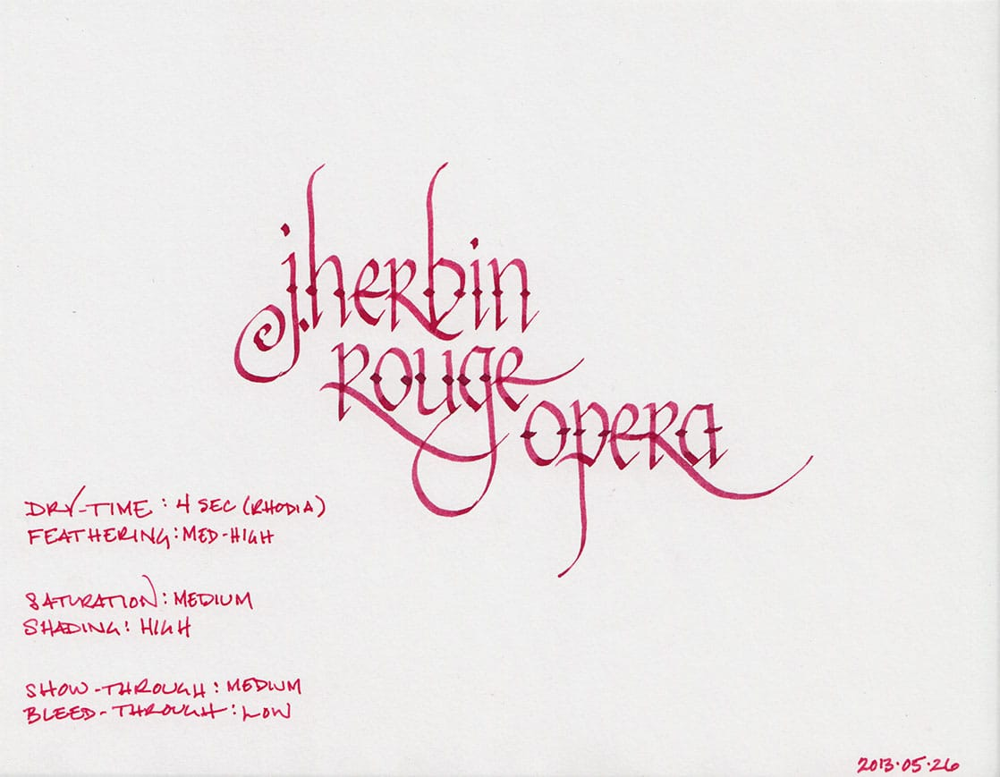
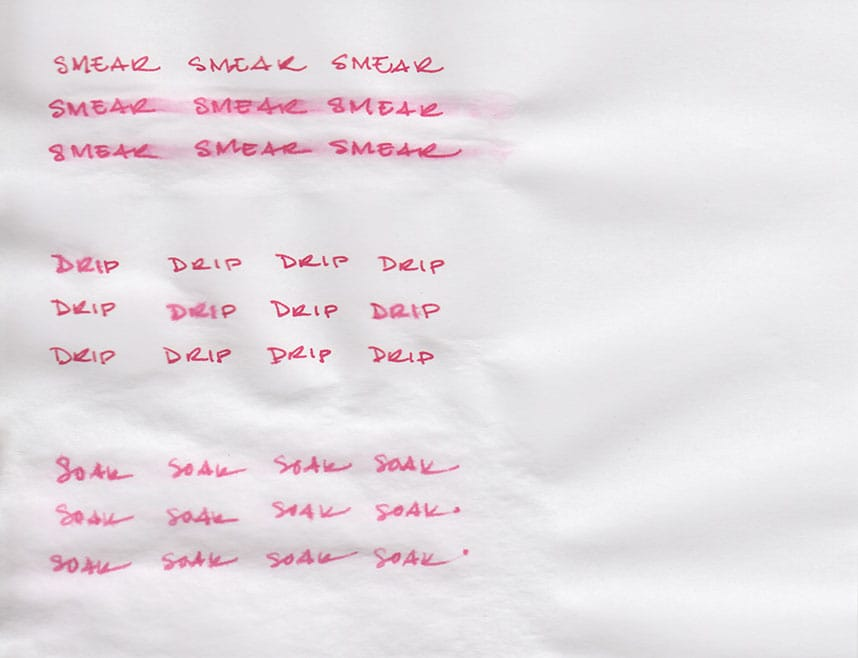
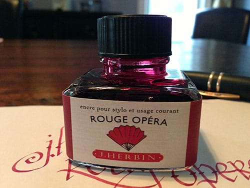

J. Herbin Rouge Opera should come with a warning. If you fill your fountain pen with it, you will, in short order, develop a compulsion to listen to Puccini, Verdi, and, perhaps, Bizet. The ink is the color of a heavy, velvet stage curtain and of walls lined with brocade. It's the color of soprano Anna Netrebko's dress in the 2005 staging of La Traviata. It's each of those shades from moment to moment, and it's all of them at once. Just try to avoid humming a little Wagner once your pen is inked up.

Practically speaking, the color is a dusky red with a hint of maroon. It exhibits a high degree of shading that ranges from brick red to a dark pink. Rouge Opera's behavior, pleasantly, is decidedly less melodramatic than its color. It took 4 seconds to dry on Rhodia paper and Staples bagasse. On cheap, office-grade copier paper, it dried nearly instantaneously.

Like many of the J. Herbin inks, Rouge Opera exhibits a high degree of feathering on low-quality paper. Bagasse fared the worst, with my [Visconti Homo Sapiens](/blog/2011/11/20/pen-review-visconti-homo-sapiens) producing a medium-weight line from a fine nib. On copier paper, the feathering was noticeable, but tolerable. As always, Rhodia and Clairefontaine paper fared the best.

On Rhodia and Clairefontaine paper, Rouge Opera results in low levels of bleed through and moderate show-through. I noticed significant bleed-through and show-through on both Staples bagasse and on copier paper, however. It is something to be aware of if one's intent is to use both sides of a page.

Most J. Herbin inks that I've reviewed have not been on speaking terms with water. [Bleu Pervenche](/blog/2013/1/1/ink-review-j-herbin-bleu-pervenche), for example, ran screaming at the slightest hint of moisture, and [Terre de Feu](/blog/2011/1/3/ink-review-j-herbin-terre-de-feu) faded into the background, leaving only a shadow of its former self behind. I was expecting the same behavior from Rouge Opera, but was, quite frankly, astounded at how it actually responded.

The smear test, in which I run a wet finger across the page, did result in significant smearing. However, as you can see, the words on the page are still completely legible – most of the ink remains bonded to the paper. The drip test, in which I let droplets of water sit on the page before blotting them up, resulted in feathering and lightening of the lines, but still left the words completely legible.

The soak test was the most surprising of all. While some ink washed away, and what was left feathered noticeably, all of the words are still completely legible and visible. I suppose one could refer to it at this point as Rouge Operetta – still of exceptional quality, just a little bit lighter.

J. Herbin fountain pen inks come in a 30ml bottle with an integrated pen rest that is suitable for displaying on top of one's desk. The red label on this bottle is fairly representative of the ink inside.

Rouge Opera is a beautiful, dramatic, and on certain types of paper, well-behaved ink; it's certainly a color that lives up to its title. The excellent water-resistance is an unexpected bonus that puts this J. Herbin ink over the top. Keeping the high degree of feathering on poor quality paper in mind, I highly recommend it.

Review Notes: the fine lines were made with a Visconti Homo Sapiens pen with an extra fine 23k palladium nib. The bold lines were made using a Lamy Joy calligraphy pen with a 1.9mm steel nib. The paper is 80gsm from a Rhodia Bloc Pad.
