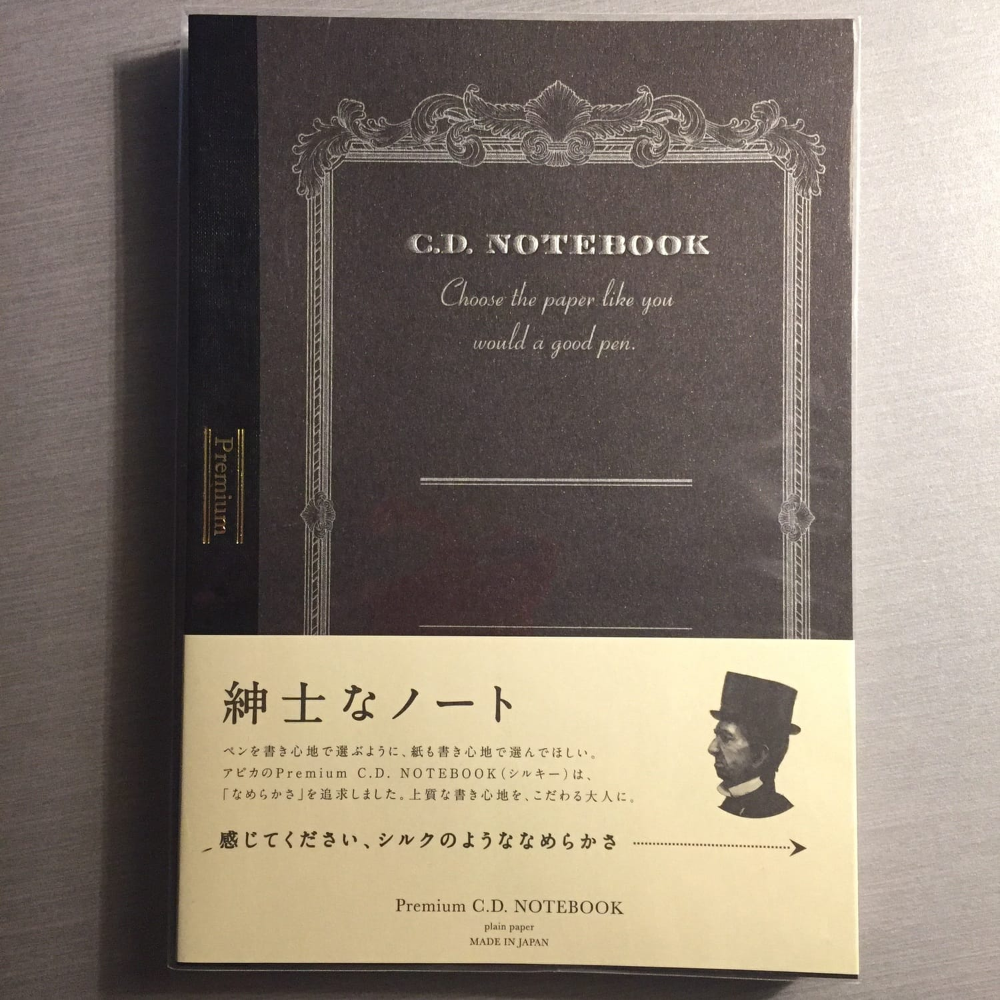
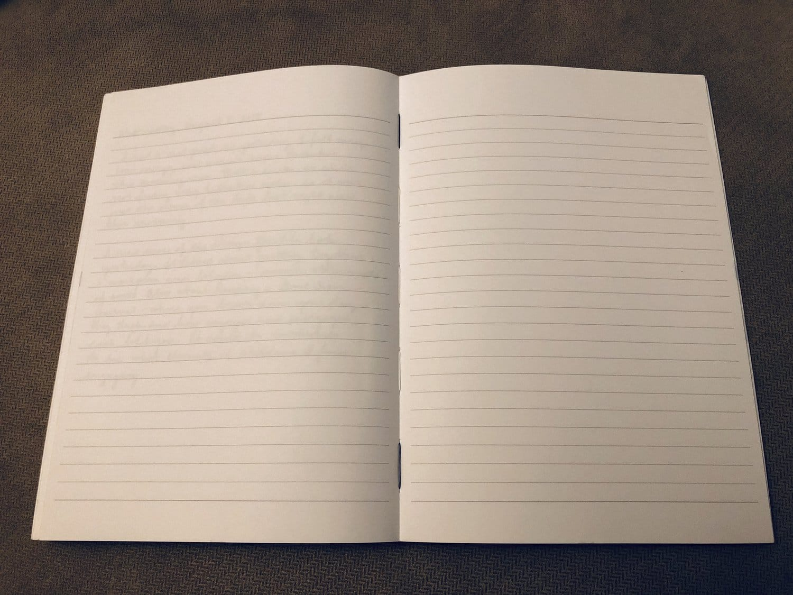

APica Premium CD Blank Notebook

- Plain, lined, or graph
- 96 sheets
- Bright white
- Stitched binding, lays flat
- Squared corners
- Card stock cover

Over the past 9 months, I’ve been using an Apica Premium CD Notebook as my daily journal. I still love my [Traveler’s Notebook](/blog/2015/12/29/midori-travelers-notebook), but it’s now dedicated to my writing journal and sketchbook. I didn’t want to stuff a third insert into the TN, so I bought a lined Apica from [Goulet Pens](https://www.gouletpens.com/collections/apica/products/apica-premium-cd-a5-notebook-blue-lined?variant=11884609765419).

APICA PREMIUM CD LINED NOTEBOOK

It’s a joy to write in. Its 96 pages of bright white premium paper are glassy smooth. It is very easy to write on, with no drag whatsoever. This is the closest that you’ll get to knowing just how much friction your pen contributes to the writing experience.The paper itself held up to any ink I put in my [Visconti Homo Sapiens](/blog/2011/11/20/pen-review-visconti-homo-sapiens/) (EF nib), with no bleed-through and no show-through. Dry times varied by ink, but were generally comparable to other sized papers - a little on the longer side, but not prohibitive.

The cardstock covers are fairly thick, providing enough protection for me to throw the book into my bag every day, though not enough support to write without a solid surface underneath. The book has stitched binding, and it lays flat without having to force it. Its squared corners have gotten a little rounded from being carried in my bag for the past year, but it’s held up pretty well overall.

My primary complaint is that, at least on the blue cover of the lined notebook, the dye on the cover bleeds like crazy when it gets wet. I can recall two times,l vividly, that I set the notebook down on a wet counter and ended up with blue dye all over the place, including inside the book.

The notebook comes in plain, lined, and graph variants. I own the plain and lined versions. The plain version comes with a gray cover, the lined with a blue cover, and the graph with a red cover. The covers all have silver embossed details, and the spine on all three has black tape covering the stitched binding.

While it’s a little on the pricy side, the Apica Premium CD Notebook is certainly worth the investment if you’re looking for some of the best paper around.
