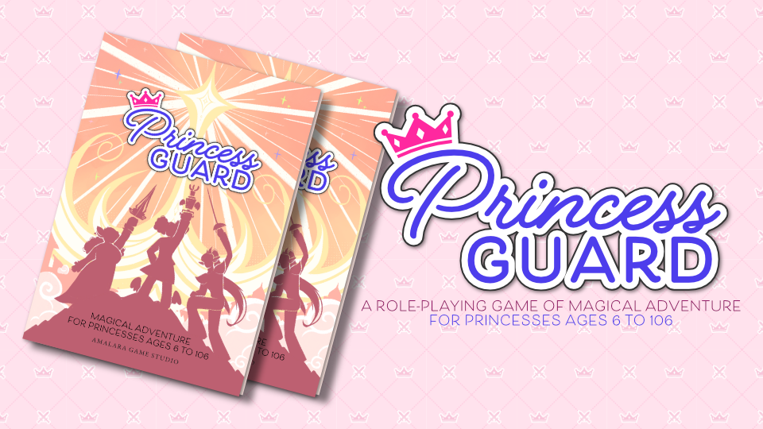
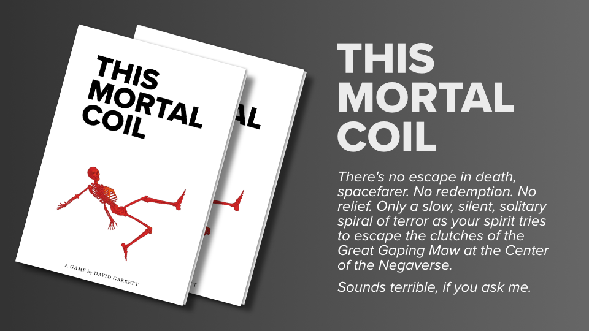
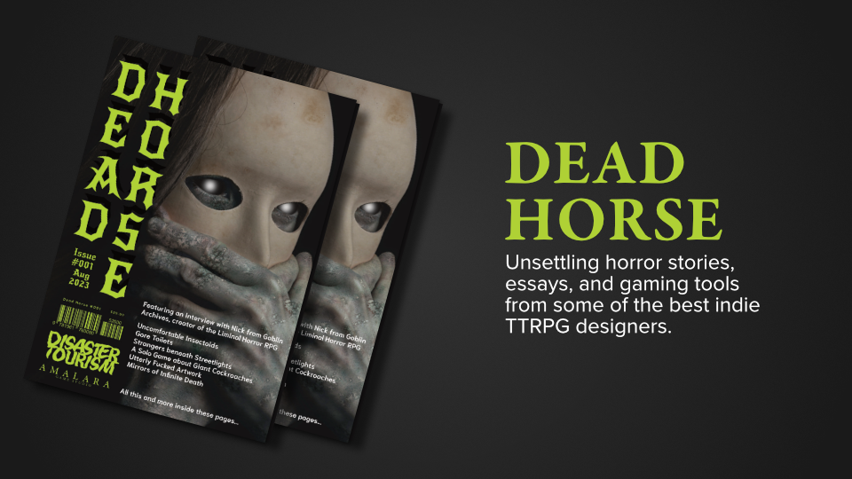
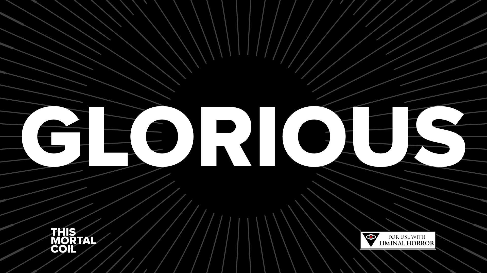
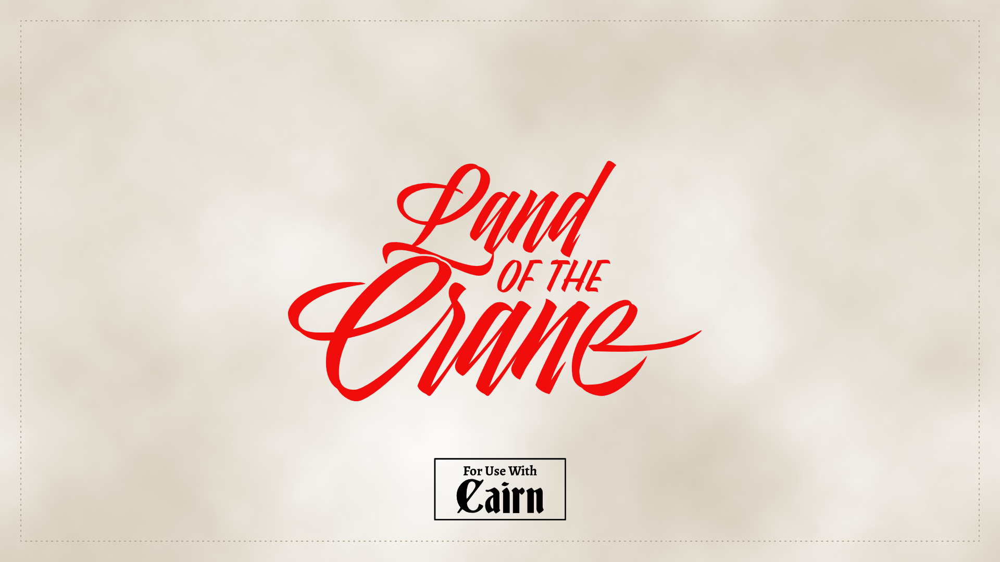
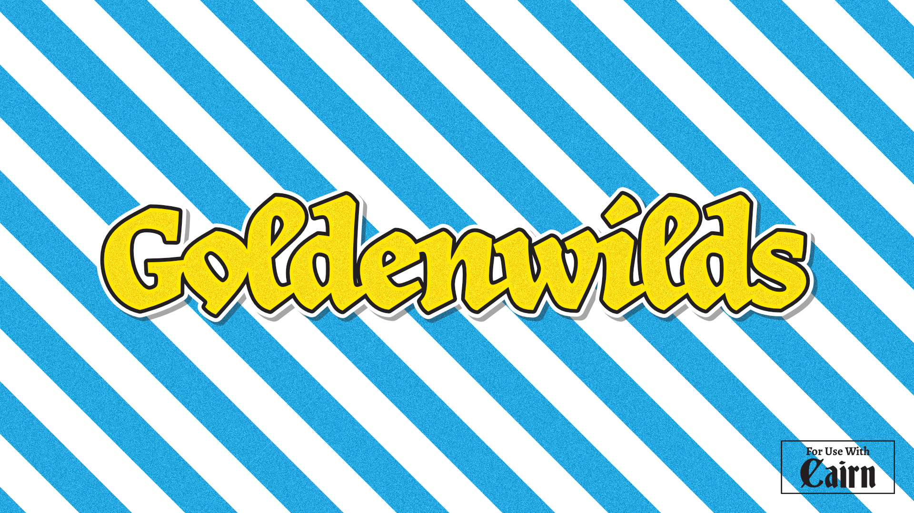

Greetings, fellow humans,

Welcome to the 2023 Year in Review for Dispatches From the Far Realms, the semi-periodic newsletter about TTRPGs and things adjacent. I've been seriously delinquent in sending these over the course of last year and hope to be better this year. My goal is to be more courageous about designing in public — giving others insight into why and how and when I'm crafting new games.

But first, an administrative note: I've moved the newsletter from Substack to [Buttondown](https://buttondown.email). For those that haven't heard, Substack continues to platform Nazis, white nationalists, and alt-right commentators: three groups of folks who I have absolutely no desire to be supporting, even indirectly. While I could conceivably accept a platform that allows all speech protected under the law, with the understanding that protecting the ugliest speech protects everyone's speech, that's not the argument that Substack is making.

Well, that's what they're *saying*, but their argument is intellectually dishonest because their terms of service don't actually allow or protect *everyone*. Instead, as a private company, they pick and choose what speech to allow — that is, which speech *they* think is valuable, and that means that they've decided that racism and antisemitism are speech (or at least revenue) worth associating with. Gross.

While I don't begrudge anyone who continues to uses Substack — it is really the best set of tools for many creators — and I will continue to subscribe to creators who do use it because moving your entire livelihood onto a new platform is a perilous endeavor under the best of circumstances, I have the luxury of choice. So here we are.

## ⭐ Things I made

I published fewer, bigger projects in 2023 than in 2022. They ranged pretty far apart, tonally!

[Princess Guard](https://amalara.com/products/princess-guard) is a game of magical princesses having magical adventures was published to favorable reviews and was nominated for an ENNIE award in Best Family Game

[This Mortal Coil](https://amalara.com/products/this-mortal-coil), a game about necromancers in space, was easily the biggest project I've ever completed. It's a setting and supplement for Liminal Horror, a modern-horror hack of Cairn.

[Dead Horse](https://amalara.com/products/dead-horse-1) — I also partnered with Disaster Tourism to publish the print version of Dead Horse, a zine of unsettling horror featuring fiction, essays, and gaming material from some of the best indie creators around.

## 🖊️ Things I'm making now

I'm not calling them goals because I'm not tying myself emotionally or financially to the completion of any of these projects. Instead, they're aspirations — things that I'd love to do if the stars align, presented in rough order of priority.

**Glorious** — I'll let the unnamed narrator of This Mortal Coil tell you about this adventure for This Mortal Coil.

*Three thousand years ago, the colony ship Victorious brought your ancestors to the Alfajiri system, spacefarer. Congratulations, you're the descendent of heroes — or lucky to be alive — but did you know that there were three ships that attempted a jump across the galaxy?*

*The Victorious survived, but both of its sibling ships were lost. The Invincible, the smallest of the three, reached its destination successfully before transmitting mayday and going silent. Tragic, but you can't make an omelet without breaking a few thousand eggs.*

*The Glorious, on the other hand, activated its jump drive and then disappeared entirely; its fate is one of the great mysteries of human exploration.*

*Until now.*

*The Glorious just reappeared — that's right, reappeared — one year to the day from when the Symbol changed the rules of reality. That can't be a coincidence, spacefarer. Feels more like an opportunity — the once-in-a-lifetime kind.*

*You're the first to hear of it, by the way. You can thank me later. Better hurry, though — as soon as word gets around, the whole system's going to descend on it; humans just can't leave a mystery like that unexplored — who knows what they'll find?*

*You, though — yes, you — you're going to find exactly what you're looking for.*

**Land of the Crane** — I'd love to convert my long-running, mythic-feudal-Japan-inspired fantasy setting to Cairn. We played the first campaign in this world using D&D 3E, then started a second campaign using D&D 4E. That second campaign went on hiatus for a bit, but we returned when 5E was launched.

If you're the sort of person who enjoys reading through slightly spruced up session logs, you can read the whole campaign arc in the collected [Eaters of the Dead](https://landofthecrane.s3-us-west-2.amazonaws.com/Kobayashi%20EotD.pdf)

Now the characters are reaching high levels of play, where D&D kind of...breaks down. My solution is to convert everything to Cairn where levels are no longer relevant.

**Goldenwilds** — I started a lunchtime campaign for a few coworkers who had never played RPGs before. I used Cairn because the rules are straightforward an intuitive and the players jumped right in. I set the campaign in an optimistic, post-apocalyptic, high-fantasy world, and I'd like to elaborate on it.

## 💡 Things I might make

I've also got a ton of other things that are percolating in my design notebook. Sometimes they bubble up to the top and take priority:

- **When Good Things Happen to Bad Necromancers** — a set of solo exploration rules and procedures for This Mortal Coil.
- **Monster Squad** — a sequel of sorts to [Spooky Town](https://amalara.com/products/spooky-town), my one-page game of mischievous monster grade-schoolers. I envision something with a similar scope to Princess Guard.
- **The Harrowing** — a diabolical depth crawl for Liminal Horror. If you're a fan of horror movies where the investigators journey too deep and cross over into Hell, this is the supplement for you.
- **Crawlspace** — a surreal megadungeon for Liminal Horror. This started out as a Dungeon 23 project which promptly got too overwhelming. But I still have ideas. Lots of ideas. And a rough map. And some creepy vibes to throw your way.

Happy gaming!

