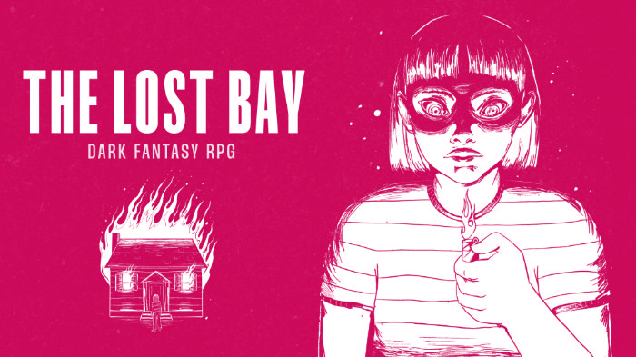
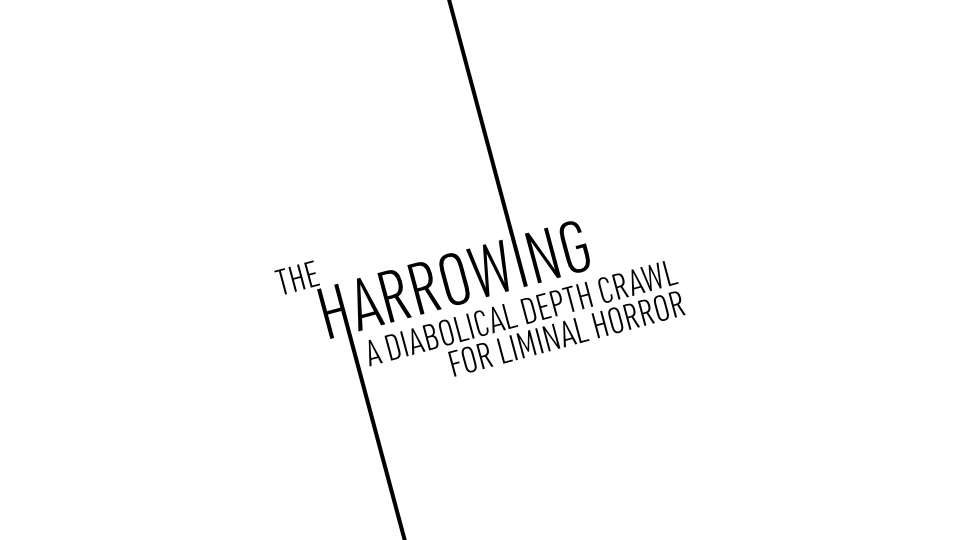

If you heard of Dungeon23, a "thing-a-day" challenge to build a megadungeon over a year, you may have also heard of Lore24, a "thing-a-day" challenge to flesh out a world by writing one bit of lore every way.

I tried Dungeon23 and bounced off, hard. I really like the concept I came up with, and it is still high on my to-do list, but, wow, I do not like the format of a "thing-a-day." Creatively, I am much more of a sprinter than a marathoner so it just *does not work* for me.

So, I'm not doing Lore24 either, but I *do* enjoy creating lore. So I'm going to share the lore I've created for my depth-crawl-though-literal-hell project for Liminal Horror, called The Harrowing. And then I'll share a special code to get 50% off your entire order at the Amalara Game Studio store because this Friday, January 12, is my birthday.

But first, I want to shout out another *amazing* creator, Iko, from the Lost Bay, whose modern fantasy horror RPG, The Lost Bay, is now available to follow on Kickstarter.

Per Iko, "*The Lost Bay* is a dark fantasy tabletop RPG. It creates an alternate version of the 90s, both familiar and uncanny, where the mundane and the magical mix inextricably. Living Saints, rituals, blood curses are part of your daily life alongside console games, VHS tapes, and phone booths."

I've been a big fan of the game from the earliest iterations. It is super creative — easily one of the best dark urban fantasy horror creations I've ever seen. If you like that sort of thing, it would behoove you to go follow along.

https://www.kickstarter.com/projects/thelostbay/the-lost-bay-suburban-dark-fantasy-rpg

## The Harrowing

In the early days of the universe, after the planets began to cool, after the moon formed from the rubble of Theia, after the first spark of life was lit, the angel, Lucifer, was given command of a third of all angels and tasked with bringing form to his Creator's new world.

As the strongest, bravest, and brightest of God’s servants, Lucifer led his legion of angels as they lit the stars and nudged the planets into orbit. They gathered the waters of the Earth to create the seas and the dry ground to create the land; built plants to bear seeds and trees to bear fruit; engineered fish to swim in the seas and birds to fly in the air and livestock to live on the land.

The angels labored under the direction of Lucifer to fulfill God's vision, and at the end of each day God witnessed what they had accomplished and saw that it was good. And at the end of each day, because his Creator was pleased with him, Lucifer became more pleased with himself.

On the sixth day, God commanded his angels to make mankind, and Lucifer molded the first man and woman with his own hands in the image of his own Creator. *How glorious,* Lucifer thought! *Of all my great works, this is by far the greatest! How pleased our Lord will be.*

Indeed, God was so pleased with mankind that he blessed them and gave them dominion over the fish in the sea and the birds in the sky and every living creature that moves along the ground. He gave them the world that Lucifer and his angels had spent every moment of innumerable eons working so hard to create.

For the first time, Lucifer was not pleased — he had worked too long and too hard to see the world he created given over to his own creation — so he committed the unforgivable sin — the only sin that a member of the heavenly host is able to commit. *You could not have done this without me*, he thought.

Before he could open his mouth, Lucifer and his legion of followers found themselves falling from greatest heights that any creature could ever hope to reach. Down they fell, one by one, ribbons of light streaking through the night, down into the world they created — into the fiery depths, into the frozen wastes, into the darkest trenches, the densest forest, the deepest canyons. Their pride became their prison, and there they remained, locked away from God's sustaining presence forever more.

There are places in this world where God's light does not shine — places where God withholds his protection. There are places you should not go.

### Inspiration

The Harrowing is inspired in part by the following movies:

- As Above So Below
- Baskin
- Errementari: The Blacksmith and the Devil
- Hellhole
- Hellraiser
- Incantation
- The Gate
- The House That Jack Built
- The Pope's Exorcist
- The Prince of Darkness

https://amalara.com/
