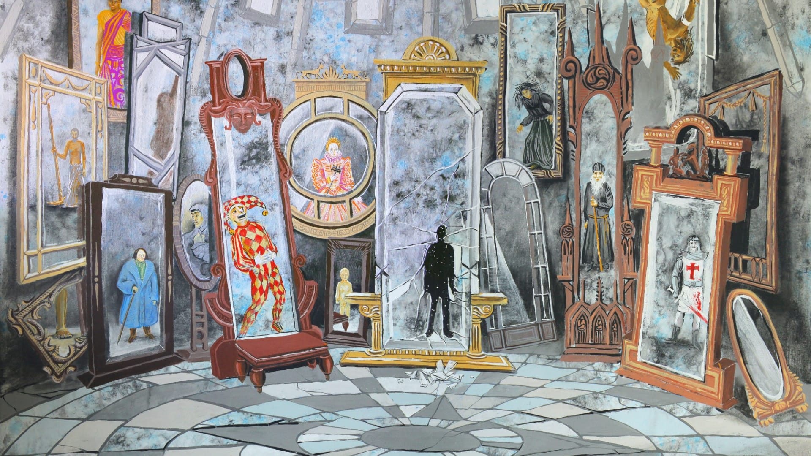

(Photo by <a href="https://unsplash.com/@hrustall?utm_content=creditCopyText&utm_medium=referral&utm_source=unsplash">Дмитрий Хрусталев-Григорьев</a> on <a href="https://unsplash.com/photos/white-and-blue-ceramic-floor-tiles-qui1Ni2Avk8?utm_content=creditCopyText&utm_medium=referral&utm_source=unsplash">Unsplash</a>)

> "All models are wrong but some are useful."
> — *George Box, statistician*

If you've ever participated in leadership training, worked for someone who was enthusiastic about leadership training, or been caught in the blast radius of a recent leadership training class, you've probably been subject to some sort of personality categorization exercise. The goal of these exercises is to help leaders and managers understand that humans aren't a homogeneous species who respond identically to all forms of stimuli — and to do that they tend to break down humans into four, five, or even sixteen homogeneous types!

Of course, people don't cleanly settle into four, five, or sixteen categories, but the idea that different people need different things is, unsurprisingly, quite useful. As a result, you'll often see people swapping their Myers Briggs types (INFJs, unite!) or talking about whether they're red, yellow, blue, or green.

Most personality models, though, are basically junk — created as thought experiments by overly clever people. One model, though, called the Big Five, has been developed and refined by scores of psychologists and personality researchers. It describes five personality traits which are common across cultures and which can be objectively rated from high to low.

Importantly, these personality types are primarily *descriptive* but are not *predictive* except in very limited circumstances. They can tell you how an NPC will view the world around them or move through their day, given a lack of strong external stimuli — but as any GM can tell you, PCs are the very definition of strong external stimuli!

The Big Five traits are:

- **Openness**, which describes a character's appreciation for adventure, creativity, and emotion.
- **Conscientiousness**, which describes a character's tendency to display self-discipline and be organized.
- **Extraversion**, which describes a character's tendency to be outgoing and high in social energy.
- **Agreeableness**, which describes a character's general concern for social harmony.
- **Stability**,[^1] which describes a character's tendency to be emotionally stable, especially when under pressure.

Creating a full personality workup on every NPC feels like a bit too much prep for my tastes, so I've taken the Big Five traits and created a useful table filled with descriptive words that you can roll *1d6* on or simply use as a guide. Lower numbers describe someone with lower expression of the trait and higher numbers describe someone with higher expression of the trait.

| **1d6** | **Openness**  | **Conscientiousness** | **Extraversion** | **Agreeableness** | **Stability** |
| ------- | ------------- | --------------------- | ---------------- | ----------------- | ------------- |
| 1       | Close-minded  | Irresponsible         | Solitary         | Manipulative      | Volatile      |
| 2       | Rigid         | Disorganized          | Reserved         | Callous           | Jumpy         |
| 3       | Knowledgeable | Effective             | Sociable         | Gruff             | Pessimistic   |
| 4       | Curious       | Reliable              | Energetic        | Polite            | Optimistic    |
| 5       | Artistic      | Careful               | Assertive        | Thoughtful        | Resilient     |
| 6       | Adventurous   | Serious               | Gregarious       | Generous          | Carefree      |

	[^1]: Stability is an inversion of Neuroticism, which is how the trait is usually defined. However, to keep "low rolls equal low expression", I flipped it.
