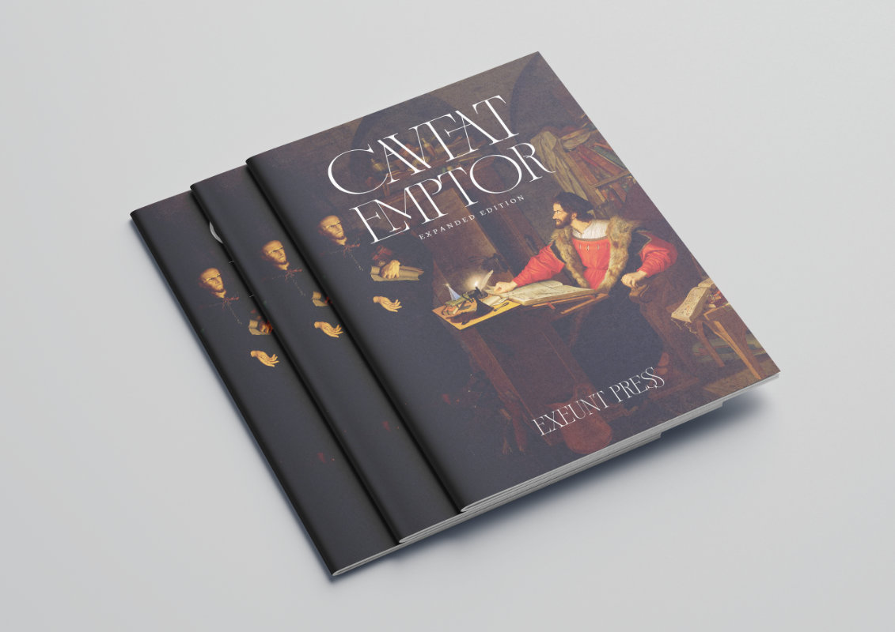

2024 was not a banner year for my creative output. I did work on a lot of projects, but none of them ended up in a format that was publishable. Instead, I backed a lot of crowdsourced projects and bought a lot of books. A **lot** of books. Enough that I've made a pact with myself: in 2025, I have to publish a review of a book I currently own in order to add another book to my collection: one review per new book.

So let's start with an easy one: Caveat Emptor, a solo journaling game in which you play an assistant demon selling secretly cursed items to unsuspecting humans in Wittenberg, Germany. Exeunt Press, the designer and publisher of Caveat Emptor is one of those people whose work I'll buy sight unseen. Everything they've released has been full of flavor, mechanically tight, and ships with a beautiful layout. The original Caveat Emptor was published in a trifold pamphlet format, which I passed on, opting instead for the 36 page, A5, staple-bound *expanded edition*.

In Caveat Emptor, you play an ineffective demon who has been placed on a *perdition* improvement plan. To avoid annihilation, you have three days to meet your sales quota of cursed items. The catch — what makes this a game and not just a cursed item generator — is that humans are naturally suspicious, so you have to be judicious in what curses you apply to the items you sell. Each time you repeat a curse from one of the three available categories, your chances of success **decrease**. You can reset your odds by closing the shop for the day, but remember that you have a quota to meet and only three days in which to do it.

To play, you need a deck of cards, three six-sided dice, and, optionally, three tokens to track your curse usage. As the game is a journaling game, you'll probably also want something to write with, though you could surely play entirely in your imagination.

The game loop is well explained by the author, which is true of all their products. If you're familiar with Skeleton Code Machine, the newsletter by Exeunt Press wherein they analyze game mechanics, then you won't be surprised. It is welcome nevertheless.

The game plays easily and quickly, requiring about an hour, and you'll end up with descriptions of a dozen or so cursed items and their proud (and doomed) new owners.

I know that, two paragraphs above, I mentioned that Caveat Emptor is more than just a cursed item generator, but it might be the **coolest** cursed item generator you can buy. If you run an urban campaign, you pretty much owe it to yourself to buy this and make one of the shops in your town **this** shop. You can even repurpose your hapless customers as NPCs and plot hooks. The value prop for this game writes itself.

Regardless, if you enjoy short solo journaling games involving demons and corporate horror, you'll probably enjoy Caveat Emptor.

You can find Caveat Emptor in print at the [Exeunt Press shop](https://www.exeunt.press/shop/p/caveat-emptor) and digitally at [itch.io](https://exeuntpress.itch.io/caveat-emptor).

*Disclaimer regarding reviews: all reviews on this blog are of products I have purchased myself, unless specified otherwise. I do not accept products for review nor do I accept renumeration for any reviewed product.*
