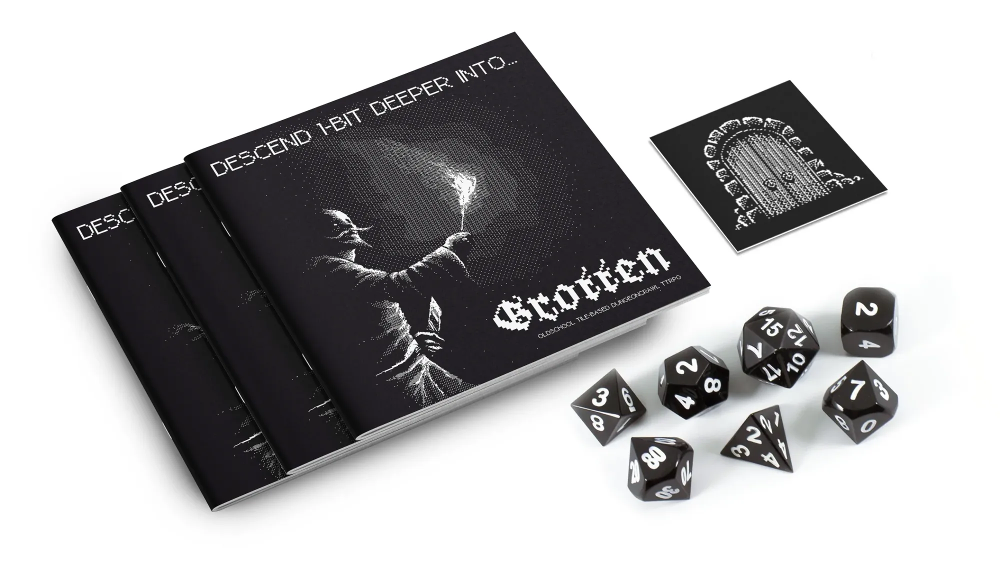

Grotten is a minimalist dungeon crawler designed for solo play by Tommy Sunzenauer, aka Sunzenaut. Sunzenauer is probably best known for introducing neon green to the Mörk Borg palette in his swamp-based campaign setting, SVMP. Regrettably, I have yet to purchase SVMP, but based on the positive reviews of that work, I backed his Kickstarter for Grotten.

In Grotten, which is a 20-page, 6x6-inch, staple-bound, black and white zine, you play a solo adventurer exploring a decrepit, monotone underworld filled with strange landmarks, grimy NPCs, dangerous creatures, and horrible boss monsters. You use physical tiles, which come on sturdy cardstock with the physical version of the game and which are printable from the digital version of the game, to randomize your dungeon layout. On the back of each tile is a door, which can be locked — requiring a key to open — or unlocked, and when flipped over reveals either a room or a corridor. Each time you flip a tile, you'll roll to determine if the newly uncovered tile is empty or contains a structure, treasure, an NPC, one or more monsters, or a boss monster, and then again to determine the specifics of what you've discovered.

Fighting monsters is the main challenge in this dungeon crawler and the rules are a very minor hack of the popular, battle-tested Mörk Borg ruleset. Characters have the same attributes as they do in basic Borg, though the creation rules are tweaked to make the solo adventurer you generate here *slightly* more likely to survive. If you live long enough to beat four regular creatures or one boss monster, you get to level up your character and can either start over with a new dungeon or continue to explore the one you're in.

And that's basically it — it's a pixel-art dungeon generator with Mörk Borg rules grafted on. Which, to be honest, is kind of nice. It does what it says on the tin and doesn't try to reach beyond. Yet, at the same time, I could see an expanded version of this having a lot of staying power — perhaps by adding some rogue-like mechanics or weaving a plot across multiple dungeon visits.

At any rate, it is worth mentioning that Grotten comes with alternate rules in case you want to generate dungeons without fiddling around with tiles or if you want to play with a group. It would be trivially easy, as a GM, to build your own plot around what the players discover in the deep, dark, ruined world of Grotten. Or you could use it as a prompt generator to create your own solo world. All you need to add is a little imagination.

Grotten is available in print and PDF form at the [Sunzenaut store](https://sunzenaut.com/).

*Disclaimer regarding reviews: all reviews on this blog are of products I have purchased myself, unless specified otherwise. I do not accept products for review nor do I accept renumeration for any reviewed product.*
